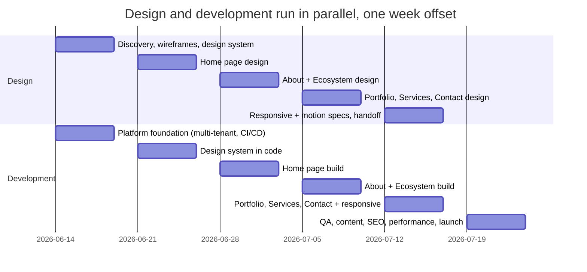

# Timeline & Milestones

Two timelines matter to anyone joining the department: the **group's history**
(context) and the **current delivery commitments** (your day-to-day reality).

## Group history

| Year | Milestone |
| ---- | --------- |
| ~1961 | Family industrial activities begin in packaging and plastics |
| 1971 | Al-Adawy Pack founded — flexible & food-grade packaging manufacturing |
| ~2000–2001 | Ahmed Aladawy begins building Adawy Group as a connected ecosystem |
| 2020+ | Vision evolves into centralizing all business functions into one aligned structure |
| 2026 | Software department formed; decision to rebuild all digital properties on one unified platform |

## The current commitment: the Adawy Group website

The first tenant of the unified platform is the new **adawygroup.com** — the
portfolio site presenting the group, its story, its business units, and its
work. Six weeks from kickoff to launch, with design and development running in
parallel (development stays ~one week behind design at all times).

**Kickoff: Sunday 14 June 2026 → Launch target: Thursday 23 July 2026.**
If kickoff moves, every date shifts by the same amount.

| Date | Milestone | What leadership can verify |
| ---- | --------- | -------------------------- |
| Thu 18 Jun | Design direction approved, staging live | Visual direction in Figma + a working staging link |
| Thu 25 Jun | Design system approved and built in code | Brand colors, typography, components rendered in the browser |
| Thu 2 Jul | Home page live on staging | The first complete piece of the site — also the **content deadline** |
| Thu 9 Jul | Majority of the site reviewable | Home, About, Ecosystem clickable on staging |
| Thu 16 Jul | Design 100% handed off, all pages built (v1) | Every page exists on staging; the last week is refinement only |
| **Thu 23 Jul** | **Launch** | The new site live on the production domain |

Three external dependencies protect these dates: **content delivered by 2
July**, **approvals within two working days** of each milestone review, and a
**frozen scope** (new ideas go to the backlog, scheduled after launch). The
working week is Sunday–Thursday.

**Why this matters beyond one website:** the foundation built in week one —
the multi-tenant codebase, hosting, domains, deployment pipeline — is
permanent infrastructure. Every Adawy site that follows runs on it, which is
why later sites ship in weeks, then days, instead of months.

For what comes after launch, see the [phased roadmap](/architecture/roadmap).
