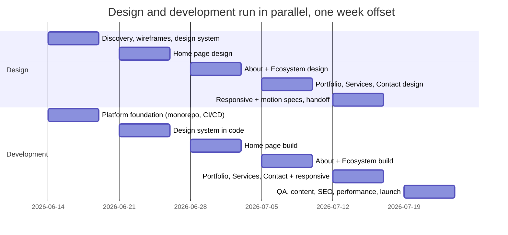

# Timeline & Milestones

This page tracks the department's **delivery commitments** — what we have
promised, by when, and how progress stays verifiable week by week.

<Callout type="important">
  **This page is owed a retrospective.** The commitment below ran to 23 July
  2026 and the dates have passed; `apps/group` is built and redeploys to its
  Vercel project on every merge to `main`. What is not recorded anywhere is the
  *outcome*: what shipped on the date, what slipped, and what the six-week
  estimate turned out to be worth.

  That last number matters beyond one website — the whole monorepo argument
  rests on "six weeks becomes one week per site as the packages mature"
  ([ADR-001](/architecture/adrs)), and the first real data point on it is this
  project. Someone who was there has to write it; this handbook will not guess
  it.

  One outcome is on record: on **21 September 2026** adawygroup.com moved from
  the old WordPress host to `apps/group` on Vercel, with adawystudio.com,
  adawypack.com, adawyprint.com, adawysupplies.com and
  adawymarketingsolutions.com moving on the same day
  ([how](/guides/move-a-domain-to-vercel)).
</Callout>

## The commitment: the Adawy Group website

The first app on the unified platform is the new **adawygroup.com** — the
portfolio site presenting the group, its story, its business units, and its
work. Six weeks from kickoff to launch, with design and development running in
parallel (development stays ~one week behind design at all times).

**Kickoff: Sunday 14 June 2026 → Launch target: Thursday 23 July 2026.**
If kickoff moves, every date shifts by the same amount.

| Date | Milestone | What leadership can verify |
| ---- | --------- | -------------------------- |
| Thu 18 Jun | Design direction approved, staging live | Visual direction in Figma + a working staging link |
| Thu 25 Jun | Design system approved and built in code | Brand colors, typography, components rendered in the browser |
| Thu 2 Jul | Home page live on staging | The first complete piece of the site — also the **content deadline** |
| Thu 9 Jul | Majority of the site reviewable | Home, About, Ecosystem clickable on staging |
| Thu 16 Jul | Design 100% handed off, all pages built (v1) | Every page exists on staging; the last week is refinement only |
| **Thu 23 Jul** | **Launch** | The new site live on the production domain |

Three external dependencies protect these dates: **content delivered by 2
July**, **approvals within two working days** of each milestone review, and a
**frozen scope** (new ideas go to the backlog, scheduled after launch). The
working week is Sunday–Thursday.

```mermaid
gantt
    title Design and development run in parallel, one week offset
    dateFormat  YYYY-MM-DD
    section Design
    Discovery, wireframes, design system :2026-06-14, 5d
    Home page design                     :2026-06-21, 5d
    About + Ecosystem design             :2026-06-28, 5d
    Portfolio, Services, Contact design  :2026-07-05, 5d
    Responsive + motion specs, handoff   :2026-07-12, 5d
    section Development
    Platform foundation (monorepo, CI/CD) :2026-06-14, 5d
    Design system in code                :2026-06-21, 5d
    Home page build                      :2026-06-28, 5d
    About + Ecosystem build              :2026-07-05, 5d
    Portfolio, Services, Contact + responsive :2026-07-12, 5d
    QA, content, SEO, performance, launch :2026-07-19, 5d
```

**Why this matters beyond one website:** the foundation built in week one —
the monorepo and its shared packages, hosting, domains, deployment pipeline — is
permanent infrastructure. Every Adawy site that follows runs on it, which is
why later sites ship in weeks, then days, instead of months.

## Since the websites moved

Dated milestones after the six domains moved, newest last. Each is something
you can open and check, not a status claim.

| Date | Milestone | Where to check |
| ---- | --------- | -------------- |
| Mon 21 Sep 2026 | adawygroup.com and five brand domains move their websites to Vercel; DNS and email stay on the Verpex host | [Domains, DNS & Email](/architecture/domains-and-email), [ADR-013](/architecture/adrs) |
| Wed 23 Sep 2026 | adawybusinessdevelopment.com goes live on Vercel — the seventh domain, and the first with DNS on Cloudflare | The domain; [its row](/architecture/domains-and-email#the-domains) |
| Wed 23 Sep 2026 | GitHub Actions stops org-wide on a billing failure; production deploys become manual | [Deployment](/how-we-work/deployment#github-actions-is-stopped) |
| Wed 23 Sep 2026 | The Aladawy Shop WordPress rebuild reaches its password-protected staging site, with cash on delivery and customer accounts added the same day | [`aladawy-shop-wp`](/repositories/aladawy-shop-wp) |
| Thu 24 Sep 2026 | The rebuilt Aladawy Shop goes live on aladawyshop.com | The domain; [ADR-015](/architecture/adrs) |
| Sun 27 Sep 2026 | The content dashboard goes online at `admin.adawygroup.com` for the team to practise on, publishing to a practice repository | [`adawy-dashboard`](/repositories/adawy-dashboard), [ADR-014](/architecture/adrs) |
| Sun 27 Sep 2026 | Aladawy Pack's website moves to WordPress on aladawypack.com | The domain; [Our Systems](/architecture/systems#the-client-sites-that-stay-on-wordpress) |
| Sun 27 Sep 2026 | The captioned training videos for the dashboard and both Aladawy sites are complete | [Training Videos](/guides/training-videos) |

What comes next is on the
[roadmap](/architecture/roadmap#what-is-next-in-the-short-term).

For what comes after launch, see the [phased roadmap](/architecture/roadmap).
