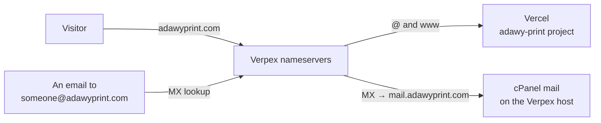

# Domains, DNS & Email

Every group domain is served by three different companies, and a change to one
of them can break the other two. Knowing which one owns what is the difference
between a five-minute DNS edit and a week of silently bounced email.

| Layer | Who | What lives there |
| ----- | --- | ---------------- |
| **Registrar** | Name.com | Ownership and renewal of every domain. The domain expires here, not at the host, so keep auto-renew on |
| **DNS** | The Verpex reseller host, nameservers `ns1`–`ns4.mysecurecloudhost.com` | Every record of every zone, edited in WHM's Zone Editor or its API |
| **Websites** | Vercel | The six moved domains, one Vercel project each ([ADR-001](/architecture/adrs)) |
| **Email** | cPanel on the same Verpex host | Mailboxes for every domain except adawygroup.com, which is on **Google Workspace** |

Form mail is separate from all of this: the group site sends enquiries through
Resend from the `send.adawygroup.com` subdomain
([Forms & Enquiries](/guides/forms-and-enquiries)).

## The domains

| Domain | Website | Email | State |
| ------ | ------- | ----- | ----- |
| adawygroup.com | `adawy-group` on Vercel | Google Workspace | <Badge tone="live">Live on Vercel</Badge> |
| adawystudio.com | `adawy-studio` on Vercel | cPanel | <Badge tone="live">Live on Vercel</Badge> |
| adawypack.com | `adawy-pack` on Vercel | cPanel | <Badge tone="live">Live on Vercel</Badge> |
| adawyprint.com | `adawy-print` on Vercel | cPanel | <Badge tone="live">Live on Vercel</Badge> |
| adawysupplies.com | `adawy-supplies` on Vercel | cPanel | <Badge tone="live">Live on Vercel</Badge> |
| adawymarketingsolutions.com | `adawy-marketing` on Vercel | cPanel | <Badge tone="live">Live on Vercel</Badge> |
| aladawypack.com | The client's old WordPress site, on the Verpex host | cPanel | <Badge tone="holding">Not moved</Badge> |
| aladawyshop.com | The client's old site, on the Verpex host | cPanel | <Badge tone="holding">Not moved</Badge> |
| adawy.com | A "coming soon" page on the Verpex host | cPanel | <Badge tone="holding">Not moved</Badge> |

The six moved on **21 September 2026**. The two Aladawy domains are client
work ([aladawy-pack](/repositories/aladawy-pack),
[aladawy-shop](/repositories/aladawy-shop)): their Next.js rebuilds are
running on `*.vercel.app` and move with
[the same procedure](/guides/move-a-domain-to-vercel) when the client is ready.
Adawy Business Development has an app but no domain yet, so it stays on its
Vercel address. The host also carries a few group domains that have no app
yet. None of them has been touched.

## Why DNS and email did not move with the websites

The websites moved to Vercel; the nameservers and the mailboxes stayed where
they were. Moving the nameservers meant copying fifteen to twenty records per
zone by hand and giving up the records cPanel maintains for its own mail
(DKIM, SPF, autodiscovery, certificates for `mail.`). One missed record means
lost email, for a change that gains the websites nothing. So only the two web
records per domain changed. [ADR-013](/architecture/adrs) records the decision
and when to revisit it.

## The trap: email rode on the website's address

cPanel's default zone points everything at the domain's root: the MX record
is the bare domain, `mail.` is a CNAME to it, and the calendar and contacts
SRV records target it. Point the root at Vercel and every one of those follows
it to a web server that does not accept email.

It fails quietly, which is what makes it dangerous. A sending server that
cannot connect queues the message and retries for days, so nobody bounces and
nobody notices until someone asks why the replies stopped. The moved domains
were rewired so that email no longer depends on the root at all:

| Record | Points at | Belongs to |
| ------ | --------- | ---------- |
| `@` A | Vercel: `216.198.79.1` and `64.29.17.1` | The website |
| `www` CNAME | The project's own `….vercel-dns-017.com` host, from its Vercel domain settings | The website |
| `mail` A | The Verpex server (was a CNAME to `@`) | Email |
| `@` MX | `mail.<domain>` (was `@`). adawygroup.com's MX is Google's and was not touched | Email |
| `_caldav`, `_carddav` SRV (and their `s` variants) | `mail.<domain>` (was `@`) | Calendars and contacts |
| `webmail`, `cpanel`, `autodiscover`, `autoconfig` A | The Verpex server, unchanged | Email and cPanel |
| SPF, DKIM, DMARC TXT | Unchanged | Email |

Rolling a website back is now safe: point `@` back at the Verpex server and
`www` back at `@`, and email does not notice.

## Records that must never be deleted

<Callout type="warning">
  - **`google-site-verification` TXT at `@`.** It is what proves ownership to
    Google Search Console; delete it and the property stops being verified.
  - **SPF, DKIM and DMARC TXT.** Without them, the group's own email starts
    landing in spam.
  - **`mail` A and the MX record.** Delete either and inbound email stops,
    silently.
</Callout>

Three other kinds of record are safe to leave alone. `_vercel` TXT records
prove to Vercel that we own a domain; adawygroup.com and adawypack.com needed
them because another Vercel account had claimed the names first.
`_acme-challenge` TXT records are left over from issuing certificates and do
nothing now. `_cpanel-dcv-test-record` is cPanel's own.

## Email settings for staff

Mail apps use **`mail.<domain>`** for incoming (IMAP, port 993) and outgoing
(SMTP, port 465) mail, e.g. `mail.adawystudio.com`. Webmail is at
`webmail.<domain>`. The bare domain no longer works as a mail server name,
because it now points at Vercel. Anyone who typed it into their mail app has to
change it.

## On the Vercel side

Each moved project has three domains. The root domain is the site, `www`
redirects to it with a 308, and the project's own `<project>.vercel.app` also
redirects to it with a 308. The last one matters for search: a production
`*.vercel.app` host that serves the site is a full duplicate of it. The
redirects are set in each project's domain settings, not in code, so a new
project needs them set by hand. Vercel issues and renews the certificates
itself.

In the code, each app names its domain once, as its `PRODUCTION_HOST`. That
switch turns on indexing, the canonical origin and the sitemap for the
production deployment serving that host. Previews stay `noindex`
([adawy-platform](/repositories/adawy-platform#things-that-will-surprise-you)).

## Search engines

- **Google Search Console** has each of the six as a **Domain property**
  (`sc-domain:`), verified by the TXT record above, with its sitemap
  submitted. A Domain property covers `www`, `http` and `https` in one. The
  owners are the department's Google account and a service account in the
  `adawy-search-console` Google Cloud project, which scripts use without a key
  file: the Google organisation forbids service-account keys, and the scripts
  impersonate it instead.
- **IndexNow** tells Bing and the other IndexNow engines about changed URLs.
  Each app serves the same key file at its root (`docs/shipping.md` in the
  platform repo has the details).
- **The brands link to each other.** Each brand page on adawygroup.com has a
  "Visit site" link to that brand's own domain. Each brand site links back to
  adawygroup.com and describes itself in its structured data as a company whose
  parent organisation is Adawy Group ([ADR-006](/architecture/adrs)).

Google's "Request indexing" button has no API. For a page that matters, open it
in Search Console's URL Inspection and press the button by hand. Everything
else reaches Google through the sitemaps.
