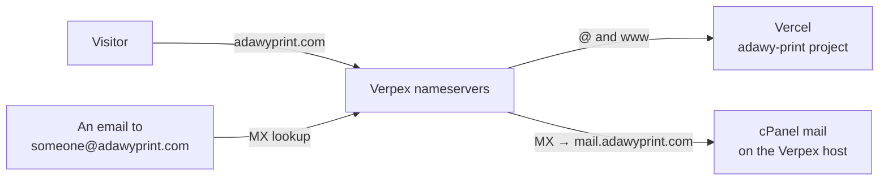

# Domains, DNS & Email

Every group domain is served by three different companies, and a change to one
of them can break the other two. Knowing which one owns what is the difference
between a five-minute DNS edit and a week of silently bounced email.

| Layer | Who | What lives there |
| ----- | --- | ---------------- |
| **Registrar** | Name.com | Ownership and renewal of every domain. The domain expires here, not at the host, so keep auto-renew on |
| **DNS** | The Verpex reseller host, nameservers `ns1`–`ns4.mysecurecloudhost.com` | Every record of almost every zone, edited in WHM's Zone Editor or its API. The exceptions are adawybusinessdevelopment.com, on **Cloudflare**, and adawyproduction.com, still on Name.com's own nameservers |
| **Websites** | Vercel, or the Verpex host | Seven group domains and `admin.adawygroup.com` on Vercel, one project each ([ADR-001](/architecture/adrs)); the two Aladawy client sites on WordPress on the Verpex host |
| **Email** | cPanel on the same Verpex host | Mailboxes for every domain except adawygroup.com, which is on **Google Workspace**, and adawybusinessdevelopment.com, which has none |

Form mail is separate from all of this: the group site sends enquiries through
Resend from the `send.adawygroup.com` subdomain
([Forms & Enquiries](/guides/forms-and-enquiries)), and the content dashboard
sends its invite and password-reset emails from the same subdomain.

```mermaid
flowchart LR
    V["Visitor"] -->|"adawyprint.com"| NS["Verpex nameservers"]
    NS -->|"@ and www"| VC["Vercel<br/>adawy-print project"]
    S["An email to<br/>someone@adawyprint.com"] -->|"MX lookup"| NS
    NS -->|"MX → mail.adawyprint.com"| MAIL["cPanel mail<br/>on the Verpex host"]
```

## The domains

| Domain | Website | DNS | Email | State |
| ------ | ------- | --- | ----- | ----- |
| adawygroup.com | `adawy-group` on Vercel | Verpex | Google Workspace | <Badge tone="live">Live on Vercel</Badge> |
| `admin.adawygroup.com` | `adawy-dashboard` on Vercel — the [content dashboard](/repositories/adawy-dashboard) | Verpex | — | <Badge tone="live">Live on Vercel</Badge> since 27 Sep |
| adawystudio.com | `adawy-studio` on Vercel | Verpex | cPanel | <Badge tone="live">Live on Vercel</Badge> |
| adawypack.com | `adawy-pack` on Vercel | Verpex | cPanel | <Badge tone="live">Live on Vercel</Badge> |
| adawyprint.com | `adawy-print` on Vercel | Verpex | cPanel | <Badge tone="live">Live on Vercel</Badge> |
| adawysupplies.com | `adawy-supplies` on Vercel | Verpex | cPanel | <Badge tone="live">Live on Vercel</Badge> |
| adawymarketingsolutions.com | `adawy-marketing` on Vercel | Verpex | cPanel | <Badge tone="live">Live on Vercel</Badge> |
| adawybusinessdevelopment.com | `adawy-business-development` on Vercel | **Cloudflare** | None | <Badge tone="live">Live on Vercel</Badge> since 23 Sep |
| aladawyshop.com | The client's **WordPress + WooCommerce** rebuild, on the Verpex host | Verpex | cPanel | <Badge tone="client">Stays on WordPress</Badge> |
| aladawypack.com | The client's **WordPress** site, on the Verpex host | Verpex | cPanel | <Badge tone="client">Stays on WordPress</Badge> |
| adawy.com | A "coming soon" page on the Verpex host | Verpex | cPanel | <Badge tone="holding">Not moved</Badge> |
| adawyit.com, adawyfinance.com | The Verpex host | Verpex | cPanel | <Badge tone="holding">Not moved</Badge> |
| adawyproduction.com | Nothing of ours — Name.com's nameservers | Name.com | — | <Badge tone="holding">Not moved</Badge> |

Six moved on **21 September 2026**; adawybusinessdevelopment.com followed on
**23 September**, and the dashboard's `admin` subdomain on **27 September**.
The last four rows have no app yet and have not been touched.

**The two Aladawy domains are not waiting to move.** Both are client work
that stays on WordPress ([ADR-015](/architecture/adrs)): aladawyshop.com has
served the rebuilt shop ([`aladawy-shop-wp`](/repositories/aladawy-shop-wp))
since 24 September, and aladawypack.com moved to WordPress on
26 September ([`aladawy-pack-wp`](/repositories/aladawy-pack-wp)). The earlier Next.js builds
([aladawy-pack](/repositories/aladawy-pack),
[aladawy-shop](/repositories/aladawy-shop)) are still deployed on
`*.vercel.app`, but neither domain points at them.

### `admin.adawygroup.com` — a subdomain, not a zone

The dashboard needed no email work, because a subdomain carries none. Two
records were added to the adawygroup.com zone on the Verpex host on
27 September 2026, and nothing else in the zone changed:

| Record | Points at | Why |
| ------ | --------- | --- |
| `admin` CNAME | The project's own `….vercel-dns-017.com` host | Sends the subdomain to the dashboard's Vercel project |
| `_vercel` TXT | A `vc-domain-verify=admin.adawygroup.com,…` value | Proves to Vercel that we own the name. adawygroup.com already needed this, because another Vercel account had claimed it first, and each name under it gets its own value |

### adawybusinessdevelopment.com — the one zone on Cloudflare

This domain never lived on the Verpex host. It is registered at Name.com, its
nameservers are **Cloudflare's**, and it has **no MX and no mailboxes**, so the
email trap below does not apply to it. Its Vercel records (the root A records
and the `www` CNAME) are edited in the Cloudflare dashboard, and Google Search
Console verifies it through a `google-site-verification` TXT on Cloudflare —
the same must-not-delete rule as everywhere else.

At the time of writing its responses arrive through Cloudflare's proxy
(`server: cloudflare` in front of Vercel's own headers). Vercel's guidance is
to leave its records **DNS-only** (the grey cloud), because a proxy in front
of Vercel adds a second cache and can interfere with certificate renewal. If
the site behaves oddly, check that setting first.

## Why DNS and email did not move with the websites

The websites moved to Vercel; the nameservers and the mailboxes stayed where
they were. Moving the nameservers meant copying fifteen to twenty records per
zone by hand and giving up the records cPanel maintains for its own mail
(DKIM, SPF, autodiscovery, certificates for `mail.`). One missed record means
lost email, for a change that gains the websites nothing. So only the two web
records per domain changed. [ADR-013](/architecture/adrs) records the decision
and when to revisit it.

## The trap: email rode on the website's address

cPanel's default zone points everything at the domain's root: the MX record
is the bare domain, `mail.` is a CNAME to it, and the calendar and contacts
SRV records target it. Point the root at Vercel and every one of those follows
it to a web server that does not accept email.

It fails quietly, which is what makes it dangerous. A sending server that
cannot connect queues the message and retries for days, so nobody bounces and
nobody notices until someone asks why the replies stopped. The moved domains
were rewired so that email no longer depends on the root at all:

| Record | Points at | Belongs to |
| ------ | --------- | ---------- |
| `@` A | Vercel: `216.198.79.1` and `64.29.17.1` | The website |
| `www` CNAME | The project's own `….vercel-dns-017.com` host, from its Vercel domain settings | The website |
| `mail` A | The Verpex server (was a CNAME to `@`) | Email |
| `@` MX | `mail.<domain>` (was `@`). adawygroup.com's MX is Google's and was not touched | Email |
| `_caldav`, `_carddav` SRV (and their `s` variants) | `mail.<domain>` (was `@`) | Calendars and contacts |
| `webmail`, `cpanel`, `autodiscover`, `autoconfig` A | The Verpex server, unchanged | Email and cPanel |
| SPF, DKIM, DMARC TXT | Unchanged | Email |

Rolling a website back is now safe: point `@` back at the Verpex server and
`www` back at `@`, and email does not notice.

## Records that must never be deleted

<Callout type="warning">
  - **`google-site-verification` TXT at `@`.** It is what proves ownership to
    Google Search Console; delete it and the property stops being verified.
  - **SPF, DKIM and DMARC TXT.** Without them, the group's own email starts
    landing in spam.
  - **`mail` A and the MX record.** Delete either and inbound email stops,
    silently.
</Callout>

Three other kinds of record are safe to leave alone. `_vercel` TXT records
prove to Vercel that we own a domain; adawygroup.com (for the root, `www` and
`admin`) and adawypack.com needed them because another Vercel account had
claimed the names first.
`_acme-challenge` TXT records are left over from issuing certificates and do
nothing now. `_cpanel-dcv-test-record` is cPanel's own.

## Email settings for staff

Mail apps use **`mail.<domain>`** for incoming (IMAP, port 993) and outgoing
(SMTP, port 465) mail, e.g. `mail.adawystudio.com`. Webmail is at
`webmail.<domain>`. The bare domain no longer works as a mail server name,
because it now points at Vercel. Anyone who typed it into their mail app has to
change it.

## On the Vercel side

Each moved project has three domains. The root domain is the site, `www`
redirects to it with a 308, and the project's own `<project>.vercel.app` also
redirects to it with a 308. The last one matters for search: a production
`*.vercel.app` host that serves the site is a full duplicate of it. The
redirects are set in each project's domain settings, not in code, so a new
project needs them set by hand. Vercel issues and renews the certificates
itself.

In the code, each app names its domain once, as its `PRODUCTION_HOST`. That
switch turns on indexing, the canonical origin and the sitemap for the
production deployment serving that host. Previews stay `noindex`
([adawy-platform](/repositories/adawy-platform#things-that-will-surprise-you)).

## Search engines

- **Google Search Console** has each of the seven domains on Vercel as a **Domain property**
  (`sc-domain:`), verified by the TXT record above, with its sitemap
  submitted. A Domain property covers `www`, `http` and `https` in one. The
  owners are the department's Google account and a service account in the
  `adawy-search-console` Google Cloud project, which scripts use without a key
  file: the Google organisation forbids service-account keys, and the scripts
  impersonate it instead.
- **IndexNow** tells Bing and the other IndexNow engines about changed URLs.
  Each app serves the same key file at its root (`docs/shipping.md` in the
  platform repo has the details).
- **The brands link to each other.** Each brand page on adawygroup.com has a
  "Visit site" link to that brand's own domain. Each brand site links back to
  adawygroup.com and describes itself in its structured data as a company whose
  parent organisation is Adawy Group ([ADR-006](/architecture/adrs)).

Google's "Request indexing" button has no API. For a page that matters, open it
in Search Console's URL Inspection and press the button by hand. Everything
else reaches Google through the sitemaps.
