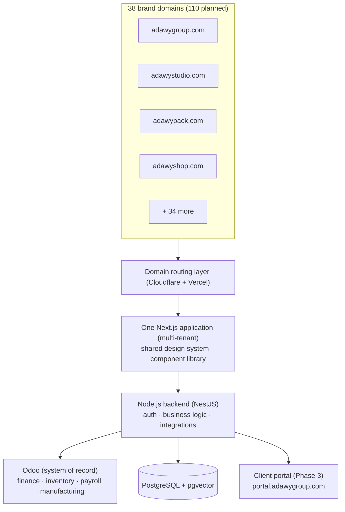

# Products & Architecture

One decision shapes everything we build: **a single codebase serves every
Adawy brand**. Each of the 38 companies keeps its own domain and its own
visual identity; behind the scenes, one Next.js application, one PostgreSQL
database, and one component library power them all.

## Why multi-tenant (the business reason)

- A change to the corporate footer ships **once** and reaches every brand site
  in one deployment, instead of 38 times.
- A security patch protects every domain at once.
- Adding the 39th brand is **configuration, not a build**: point the domain,
  set the brand tokens, pick a template, populate content. Days, not weeks.
- Without this decision, 110 brands would need ~30 engineers. With it, the
  same work is done by 7–8 at maturity.

Each brand site cross-links the parent ("part of Adawy Group") and the
corporate site links out to every sub-brand — the LVMH model: individual brand
identity first, ecosystem connection discoverable. Sub-brands are **not**
subdomains of adawygroup.com because Adawy Studio's clients should feel they
work with a creative studio that is part of a group, not with a corporate
department.

## In this section

- **[Our Systems](/architecture/systems)** — every system we run or are
  replacing, and how they connect.
- **[Tech Stack & Why](/architecture/tech-stack)** — every tool, with the
  reasoning. The principle: **own what we build; avoid subscriptions that
  compound at 110-brand scale.**
- **[Roadmap & Phases](/architecture/roadmap)** — Phase 1 (portfolios) through
  Phase 5 (consolidation), including the seven AI solutions.
- **[Decision Records](/architecture/adrs)** — the significant decisions,
  their context, and their trade-offs.
