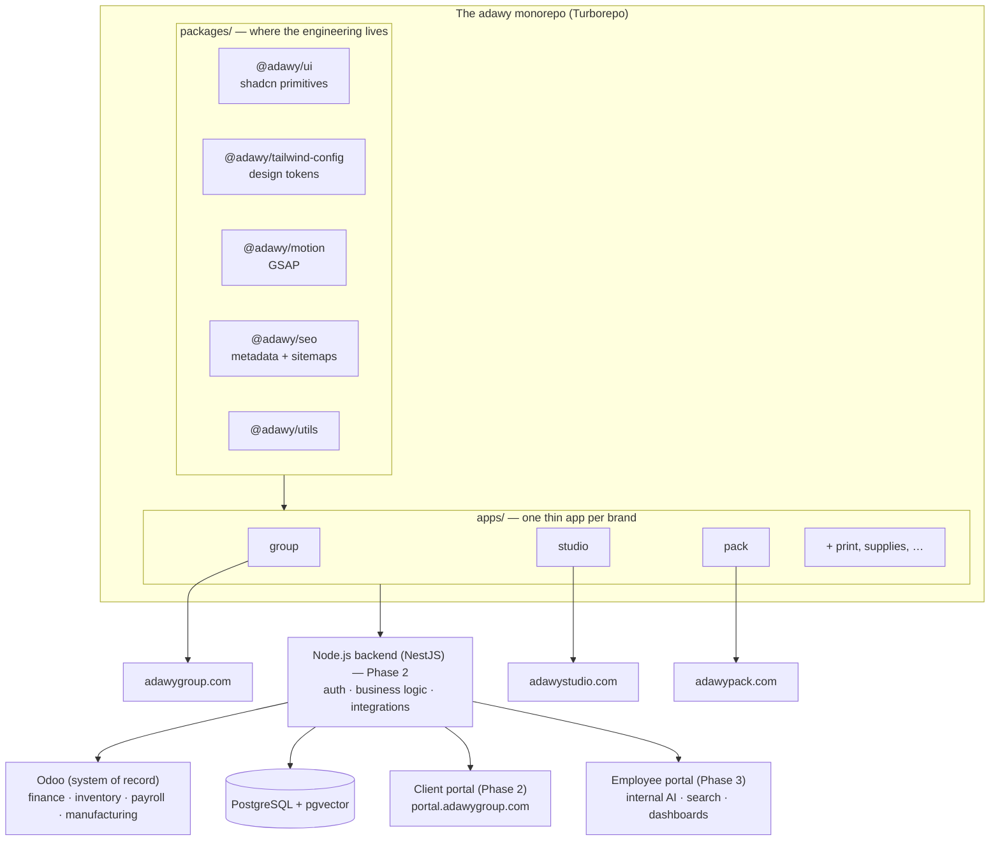

# Products & Architecture

One decision shapes everything we build: **one monorepo, shared packages, a
thin app per brand.** Each of the 38 companies keeps its own domain, its own
visual identity, and its own deployment; behind the scenes, every site is
composed from the same `@adawy/*` packages.

## Why this shape (the business reason)

- A fix in `@adawy/ui` or a token change in `@adawy/tailwind-config` ships
  **from one PR** and reaches every brand site — never the same change ×38.
- Each brand deploys **independently** as its own Vercel project: a bad deploy
  on one site cannot take down the others, and flagship brands keep full
  creative freedom inside their own app.
- Adding the next brand is **a thin app, not a new project**: scaffold under
  `apps/`, set the brand tokens, point the domain, fill content. Days, not
  weeks.
- Without shared packages, 110 brands would need ~30 engineers. With them,
  the same work is done by 7–8 at maturity.

Each brand site cross-links the parent ("part of Adawy Group") and the
corporate site links out to every sub-brand — the LVMH model: individual brand
identity first, ecosystem connection discoverable. Sub-brands are **not**
subdomains of adawygroup.com because Adawy Studio's clients should feel they
work with a creative studio that is part of a group, not with a corporate
department.

## In this section

- **[Our Systems](/architecture/systems)** — every system we run or are
  replacing, and how they connect.
- **[Tech Stack & Why](/architecture/tech-stack)** — every tool, with the
  reasoning. The principle: **own what we build; avoid subscriptions that
  compound at 110-brand scale.**
- **[Roadmap & Phases](/architecture/roadmap)** — the three product phases:
  the websites → the client portal → the employee portal, with AI woven
  through.
- **[Decision Records](/architecture/adrs)** — the significant decisions,
  their context, and their trade-offs.
