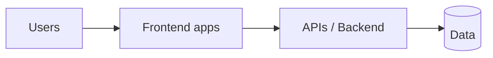

# Products & Architecture

This section explains every system the department runs, how they connect, and —
most importantly — **why each one exists and why it's built the way it is.**

- **[Our Systems](/architecture/systems)** — each product/service, its purpose,
  its users, and how the pieces fit together.
- **[Tech Stack & Why](/architecture/tech-stack)** — every major technology we
  use and the business reason we chose it.
- **[Decision Records](/architecture/adrs)** — significant technical decisions,
  their context, and their trade-offs, recorded as ADRs.

