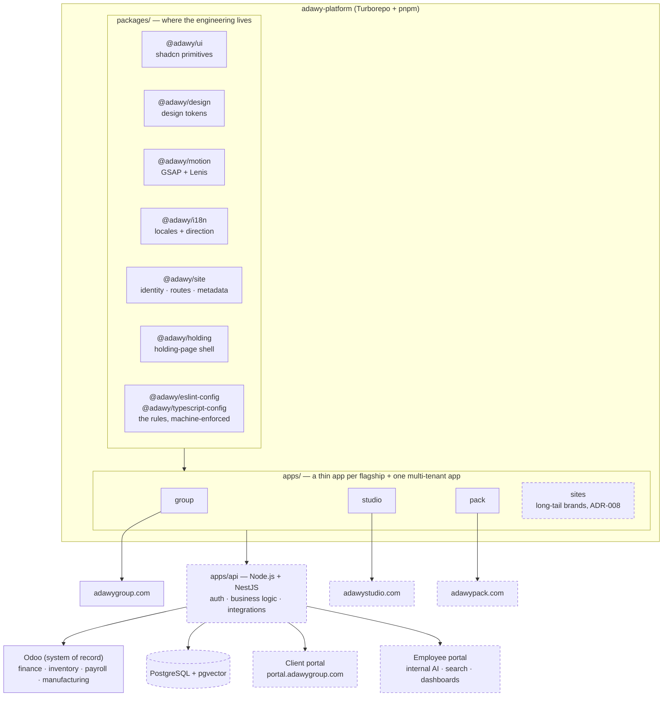

# Products & Architecture

One decision shapes everything we build: **one monorepo, shared packages, a
thin app per brand.** Each of the 38 companies keeps its own domain, its own
visual identity, and its own deployment; behind the scenes, every site is
composed from the same `@adawy/*` packages.

Dashed boxes are **decided but not built**
([the ledger](/architecture/tech-stack#built-decided-deferred--read-this-first)).

```mermaid
flowchart TD
    subgraph MONO["adawy-platform (Turborepo + pnpm)"]
        subgraph PKGS["packages/ — where the engineering lives"]
            UI["@adawy/ui<br/>shadcn primitives"]
            TW["@adawy/design<br/>design tokens"]
            MO["@adawy/motion<br/>GSAP + Lenis"]
            IN["@adawy/i18n<br/>locales + direction"]
            SEOP["@adawy/site<br/>identity · routes · metadata"]
            UT["@adawy/holding<br/>holding-page shell"]
            LINT["@adawy/eslint-config<br/>@adawy/typescript-config<br/>the rules, machine-enforced"]
        end
        subgraph APPS["apps/ — a thin app per flagship + one multi-tenant app"]
            G["group"]
            S["studio"]
            P["pack"]
            N["sites<br/>long-tail brands, ADR-008"]
        end
        PKGS --> APPS
    end
    G --> DG["adawygroup.com"]
    S --> DS["adawystudio.com"]
    P --> DP["adawypack.com"]
    APPS --> BE["apps/api — Node.js + NestJS<br/>auth · business logic · integrations"]
    BE --> ODOO["Odoo (system of record)<br/>finance · inventory · payroll · manufacturing"]
    BE --> DB[("PostgreSQL + pgvector")]
    BE --> PORTAL["Client portal<br/>portal.adawygroup.com"]
    BE --> EMP["Employee portal<br/>internal AI · search · dashboards"]

    classDef planned stroke-dasharray: 5 4;
    class N,BE,DB,PORTAL,EMP,DS,DP planned;
```

| | Built today | Decided, not built |
| --- | --- | --- |
| Apps | `group`, `studio`, `pack` | `sites`, `api` |
| Packages | all **eight** `@adawy/*` | — |
| Domains | adawygroup.com | adawystudio.com, adawypack.com |
| Behind them | — | the backend, PostgreSQL, both portals |

`apps/studio` and `apps/pack` are **holding pages** — one branded screen each,
sharing `@adawy/holding`. They are real apps with real deploys, which is why a
change to `packages/ui` verifies and deploys three apps rather than one.

## Why this shape (the business reason)

- A fix in `@adawy/ui` or a token change in `@adawy/design` ships
  **from one PR** and reaches every brand site — never the same change ×38.
- Each brand deploys **independently** as its own Vercel project: a bad deploy
  on one site cannot take down the others, and flagship brands keep full
  creative freedom inside their own app.
- Adding the next brand is **a config entry, not a new project**: most brands
  are tokens + content in the multi-tenant `apps/sites`
  ([ADR-008](/architecture/adrs)); a brand gets its own thin app only when it
  needs flagship-level customization. Days, not weeks, either way.
- Without shared packages, 110 brands would need ~30 engineers. With them,
  the same work is done by 7–8 at maturity.

Each brand site cross-links the parent ("part of Adawy Group") and the
corporate site links out to every sub-brand — the LVMH model: individual brand
identity first, ecosystem connection discoverable. Sub-brands are **not**
subdomains of adawygroup.com because Adawy Studio's clients should feel they
work with a creative studio that is part of a group, not with a corporate
department.

## In this section

<Cards num={2}>
  <Cards.Card title="Tech Stack & Why" href="/architecture/tech-stack" arrow>
    Every tool, with its reason — and an honest ledger of what is running
    versus what is only decided.
  </Cards.Card>
  <Cards.Card title="Decision Records" href="/architecture/adrs" arrow>
    Twelve decisions, their context and their trade-offs. The fastest way to
    absorb how this team thinks.
  </Cards.Card>
  <Cards.Card title="Design Patterns" href="/architecture/patterns" arrow>
    The five patterns that recur across every repo, each with the failure it
    exists to prevent.
  </Cards.Card>
  <Cards.Card title="Platform Architecture" href="/architecture/platform-architecture" arrow>
    How `apps/group` is actually built: three layers, one WebGL canvas, one
    quality governor.
  </Cards.Card>
  <Cards.Card title="Vocabulary & Map" href="/architecture/glossary" arrow>
    `apps/group`'s own language — which route each feature serves, and what a
    take, a driver or a closer is.
  </Cards.Card>
  <Cards.Card title="Our Systems" href="/architecture/systems" arrow>
    Every system we run or are replacing, and how they connect — including
    Odoo.
  </Cards.Card>
  <Cards.Card title="Roadmap & Phases" href="/architecture/roadmap" arrow>
    The websites → the client portal → the employee portal, and what each
    phase proves.
  </Cards.Card>
</Cards>

<Callout type="info">
  This section describes **Adawy Group's own products**. The department also
  builds software for clients, in standalone repositories with different rules
  — see [Client Projects](/how-we-work/client-projects) and
  [the repository map](/repositories).
</Callout>
