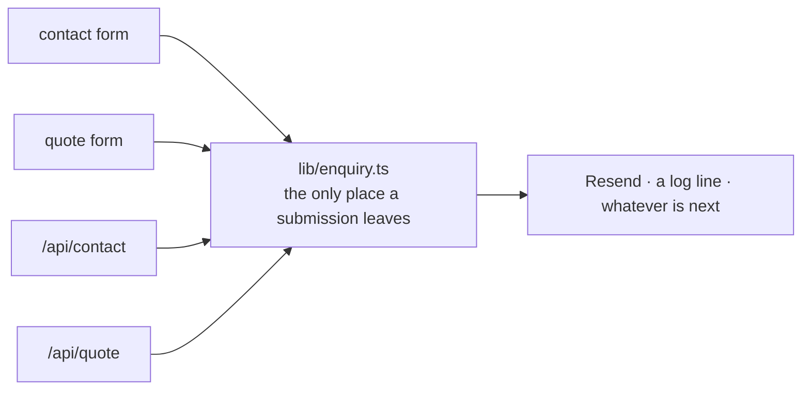
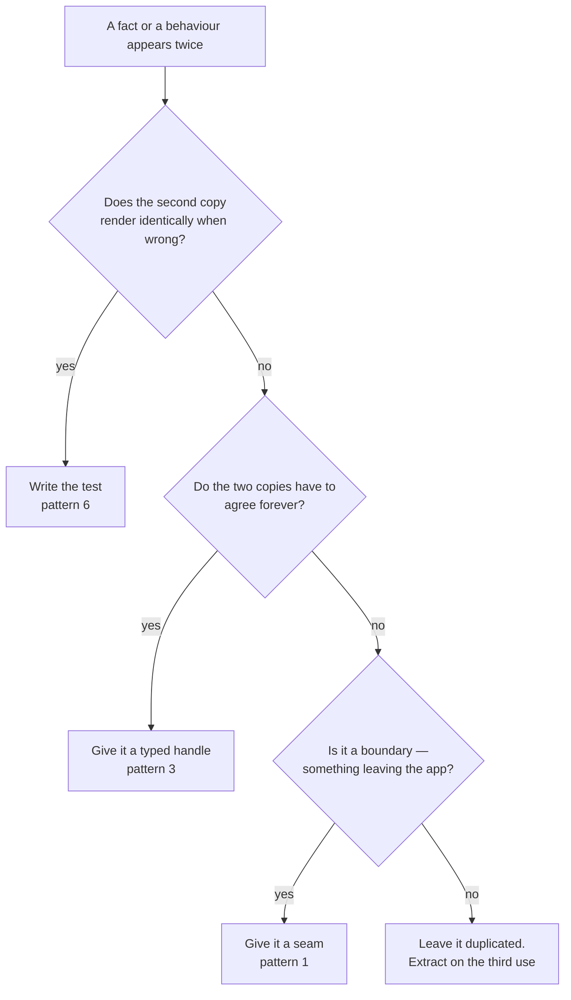

# Design Patterns

Eight repositories, two worlds, no shared code between them
([ADR-010](/architecture/adrs)) — and yet the same seven shapes keep appearing.
They are not house style. Each one is the scar left by a specific bug, and each
is written here with that bug attached, because **a pattern without its failure
mode is a preference.**

Read this before your second week. It is the fastest way to make an unfamiliar
repo in this org feel familiar.

<Callout type="info">
  Every pattern below is in production somewhere you can go and read. Where a
  repo does something different, that is noted too — the exceptions are as
  instructive as the rule.
</Callout>

## 1. The seam

**The shape.** Everything that leaves the application — an email, a plugin
registration, a public origin — goes through **exactly one module**. Callers
know the module; they know nothing about the transport.



**Where it already is:**

| Seam | Repos | What it hides |
| ---- | ----- | ------------- |
| `lib/enquiry.ts` | `aladawy-pack`, `aladawy-shop`, and the mailer in `apps/group` | The mail provider |
| `lib/motion/gsap.ts` (or `@adawy/motion`) | every repo with GSAP | Plugin registration order and the SSR guard |
| `lib/site.ts` | every client repo | Which of three fallbacks resolved the public origin |
| `@/i18n/navigation` | every next-intl repo | The locale prefix on every URL |

**Why, concretely.** Swapping a provider becomes one function body instead of a
search across the codebase — but that is the small win. The large one is that
a seam is the only place a **half-wired** integration can be caught. A mail
transport configured in one of four call sites fails silently in production:
the form submits, the user sees a success state, and the enquiry goes nowhere
for weeks because nothing errors ([forms & enquiries](/guides/forms-and-enquiries)).

**When it does not apply.** A single call site does not need a seam; it *is*
one. Extract when the second caller arrives, not in anticipation of it —
[generalize on the third use](/standards/project-structure).

## 2. Two content trees, one key

**The shape.** Content splits by **whether it survives translation**, not by
subject:

```
lib/content/*      slugs, SKUs, units, dimensions, price bands, image names
messages/*.json    every name, description and label, under the same slug
```

A new product is one entry in the content file plus one block in **each**
message file. A test asserts the locale files share an identical key tree, and
it fails the build.

**Why, concretely.** The alternative — one file per locale carrying both the
structure and the strings — duplicates the catalogue's shape as many times as
there are locales, and the copies drift. Worse, a missing Arabic key is **not**
a compile error and **not** visible in development: it is a runtime hole that
appears for Arabic visitors only, which is the audience least likely to report
it ([i18n & RTL](/standards/i18n-rtl#the-parity-test-is-a-merge-gate)).

**The exception worth knowing.** Facts that are set in Latin in both locales —
a phone number, an address, a country code — live in the **content** tree even
though they are human-readable, because translating them would be wrong.
`adawy-group-links` documents exactly this call in its own source.

**When it does not apply.** Never, in a bilingual product. This is the one
pattern with no defensible exception in this org — retrofitting it is the most
expensive mistake available on a client project.

## 3. The typed handle

**The shape.** Anything addressed by a string that lives in two files gets a
**typed handle** instead: a union, a `Record`, or a constant map. Renaming then
fails the build at every use rather than silently matching nothing.

| Instead of | The repos use | Which turns this into a build error |
| ---------- | ------------- | ----------------------------------- |
| `document.querySelector('[data-why]')` | `anchor("data-why")` / a `MARKER` map (`apps/group`, `jumeira`) | A renamed element that an animation still targets |
| `locale === 'ar' ? 'ar-LY' : locale` | `HREFLANG: Record<Locale, string>` (`jumeira`) | A third locale silently taking the `else` branch in three files |
| A hand-written `['en','ar']` | the list exported by `@adawy/i18n` | French disappearing from a sitemap, a switcher, or a set of `hreflang` alternates |
| A raw `t('Meta.title')` | next-intl's `AppConfig` augmentation (`jumeira`) | A renamed message key rendering its own path as text |

**Why, concretely.** A string shared across two files is a rename waiting to
half-happen, and the half that fails is silent by construction: a selector that
matches nothing does not throw, it just animates nothing. The type system is
the only reviewer that reads every call site every time.

**When it does not apply.** A string used once, in the file that defines it.

## 4. Read once, hand the same object to everyone

**The shape.** Each frame, one place reads **every** input channel into a
single immutable frame object and passes that same object to every consumer.
Consumers never read a channel themselves.

**Where it is.** `apps/group`'s stage: drivers publish normalized scroll
progress to module-singleton channels, the render loop samples all of them
once, and every pass receives the same `StageFrame`
([platform architecture](/architecture/platform-architecture)).

**Why, concretely.** Two consumers reading the same channel at different
moments in one frame see different values, and the picture **tears** — one
element has moved and its neighbour has not. It is also what lets a consumer be
unit-tested with a plain object instead of a live scroll bus, which is why the
choreography maths in both `apps/group` and `jumeira` is testable in Node with
no DOM at all ([testing](/standards/testing)).

**The generalization.** *Read your inputs once at the boundary, then pass
values.* The same instinct is why a quote total is re-derived server-side from
line identities rather than trusted from the client
([forms & enquiries](/guides/forms-and-enquiries)).

**When it does not apply.** Anything not on a per-frame or per-request hot
path. This is a consistency pattern, not a performance one.

## 5. One governor for one question

**The shape.** A question that every effect on a page would otherwise answer
for itself — *is this device struggling?* — is answered **once**, in one
module, and read by everything.

`apps/group`'s performance tier has two states, `full` and `lite`. It is
**downgrade-only** and **session-sticky**, and lite sheds pixels — blur,
backdrop-filters, an ambient-occlusion pass, some device pixel ratio — never
choreography.

**Why, concretely.** Three effects each inventing their own "is this a slow
device" heuristic will disagree, and a page that flips between quality levels
mid-visit is more visible than either steady state. Centralising it also makes
the invariants statable: *no fps cap ever* (a 3D layer at a capped frame rate
judders against native-refresh DOM, which reads as broken in a way a slightly
softer image never does), and *read the tier, never cache it* (it resolves
lazily and can change once mid-session).

**The generalization.** Any cross-cutting question with more than one asker —
device capability, connection speed, reduced-motion, theme — belongs to one
module. `jumeira` reaches the same conclusion from a different direction: its
bandwidth probe is a **measurement**, deliberately not `navigator.connection`,
because that API does not exist in Safari and its `effectiveType` reports `4g`
from about 700 kbps up.

<Callout type="important">
  **`prefers-reduced-motion` is a separate axis from quality, and never a
  substitute for it.** Reduced motion is accessibility and removes the
  animation; the tier is quality and keeps it. Conflating them ships a
  degraded experience to someone who asked for a calm one.
</Callout>

## 6. Enforce it, do not document it

**The shape.** A rule that a reviewer would otherwise have to remember is
written as a lint rule, a test, or a type — so it **fails the build**.

| The rule | How it is enforced |
| -------- | ------------------ |
| `platform/` never imports `features/`; `lib/` holds no React | `no-restricted-imports` blocks **generated from the layering** in `apps/group/eslint.config.js` |
| Layouts mirror in Arabic | Physical Tailwind classes (`ml-`, `left-`, `text-left`) are **errors**, with the replacement in the message |
| GSAP is registered once | `gsap`/`lenis` imports banned outside the motion gateway |
| Every URL carries its locale | `next/link` and `next/navigation`'s router APIs banned in app code |
| Locale files agree | The message-parity gate |
| The Arabic brand is عدوى, never أدوي | A spelling test, because *"nothing about writing a new Arabic string makes the wrong form look wrong — one dotless letter"* |
| A `tel:` matches its displayed number | A test, because *"`tel:` and `mailto:` are invisible to the eye but are what a tap actually dials"* |
| A publishing switch is set in **both** places it must be | A test holding the two copies together |

**Why, concretely.** The department's own history is the argument: the
accessibility findings on the old site were all things a checklist was supposed
to catch, which is why accessibility is now an axe-core merge gate rather than
a review opinion ([testing](/standards/testing)). *A rule that only exists in a
document gets skipped on the busy week.*

**The decision rule.** Ask: **would this mistake look like a mistake?** If a
reviewer scanning the diff would see it, prose is enough. If it renders
identically whether it is right or wrong — a `tel:` href, an Arabic letter, a
keyframe count, a second copy of a constant — it belongs in a test.

**When it does not apply.** Judgement. Naming, structure, whether a section
earns its place: no rule catches those, and pretending otherwise produces lint
rules people disable.

## 7. Generated output is committed, and never hand-edited

**The shape.** Optimised images, logo components, font subsets, baked pattern
tiles, encoded video and OG assets are produced by **hand-run scripts** whose
source artwork usually lives outside the repository — and their **output is
committed**.

**Why, concretely.** CI cannot reproduce them (it does not have the masters),
so a clean clone must build without them. Committing the output is what makes
that true. The cost is a rule that has to be stated because nothing enforces
it: **do not delete a baked file expecting to rebake it**, and do not hand-edit
a generated one — regenerate it.

**Where it bites.** `adawy-group-links` bakes its background pattern to a PNG
because a viewport-sized SVG pattern stalled headless capture — and `public/`
is in `.prettierignore`, so editing the geometry without re-baking changes
nothing on screen **and nothing flags it**.

**When it does not apply.** Anything the build can produce from tracked
sources. Then it belongs in `.gitignore`, and committing it is noise in every
future diff.

## Choosing between them

Most of the time the question is not *which pattern* but *does this deserve
one yet*:



The last box is deliberate. **Two is a coincidence; three is a pattern** —
extracting on the second use is how a shared abstraction ends up shaped by one
caller and fought by the next ([project structure](/standards/project-structure)).
