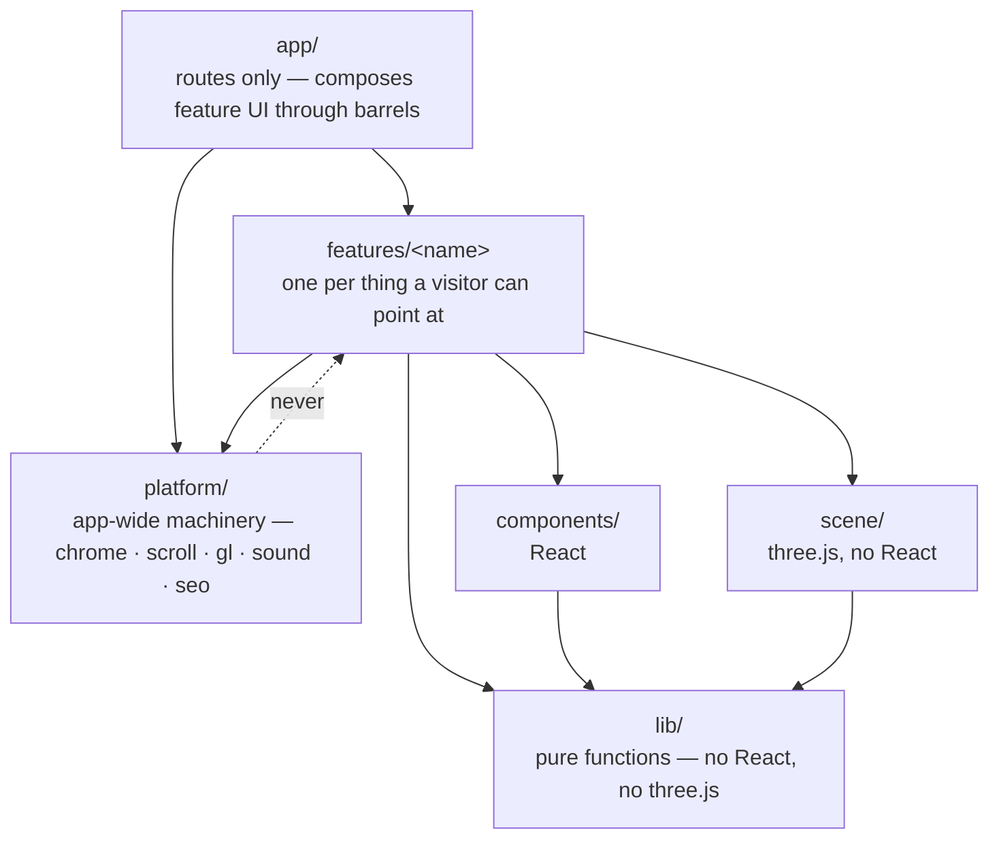
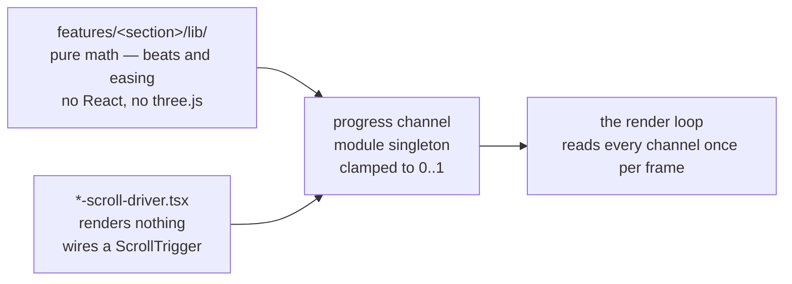

# Platform Architecture

`apps/group` is the most technically dense thing the department has built: a
single scroll narrative where most sections drive 3D. Four ideas hold it
together, and knowing them is the difference between adding a section in an
afternoon and breaking the whole page.

This page is the **orientation**. The file-level detail lives in the platform
repo, and deliberately not here — see [where each fact lives](#where-each-fact-lives)
at the bottom.

## 0. The layout, drawn

**Routes in `app/`, things you can see in `features/`, machinery in
`platform/`.** That one sentence is the whole layout;
[ADR-011](/architecture/adrs) carries the decision, what it replaced and what
it cost, and [Vocabulary & Map](/architecture/glossary) maps every route to its
feature. This is the picture — because the arrow that is **not** allowed is the
part prose keeps losing.

The dotted edge below is a `no-restricted-imports` error: the eslint config
*generates* those blocks from the layering, so the rule and the structure
cannot drift apart, and CI fails on a breach.

The four-line boundary law is stated in full in
[ADR-011](/architecture/adrs). What is worth carrying in your head while you
work:

- **`platform/` never imports `features/`.** Machinery that knows about a
  specific section is no longer machinery, and this is the edge that decays
  first.
- **`app/` composes feature *UI* through barrels — but a feature's `lib/`
  stays importable.** Pages need metadata fragments and actions need domain
  logic; routing those through a UI barrel would be ceremony.
- **`lib/` is the only layer with unit tests,** and it is testable precisely
  because it imports neither React nor three.js.

## 1. One canvas, many passes

There is exactly **one WebGL context for the entire page**, mounted once and
positioned `fixed inset-0`. Everything 3D is a *pass* on that one renderer —
the Why-Choose crystal is a second pass on the same context, not a second
canvas.

- `platform/gl/gl-canvas.tsx` is the only WebGL host: canvas element,
  create/dispose, theme pushes. A scene is a `create` function returning
  `{ dispose, applyTheme? }`.
- `features/stage/scene/runtime.ts` builds the kernel — renderer, scene, image-based
  lighting, camera, lights, group hierarchy.
- `features/stage/scene/create-stage.ts` is wire-up only: framing, resize, theme, and
  the rAF loop.
- `features/stage/scene/stage-pass.ts` is the contract.

Each frame, the stage reads **every progress channel once** into a `StageFrame`
and hands that same object to every pass. Passes never read channels
themselves. That single rule is what stops a frame tearing, and what lets a
pass be unit-tested without a live scroll bus.

**Adding a take is three edits:** a module implementing `StagePass`, one entry
in `scenePasses`, one entry in `STAGE_CHANNELS`. The frame type, the per-frame
sample, and the moved-since-last-draw check all derive from that map — there is
deliberately no fourth place to forget.

<Callout>
  If you find yourself writing a second WebGL host, you want a pass instead.
</Callout>

## 2. Driver → channel → stage

Every scroll-driven section splits the same three ways. Follow it when you add
one.

1. **Pure math in `features/<section>/lib/`** — beat thresholds and easing as plain
   functions of normalized progress `p ∈ [0,1]`, importing no React and no
   three.js. This is the only layer with unit tests, and it is where the
   choreography actually lives.
2. **A module-singleton progress channel** the driver publishes to and the
   render loop reads. Neither side imports the other's machinery.
3. **A `*-scroll-driver.tsx` that renders nothing** — it wires a ScrollTrigger
   and calls `apply(p)`.

**Reduced motion is the load-bearing consequence.** The scrub-driver hook
early-exits on `prefers-reduced-motion` *before the factory runs*, so under
reduced motion **no ScrollTrigger is ever created**. The section's CSS defaults
must therefore already be a real, legible layout. If a static render only looks
right because a driver fixed it up, the reduced-motion path is broken — and no
test will tell you, because there is nothing to test.

### Two rules the tests enforce

**Address elements through `platform/scroll/lib/anchors.ts`, never a raw selector
string.** JSX spreads `{...anchor("data-why")}`; drivers call
`query("data-why")`. Both sides take the same union, so renaming an anchor
fails the build at every use instead of silently matching nothing. A test fails
on any raw `[data-*]` selector left in source.

**Per-frame writes go through `createStageWriter()`, never `el.style.x =`.** It
owns the last-value cache every driver used to hand-roll, and gives that cache
exactly one way to be dropped: `reset()`. Call it wherever the DOM moved under
the cache — a re-measure, a seam crossed at speed, a restage. Both bugs this
layer has shipped were a hand-rolled memo that only cleared the values whoever
wrote the branch remembered.

## 3. The performance tier

`platform/perf/lib/perf-tier.ts` is a site-wide quality governor with two states,
`"full"` and `"lite"`. It exists so "this device is struggling" is answered
**once**, rather than by each effect inventing its own answer.

A device lands in lite two ways, and **only ever downwards**: a conservative
static hardware prior on first read, or a runtime monitor watching frame deltas
and downgrading on sustained jank. Downgrade-only and session-sticky, because
quality flip-flopping mid-visit is more visible than either steady state.

**Lite sheds pixels, never choreography.** Models, materials, lighting and beat
timing are identical in both tiers; what goes is per-tick blur, glass
backdrop-filters, an ambient-occlusion pass, and some device pixel ratio.

Four invariants any new effect owes the governor:

- **No fps cap, ever.** The render loop is demand-driven and uncapped. Degrade
  via DPR. A 3D layer at a capped frame rate judders against native-refresh
  DOM, which reads as a broken site in a way a slightly softer image never
  does.
- **Lite must lose nothing legible.** If switching to lite changes what a
  section *says*, it is choreography and does not belong behind the tier.
- **Read the tier, do not cache it.** It resolves lazily and can change once
  mid-session; a value captured at module load is wrong for every device the
  monitor downgrades.
- **Reduced motion is a separate axis.** `prefers-reduced-motion` is
  accessibility and removes the animation; the tier is quality and keeps it.
  Neither substitutes for the other.

## Where each fact lives

The handbook and the platform repo divide the work on one rule: **one fact, one
home.**

| | Says | Lives in |
| --- | --- | --- |
| **This handbook** | *Why*, and *what we require* — policy, standards, decisions | `adawy-technical-docs`, public |
| **`adawy-platform/docs/`** | *How it works here* — file paths, line references, the bug ledger | The platform repo, next to the code |

Mechanics that change when the code changes belong beside the code, where the
PR that breaks them is the PR that fixes them. A page in this handbook that
duplicated a file path would go stale silently, because nothing here fails when
the platform is refactored.

In the platform repo:

| File | Covers |
| ---- | ------ |
| `docs/pitfalls.md` | The bug ledger — read it before your first scroll take |
| `docs/stage.md` | The canvas and the driver → channel → stage split, in full |
| `docs/perf.md` | The tier, and what a new effect owes it |
| `docs/shipping.md` | What is tracked, what is generated, what never ships |
| `AGENTS.md` | The shadcn contract — why you edit the component, not the call site |
| `PRODUCT.md` | Brand personality, design principles, anti-references |

You need repository access to read those. If you have been given work on
`apps/group` and cannot open them, that is a missing-access problem — ask
([who to ask](/help/who-to-ask)).
