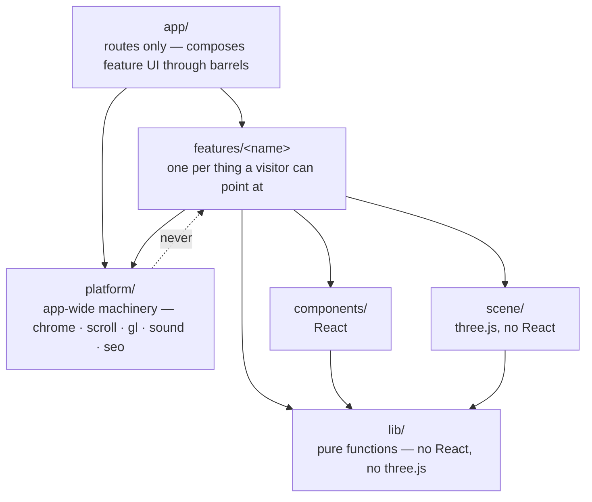
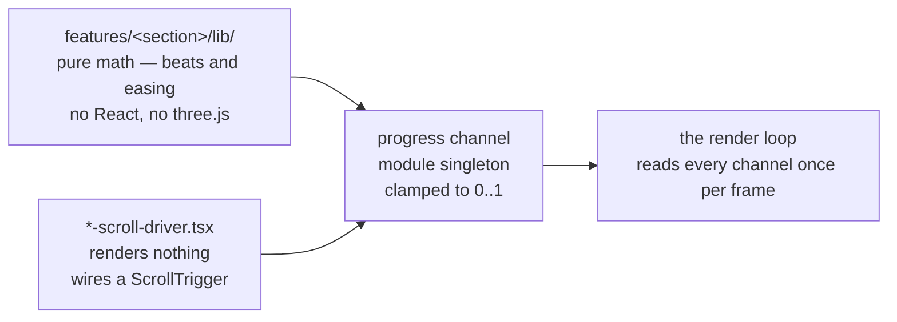
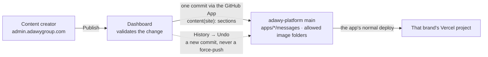
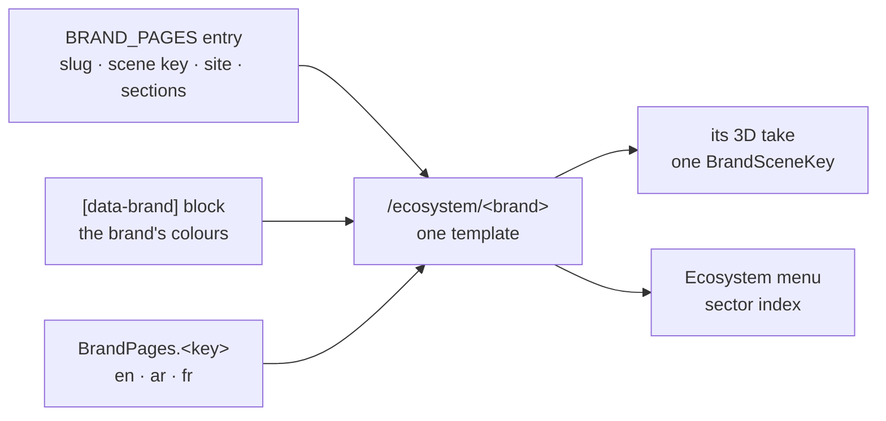

# Platform Architecture

`apps/group` is the most technically dense thing the department has built: a
home page that is a single scroll narrative where most sections drive 3D, and
thirteen company pages that each play a 3D take of their own. A handful of
ideas hold it together, and knowing them is the difference between adding a
section in an afternoon and breaking the whole page.

The other thirty apps in the monorepo are much simpler (a holding page or the
studio's one-page site) and are covered on
[the repository page](/repositories/adawy-platform).

This page is the **orientation**. The file-level detail lives in the platform
repo, and deliberately not here — see [where each fact lives](#where-each-fact-lives)
at the bottom.

## 0. The layout, drawn

**Routes in `app/`, things you can see in `features/`, machinery in
`platform/`.** That one sentence is the whole layout;
[ADR-011](/architecture/adrs) carries the decision, what it replaced and what
it cost, and [Vocabulary & Map](/architecture/glossary) maps every route to its
feature. This is the picture — because the arrow that is **not** allowed is the
part prose keeps losing.

The dotted edge below is a `no-restricted-imports` error: the eslint config
*generates* those blocks from the layering, so the rule and the structure
cannot drift apart, and CI fails on a breach.

```mermaid
flowchart TD
    APP["app/<br/>routes only — composes feature UI through barrels"]
    FEAT["features/&lt;name&gt;<br/>one per thing a visitor can point at"]
    PLAT["platform/<br/>app-wide machinery — chrome · scroll · gl · sound · seo"]
    C["components/<br/>React"]
    S["scene/<br/>three.js, no React"]
    L["lib/<br/>pure functions — no React, no three.js"]
    APP --> FEAT
    APP --> PLAT
    FEAT --> PLAT
    FEAT --> C
    FEAT --> S
    FEAT --> L
    C --> L
    S --> L
    PLAT -.->|"never"| FEAT
```

The four-line boundary law is stated in full in
[ADR-011](/architecture/adrs). What is worth carrying in your head while you
work:

- **`platform/` never imports `features/`.** Machinery that knows about a
  specific section is no longer machinery, and this is the edge that decays
  first.
- **`app/` composes feature *UI* through barrels — but a feature's `lib/`
  stays importable.** Pages need metadata fragments and actions need domain
  logic; routing those through a UI barrel would be ceremony.
- **`lib/` is the only layer with unit tests,** and it is testable precisely
  because it imports neither React nor three.js.

## 1. One canvas, many passes

The home page has exactly **one WebGL context**, mounted once and positioned
`fixed inset-0`. Everything 3D on it is a *pass* on that one renderer. The
entrance field (machined tiles laid ring by ring around the Adawy mark, which
then stands up out of the pattern) is one pass, and the Why-Choose crystal is
another, on the same context rather than a second canvas.

- `platform/gl/gl-canvas.tsx` is the only WebGL host: canvas element,
  create/dispose, theme pushes. A scene is a `create` function returning
  `{ dispose, applyTheme? }`.
- `features/stage/scene/runtime.ts` builds the kernel — renderer, scene, image-based
  lighting, camera, lights, group hierarchy.
- `features/stage/scene/create-stage.ts` is wire-up only: framing, resize, theme, and
  the rAF loop.
- `features/stage/scene/stage-pass.ts` is the contract.

Each frame, the stage reads **every progress channel once** into a `StageFrame`
and hands that same object to every pass. Passes never read channels
themselves. That single rule is what stops a frame tearing, and what lets a
pass be unit-tested without a live scroll bus.

**Adding a take is three edits:** a module implementing `StagePass`, one entry
in `scenePasses`, one entry in `STAGE_CHANNELS`. The frame type, the per-frame
sample, and the moved-since-last-draw check all derive from that map — there is
deliberately no fourth place to forget.

A pass can own the camera for a while. The entrance field runs after the
crane and keeps the camera until its hand-off completes. Its mark uses the
About mark model's own finish and lighting at the same depth, so the scroll
hand-off can be a cut made while the turning mark is edge-on, and nothing
visibly jumps.

<Callout>
  If you find yourself writing a second WebGL host, you want a pass instead.
</Callout>

**The entrance waits for the stage, not for a timer.** The preloader sends
one-shot signals: *warm* (heavy init may run behind the splash), *entered*
(the splash clears) and *revealed* (the header, scroll cue and sound dock
arrive). The home page holds *revealed* for its own entrance: a year counter
runs from 1971 while the stage boots, waits until the stage reports itself
compiled, and only then builds the field, so a slow GPU stretches the count
instead of dropping frames in the first shot. Every other page keeps the
drawn-mark splash. Heavy init belongs on *warm*, never on a visitor's first
gesture, because on a phone the first gesture is a scroll.

## 2. Driver → channel → stage

Every scroll-driven section splits the same three ways. Follow it when you add
one.

```mermaid
flowchart LR
    A["features/&lt;section&gt;/lib/<br/>pure math — beats and easing<br/>no React, no three.js"] --> B["progress channel<br/>module singleton<br/>clamped to 0..1"]
    B --> C["the render loop<br/>reads every channel once per frame"]
    D["*-scroll-driver.tsx<br/>renders nothing<br/>wires a ScrollTrigger"] --> B
```

1. **Pure math in `features/<section>/lib/`** — beat thresholds and easing as plain
   functions of normalized progress `p ∈ [0,1]`, importing no React and no
   three.js. This is the only layer with unit tests, and it is where the
   choreography actually lives.
2. **A module-singleton progress channel** the driver publishes to and the
   render loop reads. Neither side imports the other's machinery.
3. **A `*-scroll-driver.tsx` that renders nothing** — it wires a ScrollTrigger
   and calls `apply(p)`.

**Reduced motion is the load-bearing consequence.** The scrub-driver hook
early-exits on `prefers-reduced-motion` *before the factory runs*, so under
reduced motion **no ScrollTrigger is ever created**. The section's CSS defaults
must therefore already be a real, legible layout. If a static render only looks
right because a driver fixed it up, the reduced-motion path is broken — and no
test will tell you, because there is nothing to test.

### Two rules the tests enforce

**Address elements through `platform/scroll/lib/anchors.ts`, never a raw selector
string.** JSX spreads `{...anchor("data-why")}`; drivers call
`query("data-why")`. Both sides take the same union, so renaming an anchor
fails the build at every use instead of silently matching nothing. A test fails
on any raw `[data-*]` selector left in source.

**Per-frame writes go through `createStageWriter()`, never `el.style.x =`.** It
owns the last-value cache every driver used to hand-roll, and gives that cache
exactly one way to be dropped: `reset()`. Call it wherever the DOM moved under
the cache — a re-measure, a seam crossed at speed, a restage. Both bugs this
layer has shipped were a hand-rolled memo that only cleared the values whoever
wrote the branch remembered.

## 3. The performance tier

`platform/perf/lib/perf-tier.ts` is a site-wide quality governor with two states,
`"full"` and `"lite"`. It exists so "this device is struggling" is answered
**once**, rather than by each effect inventing its own answer.

A device lands in lite two ways, and **only ever downwards**: a conservative
static hardware prior on first read, or a runtime monitor watching frame deltas
and downgrading on sustained jank. Downgrade-only and session-sticky, because
quality flip-flopping mid-visit is more visible than either steady state.

**Lite sheds pixels, never choreography.** Models, materials, lighting and beat
timing are identical in both tiers; what goes is per-tick blur, glass
backdrop-filters, the drifting backdrop, and some device pixel ratio. There
is no ambient-occlusion pass left to shed: #313 removed it from the
Ecosystem pit and the brand scenes outright, because it cost 15 to 20 ms of
GPU per frame on a fast laptop for crease shading almost nobody could see.

Four invariants any new effect owes the governor:

- **No fps cap, ever.** The render loop is demand-driven and uncapped. Degrade
  via DPR. A 3D layer at a capped frame rate judders against native-refresh
  DOM, which reads as a broken site in a way a slightly softer image never
  does.
- **Lite must lose nothing legible.** If switching to lite changes what a
  section *says*, it is choreography and does not belong behind the tier.
- **Read the tier, do not cache it.** It resolves lazily and can change once
  mid-session; a value captured at module load is wrong for every device the
  monitor downgrades.
- **Reduced motion is a separate axis.** `prefers-reduced-motion` is
  accessibility and removes the animation; the tier is quality and keeps it.
  Neither substitutes for the other.

## 4. Commits that do not come from a developer

Once the [content dashboard](/repositories/adawy-dashboard) goes live, some
commits on `main` will come from it rather than from a person at a keyboard.
It edits two things in each platform app and nothing else: the locale files in
`apps/<app>/messages/`, and images in a short allow-list of folders
(`apps/group/public/about` and `public/partners`, for example). A server-side
path guard refuses everything outside those paths.

```mermaid
flowchart LR
    U["Content creator<br/>admin.adawygroup.com"] -->|"Publish"| D["Dashboard<br/>validates the change"]
    D -->|"one commit via the GitHub App<br/>content(site): sections"| G["adawy-platform main<br/>apps/*/messages · allowed image folders"]
    G -->|"the app's normal deploy"| V["That brand's Vercel project"]
    D -.->|"History → Undo<br/>a new commit, never a force-push"| G
```

What that asks of anyone working in the platform:

- **The message key tree is yours; the string values are shared.** The
  dashboard never adds, removes or renames a key, and it refuses to publish a
  value whose placeholders (`{name}`) or rich tags (`<accent>`) differ from the
  original. Renaming a key is still a code change — and it is the one that can
  collide with a pending dashboard edit, so land it on its own.
- **An image in an allow-listed folder can be replaced under you.** The
  dashboard keeps the path, the pixel size and the format, so the code never
  needs to change — but a component must not assume what the picture shows.
- **Pull before you edit a message file.** A content creator may have changed
  it since your branch started, and a text merge of two edits to one JSON value
  is a conflict you then resolve by hand.

Until go-live the dashboard publishes to a practice repository and none of this
reaches `adawy-platform` ([ADR-014](/architecture/adrs)).

## 5. Thirteen brand pages, one template

Every company page under `/ecosystem/<brand>` is the same route rendering one
entry of `BRAND_PAGES`: the six flagships (Studio, Pack, Print, Supplies,
Marketing, Business Development) and Software, Private Label, Production,
Media Production, Events, AI and Law Firm. **Structure is data, colour is a
`[data-brand]` block in CSS, and copy is a `BrandPages.<key>` message tree**,
so a fourteenth page is entries, not a new route. The Ecosystem menu groups companies by sector (Brand & Media, Make & Supply,
Digital & AI, Business & Legal), and its sector map is a full `Record` over
the company keys, so a company added without a sector fails to build.

```mermaid
flowchart LR
    REG["BRAND_PAGES entry<br/>slug · scene key · site · sections"] --> PAGE["/ecosystem/&lt;brand&gt;<br/>one template"]
    CSS["[data-brand] block<br/>the brand's colours"] --> PAGE
    MSG["BrandPages.&lt;key&gt;<br/>en · ar · fr"] --> PAGE
    PAGE --> TAKE["its 3D take<br/>one BrandSceneKey"]
    PAGE --> MENU["Ecosystem menu<br/>sector index"]
```

**Each page plays one take, and a take belongs to one brand.** The scene is
chosen by a single `BrandSceneKey` (`atelier`, `products`, `print`, …,
`agreement`) rather than a flag per scene, so a brand cannot claim two. The
seven newer pages arrived on 2026-10-01 (#323), and the same change rebuilt
all thirteen takes around one rule: the model *is* the brand idea (Pack's printed sheet folding into a box, Law Firm's agreement
initialled, signed and sealed), on real models from Blender bakes and Poly
Haven scans, and tuned for light, dark, Arabic and phones.

**Every take runs on one scene host**, which owns the lifecycle so a scene
owns only its choreography and what it draws:

- **It pauses off screen and frees everything on dispose.** A leaked renderer
  holds a WebGL context against the browser's limit and breaks the reader's
  *next* page, not this one, so the failure lands far from its cause.
- **It sheds pixels, not frames.** A resolution governor watches frame
  intervals while a take is drawing and lowers the pixel ratio a step when too
  many miss the display's deadline, under a hard cap of about 3.6 million
  pixels. Fragment cost scales with pixel count, and a 4K canvas would
  otherwise drop frames on hardware that runs a laptop screen smoothly. This
  is the [performance tier](#3-the-performance-tier)'s rule (degrade via DPR,
  never cap the frame rate) applied per scene.
- **It draws the whole take before showing it.** `warmTake` renders the scene
  at thirteen points along its progress while it is still hidden. Compiling
  shaders is not enough: the GPU driver builds its pipeline state the first
  time an object is drawn into a target, and an object first met mid-scroll
  stalls that frame by tens of milliseconds.
- **It knows when to draw one still.** Reduced motion always gets a single
  frame. The heavy product takes also reduce under Save-Data, on a device
  reporting 2 GB of memory or less, or on a software GL renderer.

**Not everything that moves is WebGL.** Software's Selected Work is a reel of
screen recordings of four live flagship sites in a plain browser window,
wiped one over the next by scroll, with an index of the rest below (#332).
It went through a three.js light table and a CSS 3D "exploded build" in the
same week before landing there, because those spent their pixels on the
process and showed sites whose craft *is* motion as a single still. Pick the
medium by what the visitor needs to see. A recording that plays by itself
needs a pause control (WCAG 2.2.2), loads only near the screen, and plays only
while in view.

**A brand page links out only to a real domain.** Each entry's `site` stays
`null` until that brand's own app has a `PRODUCTION_HOST`, and a `null` site
hides the hero's "Visit site" pill (#328). The `*.vercel.app` holding apps are
`noindex` placeholders on a platform hostname, and the group site should not
send a visitor to an address the brand will not keep.

## Where each fact lives

The handbook and the platform repo divide the work on one rule: **one fact, one
home.**

| | Says | Lives in |
| --- | --- | --- |
| **This handbook** | *Why*, and *what we require* — policy, standards, decisions | `adawy-technical-docs`, public |
| **`adawy-platform/docs/`** | *How it works here* — file paths, line references, the bug ledger | The platform repo, next to the code |

Mechanics that change when the code changes belong beside the code, where the
PR that breaks them is the PR that fixes them. A page in this handbook that
duplicated a file path would go stale silently, because nothing here fails when
the platform is refactored.

In the platform repo:

| File | Covers |
| ---- | ------ |
| `docs/pitfalls.md` | The bug ledger — read it before your first scroll take |
| `docs/stage.md` | The canvas and the driver → channel → stage split, in full |
| `docs/perf.md` | The tier, and what a new effect owes it |
| `docs/shipping.md` | What is tracked, what is generated, what never ships |
| `AGENTS.md` | The Next.js and Turborepo warnings, and the shadcn contract — why you edit the component, not the call site |
| `packages/brand-app/README.md` | The holding-app shell, and what each glyph-brand app still owns |
| `PRODUCT.md` | Brand personality, design principles, anti-references |

You need repository access to read those. If you have been given work on
`apps/group` and cannot open them, that is a missing-access problem — ask
([who to ask](/help/who-to-ask)).
