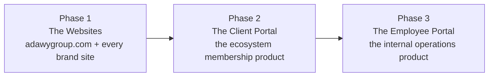

# Roadmap & Phases

The platform is delivered in three product phases, in strict order. Each phase
ships a complete product surface and proves the foundation the next one
builds on. **Phase 1 is the firm commitment** — later phases are direction,
reviewed against actual delivery before continuing.

| Phase | Product | What it proves |
| ----- | ------- | -------------- |
| 1 | **The Websites** — adawygroup.com, Adawy Studio, Adawy Pack, Adawy Print, and every other brand site | The monorepo platform and the design system |
| 2 | **The Client Portal** — the daily product of being an ecosystem member | The backend, Odoo integration, auth, and member-facing AI |
| 3 | **The Employee Portal** — one internal home for the group's teams | Internal AI, search, and operational intelligence |

## Phase 1 — The Websites

The entire public face of the group, rebuilt on one platform. Order of
delivery, priority first:

1. **adawygroup.com** (`apps/group`) — the corporate site and the first app
   in the monorepo. Building it builds the permanent foundation: the
   `@adawy/*` packages (ui, tailwind-config, motion, seo, utils), hosting,
   domains, and the deployment pipeline. Committed dates:
   [kickoff 14 June → launch 23 July 2026](/about/timeline).
2. **Adawy Studio** (`apps/studio`) — the creative flagship; sets the design
   bar and hardens the shared packages against a second, very different
   brand identity.
3. **Adawy Pack** (`apps/pack`) — the industrial flagship; establishes the
   industrial patterns that Print, Production, and Supplies reuse.
4. **Adawy Print, Adawy Supplies, Adawy Marketing Solutions, Adawy Business
   Development, Adawy Media Production, Adawy Production, and the rest** —
   each a thin new app composed from the mature packages
   ([the workflow](/guides/launch-new-brand)). Six weeks per site becomes
   one week per site as the packages mature.

Every site ships to the same bar: bilingual-ready (EN/AR), WCAG 2.1 AA,
Lighthouse mobile ≥ 94, structured data, analytics, and the "part of Adawy
Group" cross-link.

**Deliberately not in Phase 1:** the portals, AI features, Odoo integration,
e-commerce. Ship excellent websites, prove the platform, then add scope.

## Phase 2 — The Client Portal

The experience of *being* an Adawy ecosystem member, at
`portal.adawygroup.com`. Without it, "integrated ecosystem" is a marketing
claim; with it, it is a product members use every day — and the most
defensible thing the group can build, because no regional competitor operates
the integrated stack that makes it possible.

Phase 2 starts with the infrastructure the portal needs, which also unlocks
the shop:

- **The shared backend service** (Node.js/NestJS): authentication (Better
  Auth), business logic, background jobs, real-time updates.
- **Odoo integration** — read products, inventory, orders, invoices; write
  back through APIs behind an abstraction layer ([ADR-003](/architecture/adrs)).
- **Aladawy Shop rebuilt** on the platform — custom commerce, Paymob + Fawry
  ([ADR-005](/architecture/adrs)).

Then the portal itself. What members can do:

- See **all orders across every sub-brand** in one place, status pulled from Odoo
- Download **brand assets** organized by project
- **Request new work** through structured intake forms (replacing email/WhatsApp)
- View **invoices and payment history**, with online payment
- Chat with the **AI assistant** about orders, projects, and history
- Manage **team access** with per-person permissions

Member-facing AI lands here too: the **portal assistant** (quotes, orders,
briefs drafted through conversation — always human-reviewed, never
autonomous) and **lead scoring** on every form across the brand sites.

## Phase 3 — The Employee Portal

One internal home for the group's teams — the same idea as the client portal,
pointed inward. Today group knowledge is scattered across email, WhatsApp,
Drive, Notion, and Odoo; finding any single piece takes minutes and depends on
knowing where to look.

- **Internal AI assistant** — ask in natural language, answered from the
  group's own systems (RAG over pgvector), permissions respected
- **Internal search** across Notion, Drive, Slack, Odoo, and email — the
  lowest-glamour feature with possibly the highest daily value
- **Operational dashboards** — sales, operations, and marketing leadership
  views (Metabase), including **manufacturing intelligence** over Odoo's
  production data: line efficiency, anomalies, supplier signals
- **The content engine** — first-draft bilingual content in each brand's
  voice, with a human review queue; at 100+ brands content cannot be written
  by hand alone
- **Employee-facing workflows** — the structured versions of what currently
  happens over chat: requests, approvals, handoffs

## Beyond the phases

Once all three products are live: geographic scale-out (KSA, UAE, Libya, GCC —
localization, currency, regional payments), e-commerce as a service to
ecosystem members, the Odoo-vs-SAP evaluation, security/compliance hardening,
and specialist hires (AI, security, data). Direction, not commitments —
decided against real delivery.

## How the team grows

| Phase | Team size | Added roles |
| ----- | --------- | ----------- |
| 1 — Websites | 2 → 3–4 | Current team (CTO + designer); a second frontend developer once template volume demands it |
| 2 — Client Portal | 4–6 | Senior backend engineer (first hire of the phase — nothing in Phase 2 starts without the backend), part-time DevOps |
| 3 — Employee Portal | 7–9 | Engineering manager, mid-level full-stack engineers, senior analytics engineer; QA + second designer when workload requires |

Every hire is justified by specific work the current team cannot complete —
no role is added until the prior phase's delivery proves the need.

## Known risks and how we manage them

1. **Hiring is slow** → start the backend search during Phase 1, recruit at
   the top of the market, consider regional remote.
2. **Odoo integration complexity** → engage the Odoo administrator before
   Phase 2; scope the first delivery to read-only if needed.
3. **Scope creep across the brand portfolio** → template policy from day one:
   sub-brands configure within templates; custom work only for flagships,
   explicitly scoped. Platform-wide consistency beats any single brand's
   preference.
4. **FX exposure** → favor self-hosted/usage-priced services; largest costs in
   local currency.
