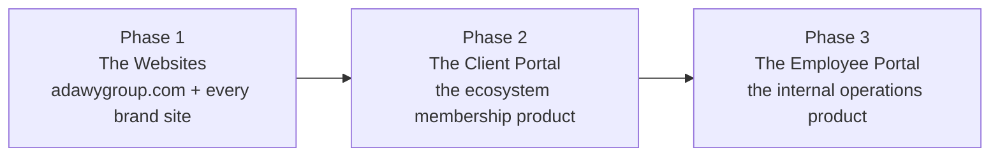
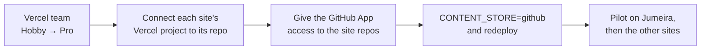

# Roadmap & Phases

The platform is delivered in three product phases, in strict order. Each phase
ships a complete product surface and proves the foundation the next one
builds on. **Phase 1 is the firm commitment** — later phases are direction,
reviewed against actual delivery before continuing.

This roadmap covers **Adawy Group's own products**. Client projects
([ADR-010](/architecture/adrs)) run on their own timelines against client
commitments and are deliberately not sequenced here — a client's launch date
does not move because a Group phase slipped, and vice versa. See
[Client Projects](/how-we-work/client-projects).

```mermaid
flowchart LR
    P1["Phase 1<br/>The Websites<br/>adawygroup.com + every brand site"] --> P2["Phase 2<br/>The Client Portal<br/>the ecosystem membership product"] --> P3["Phase 3<br/>The Employee Portal<br/>the internal operations product"]
```

| Phase | Product | What it proves |
| ----- | ------- | -------------- |
| 1 | **The Websites** — adawygroup.com, Adawy Studio, Adawy Pack, Adawy Print, and every other brand site | The monorepo platform and the design system |
| 2 | **The Client Portal** — the daily product of being an ecosystem member | The backend, Odoo integration, auth, and member-facing AI |
| 3 | **The Employee Portal** — one internal home for the group's teams | Internal AI, search, and operational intelligence |

## Phase 1 — The Websites

The entire public face of the group, rebuilt on one platform. Order of
delivery, priority first:

1. **adawygroup.com** (`apps/group`) — the corporate site and the first app
   in the monorepo. Building it builds the permanent foundation: the
   `@adawy/*` packages (ui, design, motion, i18n, site, holding, brand-app), hosting,
   domains, and the deployment pipeline. Committed dates:
   [kickoff 14 June → launch 23 July 2026](/about/timeline).
2. **Adawy Studio** (`apps/studio`) — the creative flagship; sets the design
   bar and hardens the shared packages against a second, very different
   brand identity. *A branded holding page is live on adawystudio.com; the
   full build is next.*
3. **Adawy Pack** (`apps/pack`) — the industrial flagship; establishes the
   industrial patterns that Print, Production, and Supplies reuse. *Holding
   page live on adawypack.com.* Not to be confused with the client project
   [`aladawy-pack`](/repositories/aladawy-pack).
4. **Adawy Print, Adawy Supplies, Adawy Marketing Solutions, Adawy Business
   Development, Adawy Media Production, Adawy Production, and the rest** —
   each a thin new app composed from the mature packages. *Print, Supplies
   and Marketing Solutions already have holding pages live on their own
   domains (`apps/print`, `apps/supplies`, `apps/marketing`), and Business
   Development's (`apps/bizdev`) on adawybusinessdevelopment.com since
   23 September 2026.*
   ([the workflow](/guides/launch-new-brand)). Six weeks per site becomes
   one week per site as the packages mature.

Every site ships to the same bar: bilingual-ready (EN/AR), WCAG 2.1 AA, the
[performance budget](/guides/performance-checklist#the-numbers-and-which-one-blocks-a-merge),
structured data, analytics, and the "part of Adawy Group" cross-link.

**Deliberately not in Phase 1:** the portals, AI features, Odoo integration,
e-commerce. Ship excellent websites, prove the platform, then add scope.

## What is next in the short term

The phases are the direction; this is the queue in front of them, as of
27 September 2026. Most items wait on an owner decision rather than on
engineering, which is why each one names what unblocks it.

| # | Item | Unblocked by | Why it matters |
| - | ---- | ------------ | -------------- |
| 1 | **Fix GitHub Actions billing** | The owner settling the GitHub account's payment | Until then no repo runs `verify`, and every production deploy is [by hand](/how-we-work/deployment#github-actions-is-stopped) — no accessibility gate, no previews per PR |
| 2 | **Content dashboard go-live** | The owner's go, then the steps below in order | The dashboard exists so a changed headline needs no developer ([ADR-014](/architecture/adrs)); in practice mode it saves nobody any work yet |
| 3 | **Aladawy Shop after launch** | Engineering, plus the owner's Google account for Search Console | The shop has been live since 24 September. The old Next.js build on `aladawy-shop.vercel.app` is still up and indexable, and the rebuild's design calls for it to redirect to aladawyshop.com after go-live, so it does not compete with the real site in search |
| 4 | **Aladawy Pack's theme into a repository** | Engineering | The WordPress theme serving aladawypack.com since 27 September exists only on the server; nothing reviews or can restore it ([ADR-015](/architecture/adrs)) |
| 5 | **The remaining domains** | An app for each | adawy.com, adawyit.com and adawyfinance.com are still on the Verpex host, and adawyproduction.com on Name.com's nameservers. Each moves by [the procedure](/guides/move-a-domain-to-vercel) once it has something to serve |
| 6 | **The training-video recorder into a repository** | Engineering | Without the scripts, every screen change makes a [training video](/guides/training-videos) stale with no cheap way to re-record it |

Dashboard go-live, in order — each step depends on the one before:

```mermaid
flowchart LR
    A["Vercel team<br/>Hobby → Pro"] --> B["Connect each site's<br/>Vercel project to its repo"]
    B --> C["Give the GitHub App<br/>access to the site repos"]
    C --> D["CONTENT_STORE=github<br/>and redeploy"]
    D --> E["Pilot on Jumeira,<br/>then the other sites"]
```

1. **Vercel Pro**, because Hobby cannot Git-deploy from the org's private
   repos, and "publish goes live by itself" means a commit has to trigger a
   deploy. With Git deploys the sites would also stop depending on
   GitHub Actions to reach production at all.
2. **Connect each site's Vercel project to its GitHub repo.** Platform projects
   keep their root directory `apps/<name>` and use `npx turbo-ignore` as the
   Ignored Build Step, so a publish to one brand rebuilds only that brand.
3. **Give the dashboard's GitHub App access to the site repos.** Today it can
   reach only the practice repo — the reason practice mode cannot touch a real
   site even by mistake.
4. **Switch `CONTENT_STORE` to `github`** and redeploy. The database, email,
   domain and secrets are already in place.
5. **Pilot on Jumeira** end to end — a real publish, checked live, then undone —
   before the other sites are opened.

## Phase 2 — The Client Portal

The experience of *being* an Adawy ecosystem member, at
`portal.adawygroup.com`. Without it, "integrated ecosystem" is a marketing
claim; with it, it is a product members use every day — and the most
defensible thing the group can build, because no regional competitor operates
the integrated stack that makes it possible.

Phase 2 starts with the infrastructure the portal needs:

- **The shared backend service** (Node.js/NestJS): authentication (Better
  Auth), business logic, background jobs, real-time updates.
- **Odoo integration** — read products, inventory, orders, invoices; write
  back through APIs behind an abstraction layer ([ADR-003](/architecture/adrs)).

Then the portal itself. What members can do:

- See **all orders across every sub-brand** in one place, status pulled from Odoo
- Download **brand assets** organized by project
- **Request new work** through structured intake forms (replacing email/WhatsApp)
- View **invoices and payment history**, with online payment
- Chat with the **AI assistant** about orders, projects, and history
- Manage **team access** with per-person permissions

Member-facing AI lands here too: the **portal assistant** (quotes, orders,
briefs drafted through conversation — always human-reviewed, never
autonomous) and **lead scoring** on every form across the brand sites.

## Phase 3 — The Employee Portal

One internal home for the group's teams — the same idea as the client portal,
pointed inward. Today group knowledge is scattered across email, WhatsApp,
Drive, Notion, and Odoo; finding any single piece takes minutes and depends on
knowing where to look.

- **Internal AI assistant** — ask in natural language, answered from the
  group's own systems (RAG over pgvector), permissions respected
- **Internal search** across Notion, Drive, Slack, Odoo, and email — the
  lowest-glamour feature with possibly the highest daily value
- **Operational dashboards** — sales, operations, and marketing leadership
  views (Metabase), including **manufacturing intelligence** over Odoo's
  production data: line efficiency, anomalies, supplier signals
- **The content engine** — first-draft bilingual content in each brand's
  voice, with a human review queue; at 100+ brands content cannot be written
  by hand alone
- **Employee-facing workflows** — the structured versions of what currently
  happens over chat: requests, approvals, handoffs

## Beyond the phases

Once all three products are live: geographic scale-out (KSA, UAE, Libya, GCC —
localization, currency, regional payments), e-commerce as a service to
ecosystem members, the Odoo-vs-SAP evaluation, security/compliance hardening,
and specialist hires (AI, security, data). Direction, not commitments —
decided against real delivery.

## How the team grows

| Phase | Team size | Added roles |
| ----- | --------- | ----------- |
| 1 — Websites | 2 → 3–4 | Current team (CTO + designer); a second frontend developer once the volume of brand apps demands it |
| 2 — Client Portal | 4–6 | Senior backend engineer (first hire of the phase — nothing in Phase 2 starts without the backend), part-time DevOps |
| 3 — Employee Portal | 7–9 | Engineering manager, mid-level full-stack engineers, senior analytics engineer; QA + second designer when workload requires |

Every hire is justified by specific work the current team cannot complete —
no role is added until the prior phase's delivery proves the need.

## Known risks and how we manage them

1. **Hiring is slow** → start the backend search during Phase 1, recruit at
   the top of the market, consider regional remote.
2. **Odoo integration complexity** → engage the Odoo administrator before
   Phase 2; scope the first delivery to read-only if needed.
3. **Scope creep across the brand portfolio** → keep-apps-thin policy from
   day one: sub-brands customize through tokens on the shared packages;
   genuinely custom work only for flagships, explicitly scoped. Platform-wide
   consistency beats any single brand's preference.
4. **FX exposure** → favor self-hosted/usage-priced services; largest costs in
   local currency.
