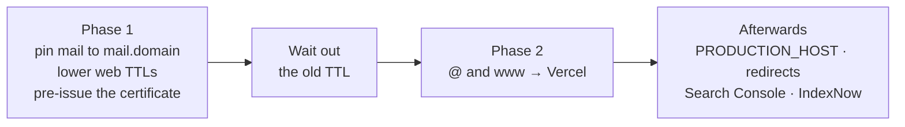

# Moving a Domain to Vercel

This is how a domain whose DNS and email live on the Verpex host starts
serving its Vercel project while its mailboxes keep working. It is how the six
domains moved on 21 September 2026, and how `aladawypack.com` and
`aladawyshop.com` will move. It takes about half an hour of work either side
of a two-hour wait, and the wait is the part that protects the email.

Read [Domains, DNS & Email](/architecture/domains-and-email) first. It explains
why the order below is not optional.



## Before you start

- The Vercel project exists and its production deployment is the site you
  want live. Check it on its `*.vercel.app` address first.
- You can edit the zone: WHM's Zone Editor, or a WHM API token with DNS rights.
  A token is a password, so revoke it when you are done.
- **Download the zone** (WHM → DNS Zone Manager, or the `dumpzone` API call)
  and keep the file. It is your rollback.
- Note the zone's current TTL on the `@` and MX records (7200 seconds on the
  Verpex zones). That number is how long phase 2 has to wait.

## 1. Attach the domain in Vercel

In the project's domain settings, add the root domain, then add `www` as a
**308 redirect** to it. The root is canonical, because that is the host
`PRODUCTION_HOST` names.

If Vercel asks for a `_vercel` TXT record, another Vercel account has claimed
the name before. Add the record it shows and press Verify. The domain then
moves to our project, and nothing on the other account can take it back without
our DNS.

## 2. Phase 1: move email off the root (nothing visible changes)

In the zone:

1. `mail`: change the CNAME to an **A record** pointing at the Verpex server.
   The address to use is the one `mail.<domain>` resolves to right now
   (`dig +short mail.<domain>`).
2. `@` MX: change the target from the bare domain to `mail.<domain>`, keeping
   the same priority. Skip this for a domain whose MX is Google or another
   provider's.
3. `_caldav._tcp`, `_caldavs._tcp`, `_carddav._tcp`, `_carddavs._tcp`: change
   each SRV record's target from the bare domain to `mail.<domain>`.
4. `@` A and `www` CNAME: lower their TTL to **300**, and leave the values as
   they are.

In cPanel, check the account's **Email Routing** is set to **Local**, or
**Remote** for a Google Workspace domain. If it is set to "Automatically
Detect", cPanel re-guesses the routing from the MX, and the MX just changed.

Then **pre-issue the certificate**, so HTTPS works the moment traffic arrives:

```bash
vercel certs issue <domain> www.<domain> --challenge-only --scope <team>
# add the two _acme-challenge TXT records it prints, then:
vercel certs issue <domain> www.<domain> --scope <team>
curl -I https://<domain> --resolve <domain>:443:216.198.79.1   # expect Vercel, valid TLS
```

Check the result on **all four** nameservers, not one. They are anycast and
pick up edits unevenly, taking anywhere from a minute to half an hour:

```bash
for n in 1 2 3 4; do dig +short MX <domain> @ns$n.mysecurecloudhost.com; done
openssl s_client -connect mail.<domain>:993 -servername mail.<domain> </dev/null | grep "Verify return code"
```

## 3. Wait out the old TTL

Wait at least the old TTL from the start of phase 1, which is two hours on
these zones. Until then, some mail server somewhere may still hold "MX → the
bare domain" in its cache. If phase 2 lands inside that window, those servers
deliver to Vercel, get no answer, and queue the mail for later.

## 4. Phase 2: switch the website

1. `@` A: change it to Vercel's addresses, `216.198.79.1`, and add a second A
   record for `64.29.17.1`. Take the values from the project's domain settings,
   which are authoritative if they ever change.
2. `www` CNAME: change it to the project's own `….vercel-dns-017.com` host,
   from the same settings page.

## 5. Check everything

- `dig +short A <domain> @8.8.8.8` returns Vercel's addresses.
- `https://<domain>` answers 200, and `https://www.<domain>` returns a 308 to it.
- Vercel's domain settings show the domain as correctly configured.
- Email still works. Run the MX and `openssl` checks from phase 1 again, load
  `https://webmail.<domain>`, and send a message both ways.

## 6. Make the app claim its domain

- **Set `PRODUCTION_HOST`** to the domain and merge. Indexing, the canonical
  origin and the sitemap turn on together
  ([client projects](/how-we-work/client-projects#launch-checklist) set it in two files).
- **Redirect the project's `*.vercel.app` domain** to the real one with a
  308, in the project's domain settings. Otherwise the production
  `*.vercel.app` host is an indexable duplicate of the site.
- **Redirect the old site's URLs** that search engines still list to their
  nearest new page, as permanent redirects in `next.config.ts`. Find them with
  a `site:<domain>` search, or in the old site's sitemap while the old host
  still serves it.
- For a group brand, set its `site` in the group app's `BRAND_PAGES`, so its
  page on adawygroup.com links out to it.

## 7. Tell the search engines

1. In Google Search Console, add a **Domain property** for the domain. Google
   gives you a `google-site-verification` TXT record. Add it at `@`, then press
   Verify. If verification fails, retry after a few minutes, because the
   nameservers may not all have the record yet.
2. Submit `https://<domain>/sitemap.xml`.
3. In URL Inspection, press **Request indexing** for the home page and the
   most important pages. There is no API for this step.
4. Send the sitemap's URLs to IndexNow. The app already serves the key file.

## 8. Tell people

Anyone whose mail app uses the bare domain as its server has to switch to
`mail.<domain>`. Webmail moves to `webmail.<domain>`, and `<domain>/webmail`
no longer works.

## Rolling back

Point `@` back at the Verpex server with a single A record, and `www` back to a
CNAME of `@`. The TTL is 300 seconds by then, so the old site is back within
minutes. Email is unaffected, because it no longer depends on either record.

## Pitfalls

- **Switching the website before moving the email.** Inbound mail follows the
  root to Vercel, and because the senders retry quietly, you find out days
  later.
- **Trusting one nameserver.** A `dig` against `ns1` can agree with you while
  `ns3` still serves the old zone. Check all four, more than once.
- **Deleting records that look unused.** The `google-site-verification` TXT,
  SPF, DKIM and DMARC all look like clutter, and each one is load-bearing
  ([the list](/architecture/domains-and-email#records-that-must-never-be-deleted)).
- **cPanel's AutoSSL complaining afterwards.** It can no longer validate the
  root and `www`, because they no longer point at the Verpex host. That is
  expected. It still covers `mail.`, `webmail.` and the other names that do.
- **Pressing "Connect Git Repository" in Vercel.** Deploys already come from
  GitHub Actions ([deployment](/how-we-work/deployment)), so a second path
  would deploy every push twice.
