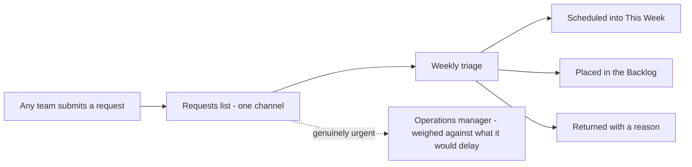

# Requests, Meetings & Reporting

## How requests reach the department

All requests, from any team, come through **one channel** — never direct
messages. This keeps every request in one place and ensures nothing is lost or
quietly jumped ahead of committed work.

- Requests are reviewed **once a week**, weighed against current priorities,
  then scheduled, backlogged, or returned with a reason.
- Anything genuinely **urgent** is raised through the **operations manager**,
  so it can be measured against what it would delay.

Why this matters: the department delivers against committed dates. Every
accepted request moves something else. One channel keeps that trade visible
and keeps the dates honest.

## Planning and delivery dates

- Priorities are set **once a week**. Alongside the board, a short roadmap
  lists upcoming deliverables with target dates.
- Each deliverable is estimated **as a whole** with a confidence level — not
  fragmented into pieces unreadable from outside.
- Dates are quoted with realistic margin built in. **Meeting committed dates
  reliably builds more confidence than quoting aggressive dates and missing
  them.**

## The weekly update

Every **Thursday**, leadership receives a short written update:

1. What was delivered this week
2. What is in progress for next week
3. What is blocked or threatening a date

Each roadmap deliverable is marked **on track / at risk / delayed**. If a date
is going to move, leadership hears it **the week the risk appears** — with the
reason and a revised date — never on the day the work was due.

## Norms

- Working week: **Sunday to Thursday**.
- Decisions get written down (board card or docs) — chat is not documentation.
- Leadership never needs to manage cards: the board carries the daily flow,
  the roadmap carries the dates, the weekly update carries the changes.
- No status meetings: the staging link and the board show live status at any
  moment.
