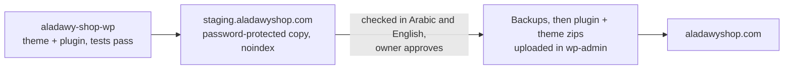

# Deployment

The pipeline is Git-based end to end and runs on **GitHub Actions**
(`.github/workflows/deploy.yml`), not Vercel's dashboard Git integration: the
platform repo is private and org-owned, which Vercel only connects on the Pro
plan, so the workflow deploys via the Vercel CLI + a token instead. No manual
FTP uploads, no editing on production, no exceptions.

<Callout type="warning">
  **Only `adawy-platform` deploys on merge today.** The organisation's free
  GitHub Actions minutes ran out on 23 September 2026, and on 27 September
  every repo's workflow was switched to run only when started by hand. The
  minutes reset on 1 October; the platform got its push and pull-request
  triggers back on 3 October, and **every other repo is still hand-only** — in
  those, a merge verifies nothing and deploys nothing
  ([what to do](#most-workflows-run-only-by-hand)).
</Callout>

## Environments

| Environment | What it is | When it updates |
| ----------- | ---------- | --------------- |
| **Preview** | A unique URL per pull request | The `deploy` job runs `vercel deploy` on every push to a PR branch |
| **Production** | The project's live URL | The `deploy` job runs `vercel deploy --prod` on merge to `main` |

<Callout type="info">
  **That table is the pipeline where CI runs automatically, which today is
  `adawy-platform` alone** ([the others](#most-workflows-run-only-by-hand)).
  `baron-menu`, `aladawy-shop`, `aladawy-links` and `adawy-dashboard` have
  no workflow at all, and `aladawy-pack-wp` none either — it does not deploy
  to Vercel ([what to do instead](#client-projects-deploy-the-same-way)). Read a
  repo's own workflow before assuming a merge deployed anything.
</Callout>

**There is no third environment** for anything on Vercel. Where this handbook
says "staging" about a Vercel site, it means the production deployment *before
its custom domain is attached* — the Vercel project URL that leadership
reviews. Same build, same pipeline, different address. The one real staging
environment belongs to the WordPress shop, `staging.aladawyshop.com`
([below](#wordpress-sites-deploy-through-staging)), because a WordPress site
has no preview per pull request to review on instead.

Once a domain is attached, the production deployment *is* the domain. The
project's `*.vercel.app` address then redirects to it, so the site is not
served twice. adawygroup.com and five brand domains are in that state today;
[Moving a Domain to Vercel](/guides/move-a-domain-to-vercel) is the procedure
that got them there, because their DNS and email live on another host.

*Why that is worth stating:* people arriving from a three-environment setup go
looking for a staging server, and there is not one. The pipeline is
deliberately two-stage — a per-PR preview and a production deploy on merge —
because a third environment needs its own data, its own variables and its own
drift, and a two-person team maintaining thirteen repositories cannot pay for
that thirteen times over.

From week one there is a **live link** that fills with real pages — anyone in
leadership can open it at any time. Progress is something you can click, not a
status claim in a report.

## Most workflows run only by hand

The organisation is on GitHub's free plan, and its Actions minutes are a
monthly budget. They ran out on **23 September 2026**, and from then every run
in every repo failed in about three seconds with no steps run, worded as *"The
job was not started because recent account payments have failed or your
spending limit needs to be increased."* GitHub uses that wording for an
exhausted spending limit as well as a failed payment, so do not go looking for
a card problem. Check the current state with:

```bash
gh run list -R Adawy-Group/adawy-platform -L 5   # "failure" in ~3s, no steps run = minutes are out
```

On 27 September every workflow lost its push, pull-request and schedule
triggers and kept only `workflow_dispatch`, so nothing would spend minutes
without a person deciding to. After the reset on 1 October only the platform
got its triggers back, with its verification narrowed to what a change
reaches so each run costs less ([below](#what-verify-actually-runs)):

| Repo | What a merge to `main` does today |
| ---- | ----------------------------------- |
| `adawy-platform` | Verifies and deploys the affected apps; a pull request gets a preview |
| `adawy-technical-docs` | Vercel's Git integration deploys it; `verify` and `external-links` run only by hand |
| `jumeira`, `zad-alhkoul`, `aladawy-pack`, `adawy-group-links`, `aladawy-shop-wp` | **Nothing.** The workflow exists and starts only from the Actions tab (*Run workflow*) or `gh workflow run` |
| `baron-menu`, `aladawy-shop`, `aladawy-links`, `adawy-dashboard`, `aladawy-pack-wp` | Nothing — they have no workflow |

A hand-started run spends the same minutes, and the Vercel **Hobby** plan
cannot stand in for Actions, because Hobby will not Git-deploy from a private
repository owned by an organisation. So in a hand-only repo — and in the
platform too, whenever the minutes run out again — **a production deploy is a
person running the Vercel CLI**:

<Steps>

### Run the repo's gates yourself

Whatever its workflow would have run. In the platform that is
`pnpm turbo lint typecheck test build`, `pnpm format:check`, and the
accessibility check for any app you touched
([troubleshooting](/help/troubleshooting#build-and-ci)). A merge that skipped
them is a merge nobody verified.

### Deploy from the repository root, naming the project

```bash
VERCEL_ORG_ID=<team id> VERCEL_PROJECT_ID=<project id> vercel deploy --prod
```

That is the platform's form; a standalone repo deploys with
`vercel deploy --prod` from its own root. In the platform, run it from the
**root** of the repository, not from `apps/<app>`: the Vercel
project's root directory is already `apps/<app>`, and the monorepo's workspace
has to be uploaded whole for the build to resolve `@adawy/*`. Setting the two
ids in the environment picks the project explicitly instead of trusting
whatever `.vercel/` folder happens to be on your machine. Both ids are in the
project's settings on Vercel. For a preview, drop `--prod`.

### Check it live

A deploy job would have checked the resolved project and posted the URL; by
hand, nobody does unless you do. Open the production domain and confirm the change
is there ([Definition of Done](/how-we-work/definition-of-done)).

</Steps>

The handbook is the exception in the other direction: Vercel still deploys it
on every merge to `main`, but its `verify` check does not run, so run
`node scripts/check-links.mjs` and `npm run build` before merging
([the repo page](/repositories/adawy-technical-docs)).

Two fixes are on the [roadmap](/architecture/roadmap#what-is-next-in-the-short-term):
keep CI inside the monthly minutes (or pay for more) so the other repos can get
their triggers back, and move Vercel to **Pro**, which lets each project deploy
from Git directly without spending Actions minutes at all — the content
dashboard's go-live needs that anyway.

## What `verify` actually runs

In the platform, the deploy only runs after `verify` passes, and `verify` is
more than the four turbo tasks:

| Step | What it does |
| ---- | ------------ |
| **Resolve affected apps** | Works out which apps a change reaches, through the dependency graph. Runs *first*, so a failing run still reports what it would have deployed |
| **Verify** | `turbo lint typecheck test build` over the changed packages and everything that depends on them (`--affected`), **two tasks at a time** so a run that reaches every app fits the runner's memory |
| **Check formatting** | `pnpm format:check` at the root. Runs even when Verify failed, so one push reports every problem it has |
| **Accessibility** | Serves the production build of `group` and runs axe-core over every route, asserting **zero WCAG A/AA violations** — only when the change reached `group` |

Three rules are deliberate:

- **Verification and deployment are filtered the same way.** Until October
  2026 verification was never filtered, on the theory that unchanged packages
  come back from Turborepo's remote cache. Without a warm cache, a one-app
  change rebuilt all thirty-one apps, which is minutes the organisation does
  not have.
- **Every doubt widens both.** A root config change, a missing base commit or
  any resolution error verifies and deploys *everything*. Over-verifying costs
  minutes; under-deploying ships stale code.
- **A change to `packages/ui` deploys all thirty-one apps**, because it
  genuinely reaches all of them. A change under `apps/group` deploys one.

A hand run (*Run workflow* in the Actions tab) takes an optional list of apps,
and deploys only from `main`, because a hand run from a branch would ship
unmerged code to production.

<Callout type="important">
  The **accessibility gate is a merge gate**, not a checklist item. A contrast
  failure or a missing label fails the build exactly like a type error. This is
  the single most common surprise for someone whose previous team treated
  accessibility as a review opinion.
</Callout>

## Deploy safety rails

- **A preflight step resolves each project id against the Vercel API** before
  deploying, and fails loudly if the project's root directory is not
  `apps/<app>`. Both ways a project id can be wrong are silent at the CLI: a
  project from another Vercel team returns `Project not found` with both ids
  masked, and a wrong root directory uploads green and then builds the wrong
  thing.
- **In the platform, deploys are remote builds, not `--prebuilt`.** Vercel's
  system environment variables drive `metadataBase` and the OG image URLs; a
  local prebuilt build lacks them and bakes a broken URL.

  **That is scoped to the platform, not a house rule.** `jumeira`,
  `zad-alhkoul` and `adawy-group-links` all run `vercel build` then
  `vercel deploy --prebuilt` on purpose: each resolves its public origin in its
  own `lib/site.ts` with an explicit fallback chain, so nothing depends on a
  variable the runner does not have. **The rule underneath is: never let a
  build environment decide a URL you publish.** Prebuilt is safe once the
  origin is resolved in your own code, and unsafe when it is not.
  (`adawy-group-links`' deploy job is written this way but currently always
  skips — the repo has no `VERCEL_TOKEN` secret — so its production ships by
  hand with `vercel deploy --prod`; see [its page](/repositories/adawy-group-links).)
- **A `--prebuilt` deploy uploads more than `.vercel/output`, and
  `.vercelignore` has to allow it.** Each function's `.vc-config.json` carries a
  `filePathMap` pointing at files elsewhere in the project — hundreds under
  `node_modules/.pnpm/` and `.next/` — and the build machine expands the bundle
  from them. Ignore either directory and the deployment is **created and then
  fails on the first missing file** (`ENOENT: lstat '/vercel/path0/.next/package.json'`),
  while production quietly stays on the previous build. The CLI's own default
  ignore list covers both, which is why this only bites once someone adds a
  `.vercelignore`.
- **Each PR gets one previews comment**, rewritten in place rather than piling
  up, and each deploy is registered with GitHub so the PR carries a native
  "View deployment" link.

## The path to production

1. PR opened → `verify` runs, then a **preview** deploy. Review happens on the
   running preview, not screenshots.
2. PR merged to `main` → `verify` runs again, then an automatic **production**
   deploy (`vercel deploy --prod`). The merge is the release — there is no
   separate manual promotion step. *That is the platform today. In a
   hand-only repo neither run happens: the merge releases nothing until
   someone [deploys by hand](#most-workflows-run-only-by-hand).*
3. Verify the change on the live URL: real phones, tablets, and browsers;
   checks green; no regressions
   ([Definition of Done](/how-we-work/definition-of-done)).
4. Card moves to **Done** only when it's live with no regressions. Rollback =
   redeploy the previous build from Vercel (instant) — every deployment is
   immutable.

## Monitoring

<Callout type="warning">
  **Sentry and Better Stack are chosen, not installed.** No repository in the
  org carries either SDK today
  ([the ledger](/architecture/tech-stack#built-decided-deferred--read-this-first)).
  Until they do, "monitoring is clean" means *somebody opened the deployed page
  and it worked* — which is why the verify-it-live step is not optional.
</Callout>

- **Vercel Analytics / PageSpeed** — the only telemetry actually running. Core
  Web Vitals are watched after each meaningful change, and the
  [performance budget](/guides/performance-checklist#the-numbers-and-which-one-blocks-a-merge)
  is part of "no regressions".
- **Sentry** <Badge tone="planned">Chosen</Badge> — error tracking and
  performance. Once it exists, a spike after a deploy is a blocked release.
- **Better Stack** <Badge tone="planned">Chosen</Badge> — uptime monitoring and
  alerting on every production domain.

## The content dashboard deploys by hand

[`adawy-dashboard`](/repositories/adawy-dashboard) has no workflow at all. It
is deployed with `vercel deploy --prod` from its own folder after its checks
(`pnpm test && pnpm typecheck && pnpm lint && pnpm build`) pass. Its
production is `admin.adawygroup.com`, which the team uses for practice today —
a broken deploy there stops people rehearsing, not a website.

## Client projects deploy the same way

Client repositories run the same pipeline on their own Vercel projects —
through a GitHub Actions job and the Vercel CLI where they have CI, because
Vercel's Hobby plan refuses to connect a private organisation-owned repo
(`repo_owned_by_org`) — with one addition that matters more than anything above: a client
site is **`noindex`-ed until launch**, flipped by a single `PRODUCTION_HOST`
switch. An indexable staging deployment competes with the client's real domain
in search — see [Client Projects](/how-we-work/client-projects#the-go-live-switch).

Four repos deploy differently, and all four are worth knowing before you push:

- **`baron-menu` has no CI** and deploys with `vercel deploy --prod --yes` from
  the folder. Its URL must never change, because the QR code is printed on
  physical table cards.
- **`aladawy-shop` has no CI either.** It has tests and a `test` script, and
  nothing runs them on a push. Until that is fixed its gates are yours to run
  by hand before you merge — a gap, not a design
  ([the matrix](/repositories#what-the-repos-actually-share)).
- **`aladawy-links` has no CI either, on purpose.** A link page changes a few
  times a year, so the pipeline was more moving parts than the site is worth.
  Run its five gates, then `vercel deploy --prod`
  ([the repo page](/repositories/aladawy-links)).
- **`jumeira`'s CI adds a Lighthouse job.** It was built to run on every pull
  request and every push to `main`; since 27 September it runs only when
  dispatched by hand (`checks only`, `preview` or `production`), so a merge
  deploys nothing.
  After a production deploy a mobile Lighthouse run checks the live site
  against budgets ([the repo page](/repositories/jumeira)).

## WordPress sites deploy through staging

aladawyshop.com and aladawypack.com are WordPress on the Verpex host
([ADR-015](/architecture/adrs)), so none of the Vercel pipeline above applies
to them. For the shop ([`aladawy-shop-wp`](/repositories/aladawy-shop-wp)) the
route is:



- **Everything is built and checked on staging first.** It is a full copy of
  the live site behind a password, sending `noindex`, so a mistake there
  reaches no customer and no search engine.
- **Code reaches live as uploaded zips, not as a copy of staging.** The plugin
  and theme are built from one commit with `git archive` and uploaded through
  `wp-admin`, after a full backup taken through the control panel. That is how
  the shop went live on 24 September 2026. The host gives the department no
  shell, so there is no rsync or WP-CLI route; Softaculous (the control panel's
  installer) can push staging over live, but it was not used for the go-live
  and copying staging wholesale is exactly what the next rule forbids. The full
  runbook is on the [repository page](/repositories/aladawy-shop-wp).
- **Staging-only safeguards must be removed before a push.** Anything added to
  staging to stop it emailing real customers or being indexed would otherwise
  be copied to live along with the code.
- **The live database is never overwritten from staging.** Orders and
  customers keep arriving on the live site while staging is being worked on,
  and a database copy from staging would erase them — so what a push carries
  is chosen deliberately, never "everything". Catalogue changes reach live through the repo's
  migration script or through `wp-admin`, not through a database copy.

**Aladawy Pack has no staging copy.** Its theme
([`aladawy-pack-wp`](/repositories/aladawy-pack-wp)) is deployed by
`sh deploy.sh`, which builds, zips and extracts it over the live theme through
the cPanel API. So compare the live assets with a local build before
deploying, deploy only `main`, never edit files on the server, and check both
languages afterwards. The full procedure is on the
[repository page](/repositories/aladawy-pack-wp#deploying).

## Launch weeks

For site launches, the final week deliberately contains **no new building** —
content entry and proofreading, device testing, SEO setup, performance
optimization for Egyptian mobile networks, analytics, and the production
cutover. That week is both real work and the buffer that absorbs slips so the
launch date stays reliable.
