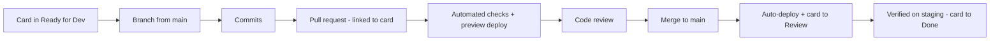

# Git Workflow

All code lives in the **`adawy-group`** GitHub organization. The workflow is
GitHub Flow — simple by design, because the deployment pipeline (previews on
every PR, auto-deploy on merge) does the heavy lifting.

## The rules

1. **`main` is always deployable.** Treat it as protected: changes land via
   reviewed pull requests, not direct pushes — discipline, since branch
   protection isn't enforced on the current plan.
2. **One branch per card.** Branch from `main`, named for the work:
   `feat/<short-description>`, `fix/<short-description>`,
   `content/<short-description>`, `chore/<short-description>` — mirroring the
   board's Type labels (Feature, Bug, Content, Maintenance).
3. **One PR per card, linked both ways.** The Trello card carries the PR link;
   the PR description carries the card link. This is how design, code, and
   status stay connected in one place.
4. **Small PRs.** The Kanban principle applies to code: small finished pieces,
   reviewed and closed before the next one starts. If a PR is hard to review
   in one sitting, it should have been two PRs.
5. **Commits are written for the reader.** Imperative mood, scoped, honest:
   `Add industrial template hero section`, `Fix RTL layout in navbar`. The
   history is documentation.

## Lifecycle of a change

Every PR gets a **preview deployment** automatically — reviews happen on real
running pages, not screenshots. Automated checks — the `verify` job runs lint,
types, tests, and build — must pass before review; a red check is the author's
to fix, not the reviewer's to catch.
