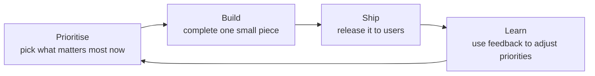
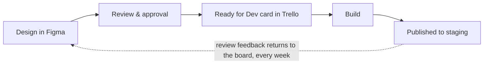

# How We Work

The department works in an **Agile** way, using **Kanban** as the method and
**Trello** as the board. The core idea: deliver value in small, finished
pieces rather than disappearing for months and returning with one large
release. Ship each piece, gather feedback, adjust priorities based on what is
actually working.

## Kanban's three rules (why this method)

1. **See all the work.** Every task lives on one shared board — anyone can see
   what is being worked on, waiting, or finished.
2. **Limit work in progress.** The build stage has a strict card limit — the
   single most important rule on the board. It forces work to be *finished*
   before anything new starts, which is what keeps delivery predictable.
3. **Pull the next task when there is capacity.** Continuous flow, no fixed
   sprint ceremonies — priorities can shift week to week as the business needs.

As the department grows, the same board extends into weekly planning cycles,
demos, and shared estimation (Kanban → Scrumban → Scrum at scale). Nothing
gets rebuilt along the way.

## The continuous handoff rule

Design does not deliver everything at the end — **approved screens flow to
development every week, in priority order**. Every approved design becomes a
*Ready for Dev* card and gets built while the next design is in progress.
This is what makes parallel design/development timelines real; without it, a
six-week project becomes a ten-week project.

## In this section

- **[The Board & Labels](/how-we-work/the-board)** — the Trello lists, what a
  card carries, and the color system.
- **[Git Workflow](/how-we-work/git-workflow)** — branches, commits, PRs.
- **[Code Review](/how-we-work/code-review)** — what gets checked and by whom.
- **[Deployment](/how-we-work/deployment)** — previews, staging, production.
- **[Requests, Meetings & Reporting](/how-we-work/communication)** — how work
  reaches us and how status flows out.
- **[Definition of Done](/how-we-work/definition-of-done)** — when work is
  actually finished.
