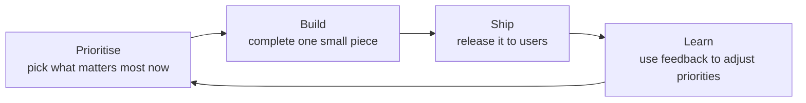
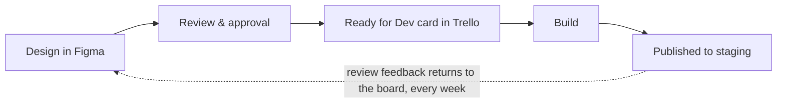

# How We Work

The department works in an **Agile** way, using **Kanban** as the method and
**Trello** as the board. The core idea: deliver value in small, finished
pieces rather than disappearing for months and returning with one large
release. Ship each piece, gather feedback, adjust priorities based on what is
actually working.

```mermaid
flowchart LR
    P[Prioritise<br/>pick what matters most now] --> B[Build<br/>complete one small piece]
    B --> S[Ship<br/>release it to users]
    S --> L[Learn<br/>use feedback to adjust priorities]
    L --> P
```

## Kanban's three rules (why this method)

1. **See all the work.** Every task lives on one shared board — anyone can see
   what is being worked on, waiting, or finished.
2. **Limit work in progress.** The build stage has a strict card limit — the
   single most important rule on the board. It forces work to be *finished*
   before anything new starts, which is what keeps delivery predictable.
3. **Pull the next task when there is capacity.** Continuous flow, no fixed
   sprint ceremonies — priorities can shift week to week as the business needs.

As the department grows, the same board extends into weekly planning cycles,
demos, and shared estimation (Kanban → Scrumban → Scrum at scale). Nothing
gets rebuilt along the way.

## The continuous handoff rule

Design does not deliver everything at the end — **approved screens flow to
development every week, in priority order**. Every approved design becomes a
*Ready for Dev* card and gets built while the next design is in progress.
This is what makes parallel design/development timelines real; without it, a
six-week project becomes a ten-week project.

```mermaid
flowchart LR
    A[Design in Figma] --> B[Review & approval]
    B --> C[Ready for Dev card in Trello]
    C --> D[Build]
    D --> E[Published to staging]
    E -. review feedback returns to the board, every week .-> A
```

## In this section

<Cards num={2}>
  <Cards.Card title="The Board & Labels" href="/how-we-work/the-board" arrow>
    The Trello lists, what every card carries, and a colour system where each
    colour means exactly one thing.
  </Cards.Card>
  <Cards.Card title="Git Workflow" href="/how-we-work/git-workflow" arrow>
    Branches, commits and pull requests — GitHub Flow, because the pipeline
    does the heavy lifting.
  </Cards.Card>
  <Cards.Card title="Code Review" href="/how-we-work/code-review" arrow>
    What reviewers check, in order, and what authors owe them before asking.
  </Cards.Card>
  <Cards.Card title="Deployment" href="/how-we-work/deployment" arrow>
    Previews, production, what CI actually gates on, and the safety rails on
    the deploy itself.
  </Cards.Card>
  <Cards.Card title="Definition of Done" href="/how-we-work/definition-of-done" arrow>
    The two gates: one before building starts, one before work is called
    finished.
  </Cards.Card>
  <Cards.Card title="Client Projects" href="/how-we-work/client-projects" arrow>
    How work for clients differs from Group work, the go-live switch, and
    handover.
  </Cards.Card>
  <Cards.Card title="Working with AI" href="/how-we-work/working-with-ai" arrow>
    The contract file every repo should carry, and the rules for AI-assisted
    code.
  </Cards.Card>
  <Cards.Card title="Requests & Reporting" href="/how-we-work/communication" arrow>
    How work reaches the department, and how status flows back out without a
    status meeting.
  </Cards.Card>
</Cards>
