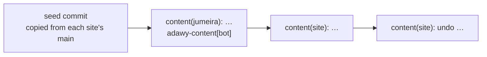

# `adawy-content-sandbox`

**Practice data, not code.** A private repository holding a copy of each
website's locale files and swappable images, one folder per site. The
[content dashboard](/repositories/adawy-dashboard) at admin.adawygroup.com
publishes here while it runs with `CONTENT_STORE=github-sandbox`, so the team
can edit, publish, look at history and undo **for real, without changing a
single live website**.

<Badge tone="internal">Internal</Badge> <Badge tone="private">Private</Badge>
No build · no CI · no Vercel project · created **27 September 2026**

<Stats>
  <Stat value="11" label="site folders" hint="one per editable site" />
  <Stat value="0" label="deployments" hint="nothing reads this repo but the dashboard" />
</Stats>

## Why it exists

Before the dashboard writes to the real site repositories it needs a real
GitHub repository to write to: the same GitHub App, the same commit path, the
same history and undo, the same login and email — everything except the last
step. A sandbox repo gives the team that for training and testing, and it
exercises the production code path (`GitHubStore`) daily, so the only thing
left untested at go-live is the *target*, not the machinery. The local
`.sandbox/` repos cannot do that job: they live on one laptop, and a
serverless deployment has no disk to keep them on.

**Nothing here is deployed**, and that is the point. A text broken in the
sandbox breaks nothing anyone can see.

## Layout

Each folder is named after the site's **id in the dashboard's
`lib/sites.ts`**, not after its repository, and holds that site's files at
their *site-relative* paths — the part below the site's root in its real repo.

```text
README.md
adawy-group/          messages/ (ar, en, fr) · public/about · public/partners
adawy-bizdev/         messages/
adawy-marketing/      messages/
adawy-pack/           messages/
adawy-print/          messages/
adawy-studio/         messages/ · public/work/<project>/
adawy-supplies/       messages/
adawy-group-links/    messages/
aladawy-links/        messages/
jumeira/              messages/ · public/{clients,numbers,why,work}
zad-alhkoul/          src/messages/
```

So `adawy-group/messages/en.json` here stands for
`apps/group/messages/en.json` in [`adawy-platform`](/repositories/adawy-platform),
and `zad-alhkoul/src/messages/` keeps the `src/` that the
[`zad-alhkoul`](/repositories/zad-alhkoul) repo has. The mapping lives in one
function, `sandboxTarget` in the dashboard's `lib/store/github.ts`, which sets
the repo root to the site id and the branch to `main`.

Only what the dashboard may touch is copied: locale files and the folders in
each site's `imageDirs` allow-list. The two WordPress sites have no folder,
because the dashboard does not edit them.

## History



- **The first commit is the seed**, copied from each site's `main`
  branch on 27 September 2026. The dashboard repo has no script that writes
  this repository — `pnpm seed:sandbox` fills the *local* `.sandbox/` only.
- **Every later commit comes from the dashboard**, authored by the Adawy
  Content GitHub App (`adawy-content[bot]`), with the subject
  `content(<site id>): <what changed>` and an `Edited-by:` trailer naming the
  person. The dashboard's History tab shows only commits with that prefix, so
  the seed never appears there.

<Callout type="info">
  **The trailers name real team members**, which is one reason this repository
  stays private.
</Callout>

## Refreshing it

The copy drifts from the real sites as developers change them, and that is
fine for practice. To bring it back in line, copy each site's locale files
and allow-listed image folders from its `main` into the matching folder here
and commit. Two rules make that safe:

- **Do not start the commit subject with `content(`.** That prefix is how the
  dashboard recognises its own publishes; a refresh that uses it would show up
  in History with an **Undo** button that "undoes" the refresh.
- **Keep the folder names as site ids.** Renaming a folder to the repo name
  makes the dashboard see an empty site.

There is no need to preserve practice publishes — nothing depends on them.

## After go-live

When the dashboard switches to `CONTENT_STORE=github` it stops writing here
([what is left for go-live](/repositories/adawy-dashboard#what-is-left-for-go-live)).
The repository can then be kept as a training ground — switching one
deployment back to `github-sandbox` gives new team members somewhere to
practise — or archived. That decision has not been made.
