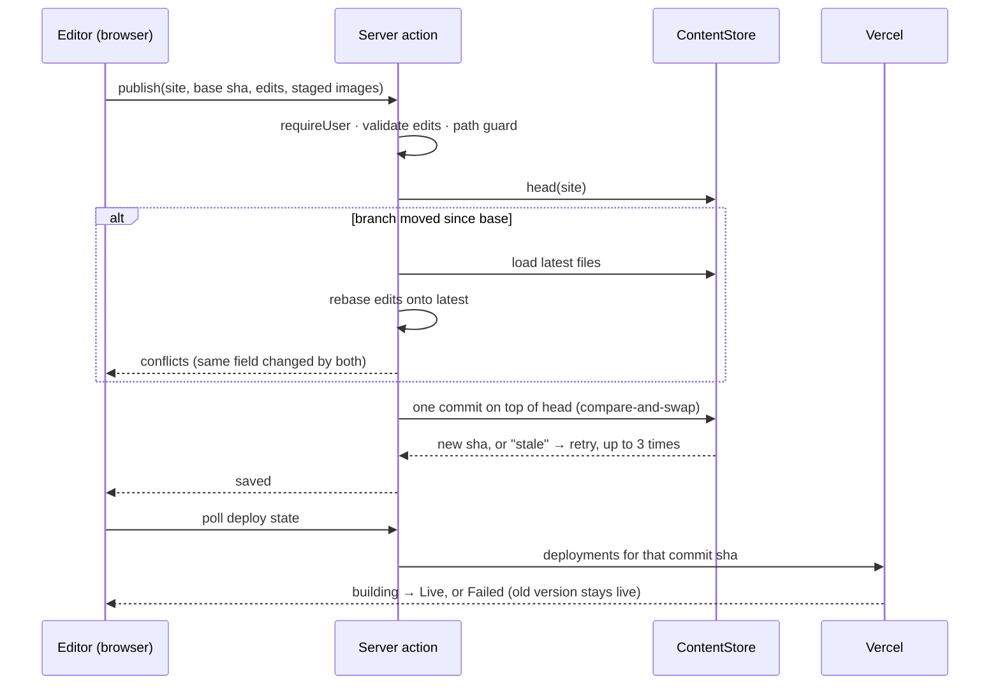
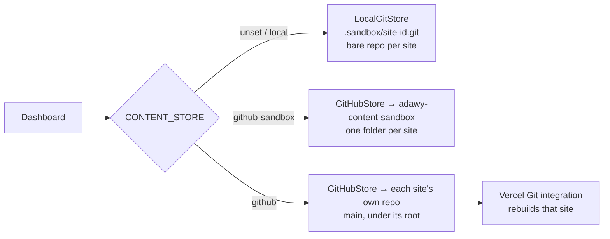

# `adawy-dashboard`

**The content dashboard.** One place where anyone on the team with a login
picks a website, changes its wording or replaces a photo, presses
**Publish**, and — once it is wired to the real repositories — the live site
rebuilds by itself. No developer in the loop for a changed headline.

<Badge tone="internal">Internal</Badge> <Badge tone="building">Practice mode</Badge>
Private · standalone Next.js 16.3 app · `pnpm@11.26.0` · Vercel project
`adawy-dashboard` (region `fra1`) · online at
[admin.adawygroup.com](https://admin.adawygroup.com) since **27 September 2026**
· **deployed by hand**

<Stats>
  <Stat value="13" label="site cards" hint="11 editable · 2 WordPress links" />
  <Stat value="3" label="content stores" hint="local · github-sandbox · github" />
  <Stat value="2" label="roles" hint="Admin · Content creator" />
  <Stat value="0" label="CI workflows" hint="checks run by hand before a deploy" />
</Stats>

<Callout type="warning">
  **It does not change any real website yet.** Online it runs with
  `CONTENT_STORE=github-sandbox`, so every publish lands in the practice repo
  [`adawy-content-sandbox`](/repositories/adawy-content-sandbox), and an amber
  banner on every screen says so. Going live is a configuration change plus
  two owner actions — see [what is left for go-live](#what-is-left-for-go-live).
</Callout>

## What it is, and what it is not

The goal in `docs/design.md`: *a content creator changes the Jumeira home-page
headline in Arabic and English, presses Publish, and sees it on the live site
within ~2 minutes, with a way to undo it.*

**In scope:** the text of every site whose wording lives in
`messages/<locale>.json`, replacing images in a hand-picked list of folders
per site, publish, history and undo, and user management. The dashboard's own
interface is Arabic by default with English beside it, fully RTL.

**Deliberately out of scope for version 1:** adding, removing or reordering
items (links, FAQ entries, menu items), anything about layout, colour or
motion, per-site permissions, and an approval step. The reason is the same
for all of them: each one needs the dashboard to change a site's *structure*,
and a tool that only ever rewrites string values and same-sized images cannot
break a build in the ways a structural edit can.

**It is not a CMS.** [ADR-004](/architecture/adrs) deferred a CMS so that
content stays in the repositories, versioned and reviewable. The dashboard
keeps that: **git is the store and the history**, a publish is an ordinary
commit on the site's own repo, and there is no content database. The only
database holds logins.

**It is department tooling, which is why it is filed as Internal.** It edits
Group brand sites *and* client sites (Jumeira, Zad Al-Hkoul, the Aladawy Pack
link page), so it belongs to neither world. It writes only locale files and
images into a client repo and adds nothing else to it — no package, no config
— so the hand-over promise of [ADR-010](/architecture/adrs) still holds.

## The sites it knows

`lib/sites.ts` is the registry; **adding a site is adding an entry**. Each
editable entry names its repo, its `root` inside that repo (`""` for a
single-site repo, `apps/<name>` inside
[`adawy-platform`](/repositories/adawy-platform)), its `messagesDir`, and its
`imageDirs` allow-list.

| Site | Repo · root | Text | Swappable images |
| ---- | ----------- | ---- | ---------------- |
| Jumeira | [`jumeira`](/repositories/jumeira) | `messages/` | `public/why`, `work`, `clients`, `numbers` |
| Adawy Group | `adawy-platform` · `apps/group` | `messages/` (ar, en, fr) | `public/about`, `public/partners` |
| Adawy Studio | `adawy-platform` · `apps/studio` | `messages/` | `public/work` |
| Business Development, Marketing Solutions, Pack, Print, Supplies | `adawy-platform` · `apps/<name>` | `messages/` | none yet |
| Zad Alhkoul | [`zad-alhkoul`](/repositories/zad-alhkoul) | `src/messages/` | none yet |
| Adawy Group Links | [`adawy-group-links`](/repositories/adawy-group-links) | `messages/` | none |
| Aladawy Pack Links | [`aladawy-links`](/repositories/aladawy-links) | `messages/` | none |
| Aladawy Shop | WordPress | — | card opens its `wp-admin` |
| Aladawy Pack | WordPress | — | card opens its `wp-admin` |

**The film-frame folders are left out on purpose** (`jumeira/public/hero`,
`zad-alhkoul/public/hero`): swapping one frame of a scrubbed sequence would
put a single foreign image in the middle of a film.

**Locales are discovered from the files present**, never hard-coded — Arabic
first, English second, anything else alphabetically — because Adawy Group has
a French file and the others do not, and a hard-coded list would either hide
it or invent empty ones.

**The two WordPress sites are link cards**, not editors: they already have
`wp-admin`, and a second way to edit the same content would make two sources
of truth. See [`aladawy-shop`](/repositories/aladawy-shop) and
[`aladawy-pack`](/repositories/aladawy-pack).

## Running it locally

```bash
pnpm install
pnpm seed:sandbox           # a practice git repo per site in .sandbox/
pnpm auth:setup <email> "<Name>" "<password>"   # login tables + first admin
pnpm dev --port 3100        # http://localhost:3100
```

- **`pnpm seed:sandbox` copies from sibling clones** (`../jumeira`,
  `../adawy-platform`, …), so clone the site repos next to this one first. It
  skips sandboxes that already exist; `--reset` rebuilds them.
- **`.env.local` needs `BETTER_AUTH_SECRET`** (any long random string) and
  `BETTER_AUTH_URL`. Nothing else: with no `CONTENT_STORE` the app uses the
  local sandbox, with no `DATABASE_URL` it uses SQLite at
  `.data/auth.sqlite`, and with no email provider it shows set-password links
  on screen. That default is deliberate — **a fresh clone cannot publish to
  anything real by accident.**
- Omit the password in `auth:setup` to get a set-password link instead.

There is **no `.env.example`** — `.env*` is gitignored wholesale. The
variable table in the repo's `README.md` is the list.

```bash
pnpm test && pnpm typecheck && pnpm lint && pnpm build   # the full check
```

## Stack

| | |
| --- | --- |
| Framework | Next.js 16.3.5 (App Router), React 19.3 — `proxy.ts` is the Next 16 name for middleware |
| UI | Tailwind CSS v4 + shadcn/ui on `radix-ui`, `lucide-react`, `sonner` toasts |
| i18n | next-intl 4 — interface language from the `ui-lang` cookie, `ar` by default; no locale in the URL |
| Auth | Better Auth 1.7 with its `admin` plugin — [below](#auth-and-roles) |
| Database | `node:sqlite` locally, Postgres (`pg`) in production — logins only |
| Content | Octokit + `@octokit/auth-app` (GitHub), `git` via `execFile` (local) |
| Images | `react-easy-crop` in the browser, `sharp` on the server |
| Validation | zod 4 |
| Tests | Vitest 5, `lib/**/*.test.ts`, Node environment |
| Hosting | Vercel, `vercel.json` pins `fra1` |

No `AGENTS.md`, no `.github/` directory.

## How a publish works



1. **The editor loads a site at a commit.** `lib/content/model.ts` reads every
   locale file and flattens them into one list of fields, each leaf string
   key carrying its value per locale. Nested objects and arrays are edited in
   place; numbers and booleans are not offered.
2. **Unpublished changes live in the browser** (`localStorage`, per site), so
   a closed tab or an expired session does not lose work.
3. **The validator blocks a publish** when a language is left empty, or when a
   placeholder (`{name}`, ICU plurals) or a rich-text tag (`<b>…</b>`) no
   longer matches the original. Those are exactly the edits that break a page
   at render time rather than at build time, so they are caught before any
   commit exists.
4. **The path guard** (`lib/path-guard.ts`) is the only gate between a request
   and the repo. Locale files must sit directly in `messagesDir`; images must
   be under one of `imageDirs` with an image extension; anything with `..`,
   an absolute path, or a path that changes when normalised is refused. **No
   route or action can write code**, whatever it is sent.
5. **A publish is one commit** — text and images together — with the subject
   `content(<site>): <sections changed>` and an `Edited-by:` trailer naming
   the editor. One commit per publish is what makes undo and history cheap:
   each publish is a single thing to look at or take back. On GitHub it goes
   through the Git Data API (blobs → tree → commit → non-force ref update);
   the local store does the same with `git` plumbing.
6. **Two people on the same site** is handled at commit time. If the branch
   moved since the editor loaded it, the server reloads the latest files and
   re-applies only the fields this editor changed. Different fields merge
   silently; the same field changed by both comes back as a conflict dialog
   showing both values, and the editor chooses which to keep.

### Images

The browser crops the new photo **locked to the original's aspect ratio** and
shrinks it, because server actions accept at most 4 MB
(`serverActions.bodySizeLimit`) and Vercel refuses larger request bodies
anyway. The server then re-encodes it with `sharp` to **the original's exact
pixel size and format** (webp, avif, jpeg or png) and stores it at **the same
path**. The site's code never learns an image changed — no `width`/`height`
prop, `next/image` config or import has to follow.

A staged image is stored as a blob before the publish; the image route serves
it with `?blob=`. Published images are served with `?v=<commit sha>` and
cached as immutable, because a URL pinned to a commit can never change content
— that is what fixed the "old picture still showing after publish" bug.

### History and undo

The History tab lists the site's dashboard commits — only those whose message
starts with `content(<site>)`, so developer commits and the seed never appear.
**Undo writes a new commit**, never a force-push, and it is field-precise: a
text goes back only if it *still* holds the value that publish gave it, and an
image only if it is still the image that publish put there. Undoing an old
publish therefore cannot clobber a later one.

## Content stores

`CONTENT_STORE` picks where content is read and written. All three implement
one `ContentStore` interface (`lib/store/types.ts`), so everything above is
identical in each.



| Mode | Where a publish goes | Status |
| ---- | -------------------- | ------ |
| `local` (default) | Bare git repos in `.sandbox/<site>.git`, seeded by `pnpm seed:sandbox` | Laptop practice |
| `github-sandbox` | [`Adawy-Group/adawy-content-sandbox`](/repositories/adawy-content-sandbox), folder `<site id>/`, set by `SANDBOX_REPO` | <Badge tone="live">Production setting today</Badge> |
| `github` | The real repo and branch in `lib/sites.ts`, under the site's `root` | <Badge tone="planned">Not yet run</Badge> |

**The `GitHubStore` class already runs against GitHub every day** — sandbox
mode is the same class with a different target. What has never run is the
`github` *target*: writing to the real site repos, under `apps/<name>` in the
monorepo. Its path prefixing and its stale-branch handling are covered by
unit tests against a mocked Octokit, not by a real publish. **The first real
publish is the pilot**, and the design names Jumeira as that pilot, checked
live and then undone.

On GitHub, commits are authored by the **Adawy Content** GitHub App (they show
as `adawy-content[bot]`); the person is in the `Edited-by:` trailer. The app is
installed on the sandbox repository only, so the credentials in production
**cannot** write to a site repo even if the setting were flipped by mistake.

## Auth and roles

**Better Auth, running inside the app, invite-only.** It replaced Clerk on
27 September 2026 for full control of the Arabic login screens and no
third-party branding. `docs/plan.md` still describes Clerk; `docs/design.md`
and the code are current.

- **Sign-up is disabled.** An admin creates the account on the **Users** page
  and the person receives a *set your password* link (valid three days) by
  email through Resend. Without email configured, the link is shown on the
  Users page to send by hand.
- **Two roles.** `admin` edits content and manages users; `user` is shown as
  **Content creator** and edits content. Every server action and the image
  route check the session on the server (`requireUser` / `requireAdmin`);
  `proxy.ts` only redirects visitors without a session cookie, which is a
  convenience, not the security boundary. An admin cannot change their own
  role or remove themselves, so nobody can lock themselves out of user
  management by accident.
- **Password rules** (`lib/password.ts`): at least 10 characters, with a
  letter in any script, a number and a symbol. **Mixed case is not
  required — it only raises the strength meter — because Arabic has no case**,
  and a rule an Arabic-only password can never meet is a rule that forces
  people into English. The same function drives the live checklist on screen
  and a server hook that refuses a weak password on every endpoint that sets
  one.
- **Rate limits are counted in the database**, not in memory — five sign-in
  attempts a minute, three reset requests per five minutes — because on
  serverless each instance has its own memory and an in-memory limit is no
  limit.
- **Sessions last 14 days**; resetting a password revokes the others.
- **Where users live:** `.data/auth.sqlite` locally; **Neon Postgres** in
  `fra1` in production. `pnpm auth:setup` creates or migrates the tables and
  can make the first admin — run it again after upgrading Better Auth.

## Deploy

```bash
pnpm test && pnpm typecheck && pnpm lint && pnpm build
vercel deploy --prod
```

**By hand, from the repo folder, with the Vercel CLI.** There is no CI, so
nothing runs those checks for you. The Git integration is not an option on
the Hobby plan, which refuses private organisation repositories — the same
constraint as the rest of the org ([Deployment](/how-we-work/deployment)).

**The app runs in `fra1` because the database does.** Every page load checks a
session, so a function in another region pays a cross-continent round trip on
every request.

**The domain:** `admin.adawygroup.com` is a CNAME to Vercel plus a `_vercel`
verification TXT record, both in the adawygroup.com zone on the Verpex host;
the mail records are untouched ([Domains, DNS & Email](/architecture/domains-and-email)).
Emails go out through Resend from `send.adawygroup.com`, the subdomain the
Group site's forms already use.

**It is kept out of search engines** with `X-Robots-Tag: noindex, nofollow`
on every response, alongside `X-Frame-Options: DENY`, a `frame-ancestors
'none'` CSP, HSTS and a restrictive `Permissions-Policy`. An internal tool has
no reason to be indexed or framed, and a framed login page is how a clickjack
starts.

Environment variables, names only (values live in the Vercel project):
`CONTENT_STORE`, `SANDBOX_REPO`, `GITHUB_APP_ID`, `GITHUB_APP_PRIVATE_KEY`,
`GITHUB_APP_INSTALLATION_ID`, `DATABASE_URL`, `BETTER_AUTH_SECRET`,
`BETTER_AUTH_URL`, `RESEND_API_KEY`, `EMAIL_FROM`, and — for the *Live ✓*
status — `VERCEL_TOKEN` and `VERCEL_TEAM_ID`.

## What is left for go-live

Database, email, domain and secrets are already set up. What remains, in
order:

<Steps>

### Vercel on Pro, and each site deploying from Git

The Hobby plan cannot connect Vercel's Git integration to a private
organisation repo, and a dashboard publish is a commit that has to trigger a
build by itself. Connect each site's Vercel project to its repo; for the
`adawy-platform` projects keep the root at `apps/<name>` and set the Ignored
Build Step to `npx turbo-ignore`, **so a publish to one brand rebuilds only
that brand** instead of all seven. Put each project's id in
`vercelProjectId` in `lib/sites.ts` — none is set today, and without it the
status stays at *Saved* instead of *Live ✓*.

### Give the GitHub App access to the site repos

Adawy-Group → Settings → GitHub Apps → **Adawy Content** → Configure, and add
the site repositories. Contents read and write only.

### Switch the store and redeploy

In the Vercel project set `CONTENT_STORE=github`, remove `SANDBOX_REPO`, add
`VERCEL_TOKEN` and `VERCEL_TEAM_ID`, and redeploy.

### Pilot on Jumeira

One real publish to production, checked live, then undone — before the other
sites are announced to the team.

</Steps>

## Tests

| Test | What would otherwise ship broken |
| ---- | -------------------------------- |
| `lib/path-guard.test.ts` | `messages/../package.json`, absolute paths, images outside `imageDirs` or with a non-image extension getting through |
| `lib/content/model.test.ts` | Nested and array messages losing structure; JSON formatting (2-space, trailing newline) drifting so every publish rewrites the whole file |
| `lib/content/validate.test.ts` | A dropped `{name}` or `<b>` tag, or an emptied language, reaching a commit |
| `lib/content/merge.test.ts` | Two editors on one site overwriting each other, or a false conflict on identical changes |
| `lib/content/service.test.ts` | Publish, merge, conflicts, staged images and undo end to end, against a real temporary git repo |
| `lib/store/local-git.test.ts` | A stale parent overwriting a newer commit; history listing the wrong paths |
| `lib/store/github.test.ts` | Paths written without the site root, a force-push instead of a stale result, files over 1 MB unreadable, sandbox folders mixed up (mocked Octokit) |
| `lib/images.test.ts` | A portrait photo replacing a landscape image at the wrong size or format |
| `lib/password.test.ts` | Arabic-only passwords refused, or weak ones accepted |
| `lib/labels.test.ts` | Unreadable field names in the editor |

The design also plans a Playwright run against a throw-away repo; **it does
not exist yet.**

## Training videos

Five Arabic tutorial videos walk the team through the dashboard — signing in
and setting a password, editing text and publishing, swapping images, history
and undo, and users and permissions. They are listed on
[Training Videos](/guides/training-videos).

## Known traps

| Symptom | Cause | Fix |
| ------- | ----- | --- |
| `pnpm seed:sandbox` seeds a site with 0 files | The site's repo is not cloned next to this one | Clone it into `../<repo>` and run `pnpm seed:sandbox --reset` |
| Publishing works but the real site did not change | You are in a sandbox mode — the banner says so | Expected until [go-live](#what-is-left-for-go-live) |
| Status stays at *Saved*, never *Live ✓* | Sandbox mode, no `VERCEL_TOKEN`, or no `vercelProjectId` for that site | All three are needed; the status matches Vercel deployments by commit sha |
| Startup fails with `SANDBOX_REPO is required` | `CONTENT_STORE=github-sandbox` without the repo name | Set `SANDBOX_REPO=Adawy-Group/adawy-content-sandbox` |
| Sign-in or rate limiting fails against a new database | The login tables (including the rate-limit table) were never created there | `pnpm auth:setup` with that `DATABASE_URL`; run it again after a Better Auth upgrade |
| An invited person never got the email | Resend not configured in that environment, or the link expired after three days | Users page → resend the link; without email it is shown on screen |
| History in a busy real repo misses older publishes | History reads the latest 100 commits on the site's path and keeps only dashboard ones | Undo what you need while it is recent; a developer can still revert older ones in git |
| A site image cannot be replaced | Its folder is not in `imageDirs` | Add the folder to that site in `lib/sites.ts` — unless it is a film-frame sequence |
