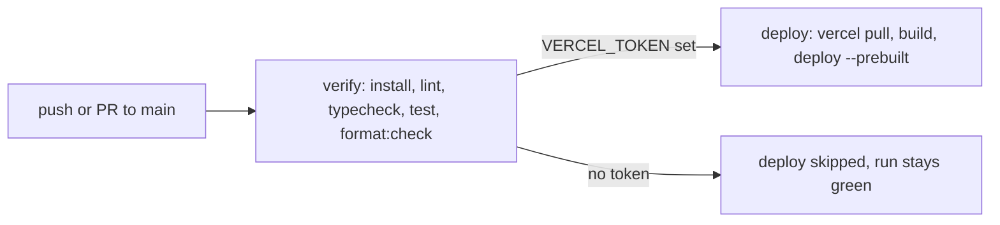

# `adawy-group-links`

**Adawy Group's own property.** The "link in bio" page: one screen carrying the
website, a WhatsApp chat, the company profile PDF, four social accounts
(Instagram, Facebook, LinkedIn, TikTok), the head-office contact details and
the branch list — in English and Arabic, light and dark.

Private · standalone Next.js 16.3 app · **not** part of the monorepo ·
production at `adawy-group-links.vercel.app`

It has a client sibling built from the same code:
[`aladawy-links`](/repositories/aladawy-links), the same page rebranded for
Aladawy Pack. A change to the shared construction (motion, theme reveal, copy
buttons, tests) usually wants making in both — see
[below](#its-client-sibling-aladawy-links).

<Stats>
  <Stat value="1" label="route" hint="everything else 404s inside the locale" />
  <Stat value="7" label="destinations" hint="count and order enforced by a test" />
  <Stat value="6" label="branches" hint="EGY · KSA · UAE · LIBYA · USA · CHINA" />
  <Stat value="5" label="test files" hint="for a two-page site" />
</Stats>

Social profiles allow one link. This is that link: a poster-like page routing a
visitor from an Instagram or TikTok bio to everything else, with tap-to-call,
`mailto:`, a WhatsApp chat, a map pin and one-tap copy on the number and the
inbox.

## An open question before you read further

<Callout type="warning">
  **This is the one Group repository that does not fit the two-worlds model.**

  [The repository map](/repositories) says Group work lives in the
  `adawy-platform` monorepo and client work gets a standalone repo each. This
  is Adawy Group's own property **in a standalone repo** — every destination,
  phone number and handle on it belongs to the Group.

  The repository does not record why it sits outside the monorepo, and this
  page will not invent a reason. Treat it as a **Group-owned standalone
  microsite** and an open placement decision: either the rule narrows to
  *"Group **brand sites** live in the monorepo"*, or this folds back into
  `apps/` later. Until someone decides, do not read it as a precedent for
  starting the next Group property outside the platform —
  [ADR-010](/architecture/adrs) still governs that choice.
</Callout>

## Stack

| | |
| --- | --- |
| Framework | Next.js 16.3.5 (App Router), React 19.3 |
| Language | TypeScript, strict — `@typescript/native` (TypeScript 7) is installed alongside, and the `typescript` package is aliased to `@typescript/typescript6` |
| Styling | Tailwind CSS v4 (CSS-first) + shadcn/ui (base-nova) on `@base-ui/react`, `rtl: true` |
| Theme | next-themes, `attribute="class"`, with a hand-rolled reveal animation |
| Motion | GSAP 3 (`@gsap/react`) entrance, gated on JavaScript **and** reduced motion |
| i18n | next-intl 4 — `en` (default) + `ar`, `localePrefix: 'always'` |
| Fonts | Montserrat (Latin) + Cairo (Arabic), `preload: false` |
| Tests | Vitest 5 — five files, and they cover the things reviewers cannot see |
| Lint / format | ESLint 10 (`eslint-config-next` 16.3.5), Prettier 3 + `prettier-plugin-tailwindcss` |
| Tooling | pnpm **11.26.0** (pinned in `packageManager`); Node ≥ 22.18 per the README (no `engines` field); CI runs Node 24 |
| Agent contract | `AGENTS.md` holds **only** the block `next dev` generates — no repo-specific rules |

No API routes, no server actions, no forms, no database, no client state
library. The only mutations on the whole site are a theme change and a
clipboard write. Seven files are client components (theme provider and
toggle, copy button, entrance, link card, copyright year, direction
provider); the link list, contact block and locale switch render on the
server. There is no `error.tsx` boundary.

## Layout

```text
app/
  [locale]/page.tsx             the whole site
  [locale]/[...rest]/page.tsx   everything else → the locale's not-found
  [locale]/layout.tsx           <html lang dir>, fonts, the no-JS gate script
  [locale]/opengraph-image.tsx  per-locale OG image
  robots.ts · sitemap.ts · fonts.ts · globals.css
components/
  backdrop/   tonal field + baked mark pattern
  brand/      the mark, the wordmark, lib/ tile geometry (+ test)
  chrome/     theme toggle + reveal, locale switch, live copyright year
  contact/    contact block, copy button
  entrance/   the GSAP timeline
  links/      link list, link card, hand-drawn social icons
  ui/         shadcn button + direction provider
lib/          links.ts · contact.ts · site.ts (+ tests)
messages/     en.json · ar.json (+ parity and brand-spelling tests)
i18n/ + proxy.ts               next-intl routing, request config, proxy
scripts/build-pattern-tile.ts  the pattern:bake script
public/       adawy-group-company-profile.pdf · pattern/tile-{ink,chalk}.png
```

`lib/` is pure data with relative imports, so Vitest reads it without the
`@/` alias. Language-neutral facts (the number, the inbox, the map pin, the
branch keys) live in `lib/contact.ts`, never in `messages/`, because they set
in Latin on the Arabic page too; what *is* translated (section titles, the two
address lines, branch names) sits under `Contact.*`.

## Commands

```bash
pnpm install
pnpm dev             # http://localhost:3000 → redirects to /en
pnpm build           # production build, both locales prerendered

pnpm lint && pnpm typecheck && pnpm test && pnpm format:check   # what CI gates on
pnpm format          # prettier --write
pnpm pattern:bake    # re-bake the background tile
```

<Callout type="important">
  `pnpm typecheck` is **`next typegen && tsc --noEmit`**, and the first half is
  load-bearing. The layout and page use Next 16's generated route types
  (`LayoutProps<"/[locale]">`), which do not exist until typegen has run. CI
  failed on exactly this once — do not "simplify" the script back to a bare
  `tsc`.
</Callout>

## Why the locale prefix is always on

`localePrefix: 'always'`, so the two pages are `/en` and `/ar` — never a bare
`/`. The routing file gives the reason, and it is specific to what this page
*is*: **a link pasted into a bio must not depend on `Accept-Language`.** The
address someone copies has to be the address everyone lands on. `proxy.ts`
sends a bare `/` to the best locale.

Compare [`zad-alhkoul`](/repositories/zad-alhkoul), which is unprefixed for its
default locale because its job is search reach rather than a shareable
constant. Same library, opposite setting, both correct
([i18n & RTL](/standards/i18n-rtl)).

## Two rules worth stealing for any Arabic interface

**The Arabic brand is عدوى — always, and a test enforces it.**
`messages/brand-spelling.test.ts` fails on أدوي, ادوي, إدوي, أدوى and
مجموعة العدوي. The test carries its own reasoning:

> Ported from adawy-platform, where the group site once shipped أدوي and عدوى
> side by side and Arabic search saw two brands where there is one. Nothing
> about writing a new Arabic string makes the wrong form look wrong (one
> dotless letter), so it is checked rather than trusted.

That last sentence is the general rule: **a mistake that does not look like a
mistake belongs in a test, not in a review checklist.**

**Never letterspace Arabic.** Latin headings here use `tracking-[0.08em]` with
`uppercase`, and every one of them is paired with a
`[&:lang(ar)]:tracking-normal` override. Arabic has no case, and letterspacing
breaks the joined script — the glyphs come apart. The lint rules cannot see
this; it is on the author ([i18n & RTL](/standards/i18n-rtl)).

## Things the tests cover that a reviewer's eye cannot

For a site with one route, five test files looks like a lot. They are all
guarding facts that render identically whether they are right or wrong:

| Test | What would otherwise ship broken |
| ---- | -------------------------------- |
| `lib/contact.test.ts` | `tel:` and `mailto:` — *"invisible to the eye but what a tap actually dials"*. The `tel:` form must equal the display number with spaces stripped; branches are unique and named in both locales; the address has two lines in both |
| `lib/links.test.ts` | Exactly seven destinations, website first and WhatsApp second; every `kind: "document"` exists on disk under `public/`, so renaming the company profile PDF breaks the suite instead of the page; the `wa.me` digits equal `CONTACT.phone.tel`; the WhatsApp opener is URL-escaped and differs per locale |
| `messages/parity.test.ts` | Identical key trees across locales, and no empty strings |
| `messages/brand-spelling.test.ts` | The Arabic brand form, as above |
| `components/brand/lib/mark-pattern-tile.test.ts` | The generated pattern geometry — six outlines, one solid, a one-pixel hairline at on-screen size |

This is the department's testing philosophy applied to a marketing page: test
the things that break silently, never the markup
([testing](/standards/testing)).

<details>
<summary>Design and performance decisions, with their reasons</summary>

- **WhatsApp is the second door, derived from the phone number.** The order is
  website first (what matters most), WhatsApp second (*"the reply most
  visitors actually want"*), then the profile and the socials. `WHATSAPP_HREF`
  is built from `CONTACT.phone.tel` with the `+` dropped — the only form
  `wa.me` accepts — so the line a visitor chats is the line the page prints and
  the tap dials: one number, edited in one place. The link list appends a
  localized opener (`Links.whatsapp.opener`) so the first message arrives in
  the visitor's language, `encodeURIComponent`-escaped because the Arabic
  opener is not URL-safe.
- **The theme flip is a hand-rolled Web Animations clip-path reveal, not the
  View Transitions API.** VT snapshots the whole page before it can animate,
  which is dead time after the tap on mobile; the overlay is one solid
  viewport-sized layer and animates from radius 0 the instant you tap. It is
  module-scoped so it survives the locale-switch remount.
- **The background pattern is a baked PNG, not a live SVG.** In the source's
  words, *"a raster tile is the one background every renderer handles the same
  way."* `scripts/build-pattern-tile.ts` rasterises it with `sharp` at 3× (one
  ink per theme) so the hairline is one device pixel on dense phones. Change
  the geometry in the tile module, then `pnpm pattern:bake` — editing the geometry without re-baking changes
  nothing on screen, and `public/` is in `.prettierignore` so nothing else
  flags it.
- **The entrance animation is gated on JavaScript.** An inline `<head>` script
  adds a class before first paint, and the CSS only hides the reveal targets
  under that class — *"a visitor without JS sees the whole page at once instead
  of nothing."* Under `prefers-reduced-motion` the timeline jumps straight to
  its finished state. The full run is ~1.5 s, with the doors tappable by
  ~0.9 s.
- **The entrance animates `y` and opacity only.** Vertical motion is
  direction-agnostic; anything horizontal has to be mirrored under `[dir=rtl]`,
  and the one glyph that does move sideways carries an explicit RTL
  counterpart.
- **Copy buttons stay silent on failure.** The clipboard write is wrapped in a
  `try`/`catch` and the catch path changes nothing on screen, because
  *"claiming a copy that did not happen is worse than no feedback at all."*
  Success flips the icon and announces through an always-mounted `aria-live`
  region.
- **Fonts do not preload.** The layout mounts both font variables for both
  locales, so preloading would push the Arabic and Latin faces on every route;
  with `preload: false` the browser fetches only the face a page renders.
- **English lists branches as codes (EGY, KSA…), Arabic as country names.**
  Deliberate — the codes are an English abbreviation. Do not "fix" the Arabic.
- **Social glyphs are hand-drawn to lucide's grammar** (24-box, 1.75 stroke,
  round caps) because lucide no longer ships brand icons, and they have to sit
  in a monochrome tile rather than on a brand-coloured card. WhatsApp's green
  never appears; the bubble carries the recognition on its own.

</details>

## Brand constraints

The palette is **black, white and industrial gray only** — every colour token
in the stylesheet is zero-chroma except shadcn's stock `--destructive`, which
only the unused `destructive` button variant and `aria-invalid` states
reference. The brand guidelines rule out bright palettes, saturated colour,
trend gradients and colour-heavy layouts, and sub-brand accent colours that
exist on adawygroup.com never appear here ([UI & brand standards](/standards/ui)).
The mark is six pieces on a 4×4 grid — the same geometry adawygroup.com uses —
and both mark and wordmark take `currentColor`.

## CI

One workflow, `.github/workflows/deploy.yml` (**Verify & deploy (Vercel)**),
on pushes to `main` and pull requests into `main`:



- `verify` always runs, on Node 24 with `pnpm install --frozen-lockfile`.
- `deploy` sends pushes to the `production` environment and pull requests to
  `preview`, writing the URL into the run summary. Its gate is a step output
  from `verify`, because secrets cannot be read in a job-level `if`.
- Concurrency cancels a PR's superseded run but never a production deploy
  mid-upload — pushes to `main` queue behind each other instead.

## Deployment

Vercel project `adawy-group-links` (team `adawy-s-projects`), deployed from
GitHub Actions with the Vercel CLI rather than Vercel's dashboard Git
integration, because the Hobby plan will not connect a private organisation
repo. Same arrangement as [`adawy-platform`](/repositories/adawy-platform);
see [Deployment](/how-we-work/deployment).

<Callout type="warning">
  **The deploy job is not live yet.** The repo has `VERCEL_ORG_ID` and
  `VERCEL_PROJECT_ID` but no `VERCEL_TOKEN` secret (checked 2026-09-19), so
  every run shows `verify` green and `deploy` skipped. Until the token is
  added, production ships by hand with `vercel deploy --prod` — run the four
  CI checks first, because nothing else runs them on that path.
</Callout>

`lib/site.ts` resolves the public origin as `NEXT_PUBLIC_SITE_URL` →
`https://$VERCEL_PROJECT_PRODUCTION_URL` → `http://localhost:3000`, and feeds
`metadataBase`, canonicals, `robots` and the sitemap. A custom domain (e.g.
`links.adawygroup.com`) is anticipated but not attached, so those URLs
currently resolve to the Vercel project host. `NEXT_PUBLIC_SITE_URL` is the
only variable in `.env.example`, and it is optional.

## Its client sibling: `aladawy-links`

[`aladawy-links`](/repositories/aladawy-links) is this page, file for file,
rebranded for [Aladawy Pack](/repositories/aladawy-pack): its own monogram,
wordmark and fonts, six destinations instead of seven, a head-office pin
instead of a branch list, and **no CI at all**. The two are separate
repositories, not a shared package — a fix to the shared construction has to
be carried across by hand, so when you touch the entrance, the theme reveal,
the copy button or a test here, check whether `aladawy-links` wants the same
change.

## Recent history

- **2026-09-19** — pnpm pinned to 11.26.0; Next 16.3.5, React 19.3, ESLint 10,
  TypeScript 7 and Vitest 5.
- **2026-09-02 → 03** — Next 16.3.4 and TypeScript 6; `@types/node`
  normalised to `^26`; agent-tool mentions dropped from tracked files.
- **2026-08** — the WhatsApp click-to-chat door (second in the list), the
  contact block and extra social links, the company-profile door, the live
  copyright year and the CI workflow; CI then learned to run `next typegen`
  before `tsc`.
