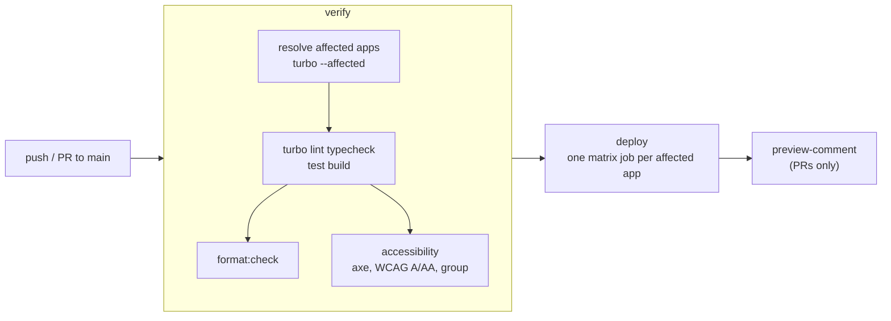

# `adawy-platform`

<Badge tone="group">Group</Badge>

**The brand-sites monorepo for Adawy Group.** A thin Next.js app per flagship
brand, built from shared `@adawy/*` packages. All six flagships now have an
app; `group` is the full site and the other six apps are holding pages. This
is the department's largest and most active codebase, and the one every Group
standard is written about.

Private · Turborepo + pnpm 11.26.0 · Node ≥ 22.18 · TypeScript

<Stats>
  <Stat value="7" label="apps" hint="1 full site · 6 holding pages" />
  <Stat value="9" label="shared packages" hint="@adawy/*" />
  <Stat value="3" label="platform locales" hint="en · ar · fr — group only serves fr" />
</Stats>

## What is in it today

```
apps/
├── group/      Adawy Group  → adawygroup.com  (the full site, en/ar/fr)
│   ├── app/         routes only: /, /about, /contact, /ecosystem (+ md/, og/)
│   ├── features/    one per thing a visitor can point at (hero, brands, stage, …)
│   │                each is components/ + scene/ (three.js) + lib/ (pure)
│   └── platform/    app-wide machinery: chrome, scroll, gl, perf, sound, seo, …
├── studio/     Adawy Studio                → adawystudio.com, holding page (en/ar)
├── pack/       Adawy Pack                  → adawypack.com, holding page (en/ar)
├── print/      Adawy Print                 → adawyprint.com, holding page (en/ar)
├── supplies/   Adawy Supplies              → adawysupplies.com, holding page (en/ar)
├── marketing/  Adawy Marketing Solutions   → adawymarketingsolutions.com, holding page (en/ar)
└── bizdev/     Adawy Business Development  → holding page, no domain yet (en/ar)

packages/
├── ui/                 @adawy/ui         shadcn primitives + shared sections, ours to edit
├── design/             @adawy/design     Tailwind v4 token structure (CSS-first)
├── motion/             @adawy/motion     GSAP + Lenis primitives, registered once
├── i18n/               @adawy/i18n       locale list, direction, next-intl helpers
├── site/               @adawy/site       identity, routes, hreflang, robots, sitemap, test helpers
├── holding/            @adawy/holding    the holding-page body the six render
├── brand-app/          @adawy/brand-app  the holding-app shell: layout, page, fonts, icon bake
├── eslint-config/      the architecture-enforcing lint rules
└── typescript-config/  shared tsconfig bases
```

The six holding apps are a single branded screen each. Every one takes its
field and ink from that brand's `[data-brand]` block in
`apps/group/app/globals.css`, where the pair was measured. **Identity is token
values, not a forked component**, so a brand's look cannot drift from the one
the group site shows. What differs per app is the mark and its entrance. They
are real apps with real Vercel deploys, which is why a change to `packages/ui`
verifies and deploys all seven apps rather than one.

**`@adawy/brand-app` is the newest package.** It owns everything around the
holding page that each app used to copy: the `[locale]` layout and metadata,
the page, the fonts, the locale proxy and a Node-only `./icons` entry for the
icon bake. Before it, those were 439 identical lines per app. Today **only
`apps/print` consumes it** (#281). The other five still carry their own copy
and are expected to move over. `apps/group` is deliberately not a consumer,
because its routing, proxy, sitemap and layout all differ.

The repo extracts a package on the **third use, not the first**, because an
abstraction made from one example encodes that example's accidents.
`@adawy/site` and `@adawy/holding` came out once `pack` and `studio` had
hand-copied the same platform layer twice. `@adawy/utils` is still waiting for
a second caller. What `group` does not share lives in its own
`features/` + `platform/` layering ([ADR-010](/architecture/adrs)).

Planned but not built: `apps/sites` (the multi-tenant long tail,
[ADR-008](/architecture/adrs)) and `apps/api` (the Phase-2 NestJS backend,
[ADR-009](/architecture/adrs)).

## Stack

| | Version (Sept 2026) |
| --- | --- |
| Framework | Next.js 16.3.5, React 19.3.0, next-intl 4 |
| Language | TypeScript 7 (`tsc`) side by side with TypeScript 6, which typescript-eslint and Next still load as an API |
| Styling | Tailwind CSS 4.3, shadcn 4 on Base UI 1.8, Hugeicons |
| Motion & 3D | GSAP 3.15 + Lenis 1.3 (`@adawy/motion`), three.js 0.186, Rapier 0.20 |
| Forms & email | react-hook-form 7 + zod 4, Resend 6 |
| Tooling | Turborepo 2, pnpm 11.26.0, ESLint 10 (flat config), Prettier 3, Vitest 5 |

`typescript` in every `package.json` is an alias to
`@typescript/typescript6`, and `@typescript/native` is TypeScript 7. That split
follows the TS 7.0 announcement: the fast compiler does the typechecking while
the tools that need the JS API keep working.

## Commands

Everything runs from the repo root. **This repo is pnpm-only** — `npm install`
will produce a tree the lockfile does not describe. pnpm 11 reads its settings
from `pnpm-workspace.yaml` (there is no `.npmrc`), so hoisting, build-script
allowances and security overrides all live there.

```bash
pnpm install
pnpm turbo dev --filter=group    # http://localhost:3000 → redirects to /en

# what CI gates on
pnpm turbo lint typecheck test build
pnpm format:check
pnpm --filter group a11y:check   # needs a running `pnpm --filter group start`
```

`--filter=group` scopes a task to one app. Workspace names are `group`,
`studio`, `pack`, `print`, `supplies`, `marketing`, `bizdev`, and the
`@adawy/*` packages.

Running a single test means working inside the app:

```bash
pnpm --filter=group exec vitest run messages/parity.test.ts
pnpm --filter=group exec vitest run -t "message parity"
pnpm --filter=group exec vitest                          # watch mode
```

`apps/group` also carries about thirty `*:bake` / `*:grade` scripts
(`coins:bake`, `crystal:bake`, `ao:bake`, …) that regenerate the committed 3D
models, textures and audio. Each holding app has one, `icons:bake`. Secrets
for the inquiry form (`RESEND_API_KEY`, `INQUIRY_TO`, `INQUIRY_FROM`) are
listed in `apps/group/.env.example`.

<Callout type="important">
  `pnpm format:check` is a **separate CI gate** from `turbo lint`. The
  per-package lint scripts only reach `.ts`/`.tsx`; README and CSS files drift
  too, so Prettier runs at the root. A green `turbo lint` does not mean CI will
  pass.
</Callout>

## Tests

Vitest, colocated, run with no config file. There are about 165 test files, and
146 of them sit in `apps/group`. They test the pure `lib/` layer (scroll curves,
physics, camera fits, the inquiry schema, rate limit and email) because
`lib/` holds no React or three.js and runs without a DOM. Every app runs a
**message parity** test from `@adawy/site/testing`, which checks there is
exactly one message file per locale the app serves, and that every other
locale has exactly the default locale's keys. A missing key would otherwise
fail only at render time in production, because next-intl does not check keys
at build time.
`group` adds `brand-spelling` and `seo` checks on its messages. The
packages test locales and direction (`i18n`), identity, routes, robots and
alternates (`site`), and `ui`.

## Things that will surprise you

**Middleware is `proxy.ts`.** Next.js 16 renamed it; `middleware.ts` does not
exist here. More generally, this is not the Next.js in most people's heads —
`AGENTS.md` says to read the relevant guide in `node_modules/next/dist/docs/`
before writing framework code.

**There is a third locale, and only one app serves it.** `@adawy/i18n` ships
`en`, `ar` **and `fr`**, and `apps/group` has a complete `messages/fr.json`.
The six holding apps publish `en` and `ar` only. Each app's `i18n/routing.ts`
declares its subset with `satisfies readonly Locale[]`, so a code the platform
does not know fails the build. Anything that enumerates locales must come from
the package or that routing file, never a hand-written array
([i18n & RTL](/standards/i18n-rtl)).

**Each app names its own domain, in one file.** `PRODUCTION_HOST` lives in
`lib/site/production-host.ts` (`platform/seo/production-host.ts` in
`apps/group`). It is the switch for indexing, the canonical origin and the
sitemap, and it only turns them on for the production deployment serving that
host, so previews stay `noindex`. Every app names its domain except `bizdev`,
which has none yet. A holding page on a domain also links back to
adawygroup.com and names Adawy Group as its parent organisation in its
structured data (`@adawy/holding`'s `siteUrl`). The group's brand pages link
out through each brand's `site` in `BRAND_PAGES`. Old WordPress URLs that search
engines still list are permanent redirects in `apps/group/next.config.ts`
([Domains, DNS & Email](/architecture/domains-and-email)).

**The layering in `apps/group` is enforced, not suggested.** `platform/` never
imports `features/`, a feature reaches another only through its barrel,
`lib/` holds no React or three.js, and `scene/` holds no React.
`apps/group/eslint.config.js` generates the `no-restricted-imports` blocks, so
CI fails on a breach instead of waiting for a reviewer to notice.

**The whole page is one WebGL canvas.** Every 3D element on adawygroup.com is a
pass on a single `three.js` context, driven by scroll through a strict
driver → channel → stage split. Do not add a second canvas — see
[Platform Architecture](/architecture/platform-architecture).

**shadcn components are ours to edit.** Everything under
`packages/ui/src/components` was vendored by the CLI. When a consumer needs
different geometry, you change the component. Out-specifying it from the call
site does not work, because shadcn's defaults are variant-scoped and
tailwind-merge will not treat a bare `h-14` as overriding them. The site's
button is `ActionButton`/`ActionLink` from `@/platform/ui/action`; importing
shadcn's `Button` from app code is an ESLint error. `AGENTS.md` has the full
contract.

**Files are kebab-case, enforced.** `unicorn/filename-case` fails the build on
a PascalCase file, because mixed-case names break git on case-insensitive
filesystems (macOS, Windows). Components are PascalCase identifiers in kebab
files, named exports only except where Next requires a default export.

**Baked assets are committed and currently un-reproducible.** `public/` holds
generated `.glb`, `.webp` and audio files produced by the hand-run bake
scripts, whose source artwork lives outside the repo. Do not delete one
expecting to rebake it — see `docs/shipping.md` in the repo.

## Where the deep documentation lives

Policy lives in this handbook. The mechanics that change when the code changes
live in the repo, in `docs/` (indexed by `docs/README.md`). **One fact, one
home:** the handbook says why and what we require, the repo says how it works
there, and a page that no longer matches the code is a bug in the PR that
broke it.

| File | Covers |
| ---- | ------ |
| `docs/pitfalls.md` | The bug ledger — read before your first scroll take |
| `docs/stage.md` | The one canvas and the driver → channel → stage split |
| `docs/perf.md` | The `full`/`lite` tier governor and what a new effect owes it |
| `docs/shipping.md` | What is tracked, what is generated, what never ships |

Also at the root: `README.md` (the tour and the commands), `AGENTS.md` (the
Next.js 16 warning and the shadcn contract), `PRODUCT.md` (users, brand
personality, anti-references and design principles for adawygroup.com). Each
app and `packages/brand-app` has its own `README.md`.

[Platform Architecture](/architecture/platform-architecture) explains that
split and summarizes what each of those files is for.

## CI and deployment

One workflow, `.github/workflows/deploy.yml`, on every push and pull request
to `main`. It drives the Vercel CLI instead of Vercel's dashboard Git
integration, because the repo is private on the Hobby plan and dashboard Git
needs Pro for that.



- **`verify` checks every app and package on every commit.** One app's change
  can break a sibling that compiles the same `@adawy/*` source, and unchanged
  packages come back from Turborepo's remote cache, so checking everything
  costs about the same as checking one app.
- **`deploy` ships only the apps a change reaches**, resolved through the
  dependency graph. A root config change, a missing base commit or any
  resolution error deploys every app, because deploying too few is the only
  mistake that ships stale code.
- A **preflight** step checks each Vercel project id and root directory
  (`apps/<app>`) against the API. A wrong root directory would otherwise
  upload green and build the wrong thing.
- **Adding an app** is one line in the workflow's `apps` map plus a
  `VERCEL_PROJECT_ID_<APP>` secret. An app whose secret is missing skips its
  deploy, so it can land before its Vercel project exists.
- Dependabot opens grouped npm PRs weekly (react, three, next, tooling,
  runtime) and GitHub Actions PRs monthly. The maintainer usually lands a
  week's green bumps as one regenerated lockfile.

Full detail on [Deployment](/how-we-work/deployment).
