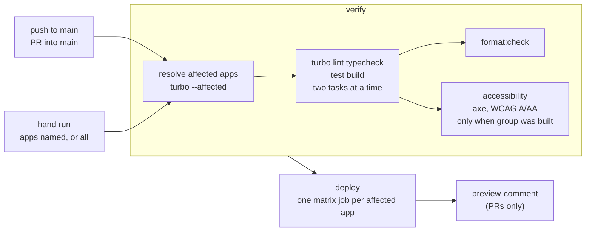

# `adawy-platform`

<Badge tone="group">Group</Badge>

**The brand-sites monorepo for Adawy Group.** A thin Next.js app per Adawy
brand, built from shared `@adawy/*` packages. `group` is the full site,
`studio` is the studio's own one-page site, and the other twenty-nine apps are
holding pages: five for the original flagships, and twenty-four added on
2026-09-29 for the brands in the designer's logo delivery. This is the
department's largest and most active codebase, and the one every Group
standard is written about.

Private · Turborepo + pnpm 11.26.0 · Node ≥ 22.18 · TypeScript

<Stats>
  <Stat value="31" label="apps" hint="1 full site · 1 studio site · 29 holding pages" />
  <Stat value="10" label="shared packages" hint="@adawy/*" />
  <Stat value="3" label="platform locales" hint="en · ar · fr — group only serves fr" />
</Stats>

## What is in it today

```
apps/
├── group/      Adawy Group  → adawygroup.com  (the full site, en/ar/fr)
│   ├── app/         routes only: /, /about, /contact, /ecosystem/[brand] (+ md/, og/)
│   ├── features/    one per thing a visitor can point at (hero, brands, stage, …)
│   │                each is components/ + scene/ (three.js) + lib/ (pure)
│   └── platform/    app-wide machinery: chrome, scroll, gl, perf, sound, seo, …
├── studio/     Adawy Studio                → adawystudio.com, one page + the work stair (en/ar)
├── pack/       Adawy Pack                  → adawypack.com, holding page (en/ar)
├── print/      Adawy Print                 → adawyprint.com, holding page (en/ar)
├── supplies/   Adawy Supplies              → adawysupplies.com, holding page (en/ar)
├── marketing/  Adawy Marketing Solutions   → adawymarketingsolutions.com, holding page (en/ar)
├── bizdev/     Adawy Business Development  → adawybusinessdevelopment.com, holding page (en/ar)
└── software/ … manufacturer/               24 glyph-brand holding pages, no domain yet (en/ar)

packages/
├── ui/                 @adawy/ui         shadcn primitives + shared sections, ours to edit
├── design/             @adawy/design     Tailwind v4 token structure (CSS-first)
├── motion/             @adawy/motion     GSAP + Lenis primitives, registered once
├── i18n/               @adawy/i18n       locale list, direction, next-intl helpers
├── site/               @adawy/site       identity, routes, hreflang, robots, sitemap, test helpers
├── holding/            @adawy/holding    the holding-page body every holding app renders
├── brand-app/          @adawy/brand-app  the holding-app shell: layout, page, fonts, mark, entrance, icon bake
├── analytics/          @adawy/analytics  PostHog behind a consent banner, for every app
├── eslint-config/      the architecture-enforcing lint rules
└── typescript-config/  shared tsconfig bases
```

The twenty-four glyph brands are `software`, `it`, `innovation`, `ai`,
`automation`, `financial`, `invest`, `law-firm`, `fnb`, `farm`, `shop`,
`fashion`, `recycle`, `security`, `hr`, `events`, `tv`, `advertising`,
`media-production`, `radio`, `production`, `plast`, `private-label` and
`manufacturer`.

**Identity is token values, not a forked component**, in every holding app,
so a brand's look cannot drift into a private copy of shared code. The two
generations of holding app differ in where those values come from and in how
much is bespoke:

| | The five flagship holding apps | The twenty-four glyph brands |
| --- | --- | --- |
| Field and ink | The pair measured in that brand's `[data-brand]` block in `apps/group/app/globals.css` | The brand's palette 300 as the field, and whichever of the group's two inks clears AA on it |
| Mark and entrance | Bespoke per app | The designer's glyph, drawn by `BrandMark`, with the shared bloom entrance (`@adawy/brand-app/entrance.css`) |
| Shell | Their own copy of layout, page and fonts | `@adawy/brand-app` |
| Contrast | Measured by hand and recorded in the app's `globals.css` | A test in `lib/brand/<app>-mark.test.ts` pins the pair at 4.5:1 |
| Domain | Each has one, and is indexed | None yet, so every deployment is `noindex` |

The shared entrance is CSS rather than GSAP for the same reason the studio's
stair is: a JS timeline cannot start until hydration, so a prerendered page
would paint finished and then jump back to the start. All thirty-one are real
apps with real Vercel deploys, which is why a change to `packages/ui` verifies
and deploys every one of them rather than one.

**A holding app is not a group brand page.** adawygroup.com has thirteen
company pages under `/ecosystem` (the six flagships plus Software, Private
Label, Production, Media Production, Events, AI and Law Firm). Seventeen of
the glyph brands have an app and no group page yet. The two lists are
maintained separately (`BRAND_PAGES` in the group app, the `apps/` folder and
the deploy map for the apps), so adding a brand to one does not add it to the
other.

**`studio` stopped being a holding page on 2026-09-22** (#300). adawystudio.com
opens on a headline, an intro, a link to the group's contact form and the
studio's work climbing past as a diagonal "work stair" of tiles. The stair is
CSS, not GSAP, for the hydration reason above. It has a pause control,
because WCAG 2.2.2 requires one for anything that moves by itself for more
than five seconds. The work is data in `apps/studio/lib/work/work.ts`, baked
by `work:bake`, and a test holds every panel to 4.5:1 contrast. The same
client work fills the group site's Studio brand page (#301, #303).

**`@adawy/brand-app` is now the shell most apps are built on.** It owns
everything around the holding page that each app used to copy: the `[locale]`
layout and metadata, the page, the fonts, `BrandMark`, the shared entrance, a
WCAG contrast helper (`./contrast`) and a Node-only `./icons` entry for the
icon bake. Before it, those were 439 identical lines per app. `print` and all
twenty-four glyph brands consume the shell (#281, 64f0333). `pack`, `studio`,
`supplies`, `marketing` and `bizdev` use only its icon bake and still carry
their own layout, so **check an app's imports before assuming a change to the
shell reaches it**. `apps/group` is deliberately not a consumer, because its
routing, proxy, sitemap and layout all differ.

The repo extracts a package on the **third use, not the first**, because an
abstraction made from one example encodes that example's accidents.
`@adawy/site` and `@adawy/holding` came out once `pack` and `studio` had
hand-copied the same platform layer twice, and that is what made twenty-four
apps in one change affordable: each new app is mostly configuration.
`@adawy/utils` is still waiting for a second caller. What `group` does not
share lives in its own `features/` + `platform/` layering
([ADR-010](/architecture/adrs)).

Planned but not built: `apps/sites` (the multi-tenant long tail,
[ADR-008](/architecture/adrs)) and `apps/api` (the Phase-2 NestJS backend,
[ADR-009](/architecture/adrs)).

## Stack

| | Version (Oct 2026) |
| --- | --- |
| Framework | Next.js 16.3.8, React 19.3.0, next-intl 4 |
| Language | TypeScript 7 (`tsc`) side by side with TypeScript 6, which typescript-eslint and Next still load as an API |
| Styling | Tailwind CSS 4.3, shadcn 4 on Base UI 1.8, Hugeicons |
| Motion & 3D | GSAP 3.15 + Lenis 1.3 (`@adawy/motion`), three.js 0.186, Rapier 0.21 |
| Forms & email | react-hook-form 7 + zod 4, Resend 6 |
| Analytics | posthog-js 1 behind a consent banner (`@adawy/analytics`) |
| Tooling | Turborepo 2.11, pnpm 11.26.0, ESLint 10 (flat config), Prettier 3, Vitest 5 |

`typescript` in every `package.json` is an alias to
`@typescript/typescript6`, and `@typescript/native` is TypeScript 7. That split
follows the TS 7.0 announcement: the fast compiler does the typechecking while
the tools that need the JS API keep working.

Because every app pins `next` and the rest in its own `package.json`, a
dependency bump touches all thirty-one files and the lockfile. Dependabot's
grouped PRs therefore conflict with each other once one merges, so the
maintainer folds a week's bumps into one PR (#338) and CI verifies every app
once instead of once per group.

## Commands

Everything runs from the repo root. **This repo is pnpm-only** — `npm install`
will produce a tree the lockfile does not describe. pnpm 11 reads its settings
from `pnpm-workspace.yaml` (there is no `.npmrc`), so hoisting, build-script
allowances and security overrides all live there.

```bash
pnpm install
pnpm turbo dev --filter=group    # http://localhost:3000 → redirects to /en

# what CI gates on
pnpm turbo lint typecheck test build
pnpm format:check
pnpm --filter group a11y:check   # needs a running `pnpm --filter group start`
```

`--filter=group` scopes a task to one app. Each workspace is named after its
folder under `apps/` (`group`, `studio`, `pack`, `law-firm`,
`media-production`, …), plus the `@adawy/*` packages. A full
`pnpm turbo build` builds thirty-one Next.js apps; on a laptop, filter to the
apps you touched and let `--affected` or CI cover the rest.

Running a single test means working inside the app:

```bash
pnpm --filter=group exec vitest run messages/parity.test.ts
pnpm --filter=group exec vitest run -t "message parity"
pnpm --filter=group exec vitest                          # watch mode
```

`apps/group` also carries about twenty-five hand-run asset scripts
(`patterns:bake`, `blender:bake`, `polyhaven:fetch`, `models:recolor`,
`software:work`, …) that regenerate the committed 3D models, textures,
recordings and audio. Every other app has `icons:bake`, which writes the app
icons, `favicon.ico` and the Open Graph card from the brand's artwork
(`studio` also has `work:bake`).
Secrets for the inquiry form (`RESEND_API_KEY`, `INQUIRY_TO`, `INQUIRY_FROM`)
are listed in `apps/group/.env.example`.

<Callout type="important">
  `pnpm format:check` is a **separate CI gate** from `turbo lint`. The
  per-package lint scripts only reach `.ts`/`.tsx`; README and CSS files drift
  too, so Prettier runs at the root. A green `turbo lint` does not mean CI will
  pass.
</Callout>

## Tests

Vitest, colocated, run with no config file. There are about 240 test files, and
about 165 of them sit in `apps/group`. They test the pure `lib/` layer (scroll
curves, physics, camera fits, each brand scene's choreography, the inquiry
schema, rate limit and email) because `lib/` holds no React or three.js and
runs without a DOM. Every app runs a **message parity** test from
`@adawy/site/testing`, which checks there is exactly one message file per
locale the app serves, and that every other locale has exactly the default
locale's keys. A missing key would otherwise fail only at render time in
production, because next-intl does not check keys at build time. Every glyph
brand also tests its mark: ink on field at 4.5:1 or better, and no duplicate
piece, since each piece's path is its React key.
`group` adds `brand-spelling` and `seo` checks on its messages. The
packages test locales and direction (`i18n`), identity, routes, robots and
alternates (`site`), consent (`analytics`), and `ui`.

## Things that will surprise you

**Middleware is `proxy.ts`.** Next.js 16 renamed it; `middleware.ts` does not
exist here. More generally, this is not the Next.js in most people's heads —
`AGENTS.md` says to read the relevant guide in `node_modules/next/dist/docs/`
before writing framework code. Each app has its own `AGENTS.md` carrying that
block, because `next dev` writes it into the app it runs.

**Two tools rewrite `AGENTS.md`, and the blocks they own stay committed.**
`next dev` re-adds the Next.js block, and `turbo` re-adds a Turborepo block
(read the bundled docs of the installed `turbo` before changing its config)
whenever it detects an AI agent. Deleting either only produces the same
uncommitted change on the next run, so both are committed (c6eb42d). The
shadcn contract between them is the repo's own and is hand-written.

**There is a third locale, and only one app serves it.** `@adawy/i18n` ships
`en`, `ar` **and `fr`**, and `apps/group` has a complete `messages/fr.json`.
Every other app publishes `en` and `ar` only. Each app's `i18n/routing.ts`
declares its subset with `satisfies readonly Locale[]`, so a code the platform
does not know fails the build. Anything that enumerates locales must come from
the package or that routing file, never a hand-written array
([i18n & RTL](/standards/i18n-rtl)).

**Each app names its own domain, in one file.** `PRODUCTION_HOST` lives in
`lib/site/production-host.ts` (`platform/seo/production-host.ts` in
`apps/group`). It is the switch for indexing, the canonical origin and the
sitemap, and it only turns them on for the production deployment serving that
host, so previews stay `noindex`. Seven apps name one: `group`, `studio`,
`pack`, `print`, `supplies`, `marketing` and `bizdev`. The twenty-four glyph
brands are `null`, so every one of their deployments is `noindex` until it
gets a domain. adawybusinessdevelopment.com's DNS is on Cloudflare, not on
Verpex with the other brand domains, so look there when it misbehaves. A
holding page on a domain also links back to adawygroup.com and names Adawy
Group as its parent organisation in its structured data (`@adawy/holding`'s
`siteUrl`). The group's brand pages link out through each brand's `site` in
`BRAND_PAGES` (#297), and that field stays `null` until the brand's app has a
`PRODUCTION_HOST`, which hides the hero's "Visit site" pill (#328): a link to
a `noindex` `*.vercel.app` holding page sends visitors somewhere search
engines are told to ignore. Each domain app serves the same IndexNow key file
from `public/`, so a changed page can be pushed to search engines instead of
waiting for a crawl. Old WordPress URLs that search engines still list are
permanent redirects in `apps/group/next.config.ts`
([Domains, DNS & Email](/architecture/domains-and-email)).

**`X-Robots-Tag` is sent on every response, production included.** Off the
production host it is `noindex, nofollow`. On it, the header states
`index, follow` with large image and full snippet previews (a09879d), because
the `<meta>` robots tag cannot travel on an image or the Open Graph card, and
those are what a search result shows full size. The PostHog proxy (`/ingest`)
and the group site's markdown copies (`/md`) stay `noindex`. They are
*excluded* from the indexing rule rather than overridden by a later one,
because Next sends the headers of every rule that matches.

**robots.txt is a route handler, not `robots.ts`.** `@adawy/site` writes it by
hand because Next's `MetadataRoute.Robots` cannot emit the `Content-Signal:`
line. The signals say search and answer-time quoting are allowed and training
is not, because the pages carry commissioned photography and brand copy. Since
2026-09-24 each training crawler that ignores Content Signals also gets its own
`Disallow`.

**Every app serves `/favicon.ico`.** The `icon.png` Next links from the page
is not enough: browsers and crawlers still request `/favicon.ico` directly,
and while it 404'd they kept the icon cached from before the rebrand (#321).
`icons:bake` packs the baked icon into a 16/32/48 ICO.

**Analytics is off everywhere except Production.** `@adawy/analytics` (#304)
puts PostHog behind a consent banner on every app, one PostHog project
on the US cloud (#305), with every event tagged by `brand` and `locale` so one
brand is a filter away and the unfiltered view is the whole group. `brand` is
a closed union with one member per app, so a new app is also a new member
there. Nothing loads unless `NEXT_PUBLIC_POSTHOG_PROJECT_TOKEN` is set, and it
is set on each Vercel project for Production only, so `next dev` and previews
send nothing and show no banner. The browser posts to `/ingest` on the site's
own origin, which each app's `next.config.ts` rewrites to PostHog, so the
group site's CSP needs no analytics host. Each app also skips Next's
trailing-slash redirect (PostHog posts to `/e/`) and restores it for pages in
`proxy.ts`; a new app that forgets either half loses its events or answers
pages at two URLs.

**The layering in `apps/group` is enforced, not suggested.** `platform/` never
imports `features/`, a feature reaches another only through its barrel,
`lib/` holds no React or three.js, and `scene/` holds no React.
`apps/group/eslint.config.js` generates the `no-restricted-imports` blocks, so
CI fails on a breach instead of waiting for a reviewer to notice.

**The home page is one WebGL canvas.** Every 3D element on adawygroup.com's
home page, from the entrance field to the Why-Choose crystal, is a pass on a
single `three.js` context, driven by scroll through a strict
driver → channel → stage split. Each of the thirteen brand pages plays its own
3D take through the same canvas host. Do not add a second host — see
[Platform Architecture](/architecture/platform-architecture).

**shadcn components are ours to edit.** Everything under
`packages/ui/src/components` was vendored by the CLI. When a consumer needs
different geometry, you change the component. Out-specifying it from the call
site does not work, because shadcn's defaults are variant-scoped and
tailwind-merge will not treat a bare `h-14` as overriding them. The site's
button is `ActionButton`/`ActionLink` from `@/platform/ui/action`; importing
shadcn's `Button` from app code is an ESLint error. `AGENTS.md` has the full
contract.

**Files are kebab-case, enforced.** `unicorn/filename-case` fails the build on
a PascalCase file, because mixed-case names break git on case-insensitive
filesystems (macOS, Windows). Components are PascalCase identifiers in kebab
files, named exports only except where Next requires a default export.

**Baked assets are committed and currently un-reproducible.** `public/` holds
generated `.glb`, `.webp`, video and audio files produced by the hand-run
scripts, and much of their source artwork lives outside the repo. Do not
delete one expecting to rebake it — see `docs/shipping.md` in the repo.

## Where the deep documentation lives

Policy lives in this handbook. The mechanics that change when the code changes
live in the repo, in `docs/` (indexed by `docs/README.md`). **One fact, one
home:** the handbook says why and what we require, the repo says how it works
there, and a page that no longer matches the code is a bug in the PR that
broke it.

| File | Covers |
| ---- | ------ |
| `docs/pitfalls.md` | The bug ledger — read before your first scroll take |
| `docs/stage.md` | The one canvas and the driver → channel → stage split |
| `docs/perf.md` | The `full`/`lite` tier governor and what a new effect owes it |
| `docs/shipping.md` | What is tracked, what is generated, what never ships |

Also at the root: `README.md` (the tour and the commands), `AGENTS.md` (the
Next.js and Turborepo warnings and the shadcn contract), `PRODUCT.md` (users,
brand personality, anti-references and design principles for adawygroup.com).
Each app and `packages/brand-app` has its own `README.md`.

[Platform Architecture](/architecture/platform-architecture) explains that
split and summarizes what each of those files is for.

## CI and deployment

One workflow, `.github/workflows/deploy.yml`. Every push to `main` deploys to
production and every pull request into `main` gets a preview. It drives the
Vercel CLI instead of Vercel's dashboard Git integration, because the repo is
private on the Hobby plan and dashboard Git needs Pro for that.


```mermaid
flowchart LR
    PUSH["push to main<br/>PR into main"] --> R
    HAND["hand run<br/>apps named, or all"] --> R
    subgraph V["verify"]
        R["resolve affected apps<br/>turbo --affected"] --> T["turbo lint typecheck<br/>test build<br/>two tasks at a time"]
        T --> F["format:check"]
        T --> A["accessibility<br/>axe, WCAG A/AA<br/>only when group was built"]
    end
    V --> D["deploy<br/>one matrix job per affected app"]
    D --> C["preview-comment<br/>(PRs only)"]
```

- **Both jobs run only what a change reaches.** `verify` checks the changed
  packages and everything that depends on them, and `deploy` ships the apps
  among them, both from Turborepo's dependency graph. A change to an
  `@adawy/*` package still verifies every app that compiles it, so one app's
  change cannot break a sibling unseen. Verify used to check everything on
  every commit and count on the remote cache, but without a warm cache a
  one-app change rebuilt all thirty-one (#326).
- **Any doubt falls back to everything.** A root config change, a missing
  base commit or any resolution error verifies and deploys every app, because
  deploying too few is the only mistake that ships stale code.
- **Verify runs two tasks at a time.** The private repo's runner has two
  cores and about 7 GB. A change that reaches every app (a dependency bump)
  ran ten builds at once, ran out of memory and was killed with exit 143;
  every Dependabot run after the glyph brands landed died that way until the
  cap (#338).
- **A hand run redeploys `main`, and only `main`.** `workflow_dispatch` takes
  an optional space-separated `apps` list (`group software`); empty means
  every app, and a name not in the map fails the run rather than deploying
  less than was asked. The deploy job refuses a hand run from any other
  branch, which would ship unmerged code to production (#327).
- A **preflight** step checks each Vercel project id and root directory
  (`apps/<app>`) against the API. A wrong root directory would otherwise
  upload green and build the wrong thing.
- **Adding an app** is one line in the workflow's `apps` map plus a
  `VERCEL_PROJECT_ID_<APP>` secret (hyphens become underscores:
  `VERCEL_PROJECT_ID_LAW_FIRM`). An app whose secret is missing skips its
  deploy, so it can land before its Vercel project exists.
- Dependabot opens grouped npm PRs weekly (react, three, next, tooling,
  runtime) and GitHub Actions PRs monthly. The maintainer lands a week's
  green bumps as one batched PR, for the conflict reason in [Stack](#stack).

<Callout type="warning">
  **Actions minutes are a budget, and this repo has already run out once.**
  On 2026-09-23 the org used up its free GitHub Actions minutes for the
  month, and every run after that failed within seconds without running a
  step. Until the quota reset on 1 October, merges were verified locally and
  each affected app shipped by hand with `vercel deploy --prod`. Automatic
  deploys came back on 2026-10-03 (#326). If runs stop starting again, a red
  run says nothing about the code and a merged PR is not a deployed one:
  check the deployment itself, and follow the hand procedure on
  [Deployment](/how-we-work/deployment).
</Callout>

Full detail on [Deployment](/how-we-work/deployment).
