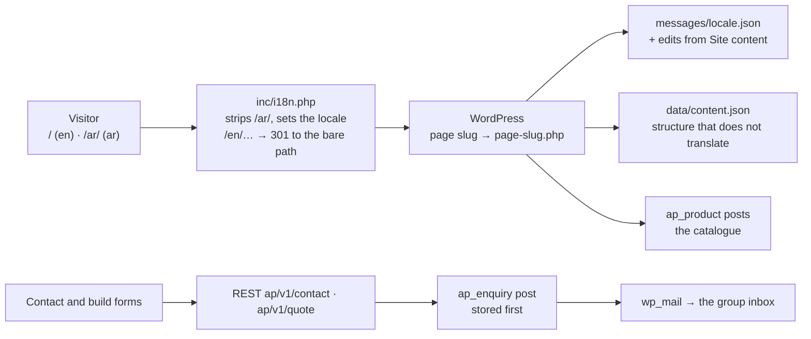
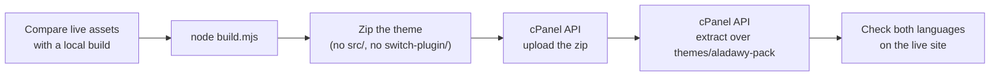

# `aladawy-pack-wp`

<Badge tone="client">Client</Badge> <Badge tone="live">Live</Badge>

**Client project.** The production website of **Aladawy Pack for Printing &
Packaging**, the flexible-packaging manufacturer whose Next.js build is
[`aladawy-pack`](/repositories/aladawy-pack). Aladawy Pack is a client, not a
Group brand.

Private · one classic WordPress theme, `aladawy-pack` · no plugin of its own ·
not part of the monorepo · npm · **live at `aladawypack.com` since 26 September
2026**

<Callout type="warning">
  Not to be confused with **Adawy** Pack, the Group brand at `apps/pack` inside
  [`adawy-platform`](/repositories/adawy-platform). Different company,
  different codebase ([the repository map](/repositories)).
</Callout>

<Stats>
  <Stat value="6" label="pages" hint="home, products, services, build, about, contact" />
  <Stat value="15" label="products" hint="seeded once, then edited in wp-admin" />
  <Stat value="en · ar" label="locales" hint="English at the root, Arabic under /ar/" />
  <Stat value="2" label="forms" hint="contact · build your own bag" />
</Stats>

## What it is

The Next.js site, rebuilt as a PHP theme so that it runs on the client's
existing WordPress install. Its own stylesheet header says what it is:
*"bilingual (EN/AR) site, ported from the Next.js build"*. What came across,
and how:

- **The design, unchanged.** `src/globals.css` is the Next app's
  `globals.css` with only the asset URLs changed, so the monochrome surface
  system, the four press inks and the Arabic type rules on the
  [`aladawy-pack` page](/repositories/aladawy-pack#the-rules-to-know-before-editing)
  apply here word for word.
- **The components, as template parts.** Each React section became a PHP file
  under `parts/` with the same name (`parts/home/process-rail.php`,
  `parts/services/substrates.php`), and the motion became vanilla modules under
  `src/js/` driving the same GSAP and Lenis.
- **The content model.** `lib/content/*` was exported once to
  `data/content.json` (structure that does not translate) and the two message
  files were copied to `messages/`. No script in either repository regenerates
  them, so the two repos now drift independently.

What the Next build did not have: staff edit every string and every product in
`wp-admin`, and enquiries are stored in WordPress as well as emailed.

**How it got into git.** The theme went live on 26 September 2026 from an
untracked folder inside the `aladawy-pack` working copy. On 2 October 2026 it
was imported here as one commit, checked file for file against what the server
was serving. *Why that matters:* until then the only copy of the live site's
code was the live site.

## How it fits together



**The theme is the whole site, including its SEO.** There is no plugin of the
department's in this install, unlike [`aladawy-shop-wp`](/repositories/aladawy-shop-wp),
which splits presentation from rules. The repo records no reason; with six
pages, two forms and no commerce, there are no rules a theme swap could take
away that the site would still need. The consequence to know: **switching
themes switches off the post types too** — products and enquiries stay in the
database but vanish from `wp-admin` until this theme is active again.

## Stack

| | |
| --- | --- |
| Platform | WordPress on the group's Verpex reseller cPanel host, behind LiteSpeed. No WooCommerce in the theme |
| Language | PHP — uses `match`, so **PHP 8.0 or later**, whatever the stylesheet header says (below) |
| Styling | Tailwind CSS v4 (`@tailwindcss/cli`) + `tw-animate-css`, scanning the PHP templates and the JS |
| Motion | GSAP 3.15 (ScrollTrigger, SplitText) + Lenis, bundled by esbuild into one IIFE |
| Fonts | Archivo, Inter, JetBrains Mono, IBM Plex Sans Arabic from Google Fonts (`next/font` did this before) |
| Build | `node build.mjs` → `assets/app.css` + `assets/app.js` |
| Package manager | **npm** (`package-lock.json`, no `packageManager` pin) — not pnpm like the Next build |
| CI, tests | None |

## Building it

```bash
git clone git@github.com:Adawy-Group/aladawy-pack-wp.git
cd aladawy-pack-wp
npm install
npm run build        # = node build.mjs: Tailwind → assets/app.css, esbuild → assets/app.js
```

**The built files are not committed** (`assets/app.css` and `assets/app.js`
are in `.gitignore`); `deploy.sh` rebuilds them on every deploy. *Why that
differs from the shop, which commits its CSS:* here one script builds and ships
in the same step, so a stale committed build has nowhere to come from.

**There is no local WordPress in the repo** — no Playground blueprint, no
Docker. To see a change before it ships you need a WordPress to mount the
theme into; the WordPress Playground setup in
[`aladawy-shop-wp`](/repositories/aladawy-shop-wp#running-locally) is the
pattern to copy, and adding it here is the most useful small PR this repo has.

## Layout

```
style.css                theme header only — the real CSS is assets/app.css
functions.php            contact constants, enqueues, old-URL redirects; requires inc/*
inc/i18n.php             /ar routing, ap_t() / ap_str() strings, the locale filter
inc/content.php          data/content.json, ap_img(), the ap_product post type
inc/seo.php              title, description, canonical, hreflang, Open Graph, JSON-LD
inc/forms.php            form rules, REST endpoints, the Enquiries post type
inc/admin.php            Appearance → Site content; the product edit box
inc/setup.php            first-run seeding of pages and products (Tools → Aladawy setup)
front-page.php, page-<slug>.php   one template per page: about, build, contact, products, services
index.php, 404.php       anything without its own template is a 404
parts/                   home, about, services, products, forms, layout — one file per section
src/app.css → globals.css     Tailwind entry → the Next app's design tokens
src/js/                  app.js entry; home, pages, forms, motion primitives, lib/gsap.js
data/content.json        products, plant lines, substrates, partners, image dimensions…
messages/en.json, ar.json     every string, same keys in both
assets/                  photography (AVIF + WebP), partner logos, brand marks, icons
switch-plugin/           one-shot plugin that activates this theme (never deployed)
build.mjs, deploy.sh     build; build + zip + upload
```

## The rules to know before editing

**1. English lives at the root; Arabic lives under `/ar/`.** `inc/i18n.php`
strips the prefix from `REQUEST_URI` when the theme loads, before WordPress
parses the request, so every page exists once and renders in whichever language
the URL asked for. A `/en/…` URL — the Next site's English scheme — answers
`301` to the bare path. The `locale` filter makes WordPress's own strings and
`is_rtl()` follow the URL, and `redirect_canonical` is patched to put `/ar`
back. This is the reverse of the shop, which keeps Arabic at the root; here
it follows the Next build, which was English-default, and the old site, whose
URLs had no language prefix. Build links with
`ap_url()`, never by hand — it adds the prefix for the current locale.

**2. Strings come from `messages/<locale>.json`, overlaid by wp-admin edits.**
`ap_t()` (escaped for HTML), `ap_attr()` (for attributes) and `ap_str()`
(raw) look up a dotted key and fill `{name}` placeholders. Appearance → Site
content edits are stored as the difference from the file, per language (option
`ap_strings_<locale>`). *Why:* a theme update that rewords a default still
shows wherever nobody has edited that string. The two files have identical key
sets today; nothing enforces that, because this repo has no parity test like
the Next build's — check both files when you add a key.

**3. Products are posts, not files.** The 15 products are `ap_product` posts:
the English name is the title, the photo is the featured image, everything
else is post meta from the product edit box. They were seeded once from
`data/content.json` and `messages/*.json`, and `ap_setup()` skips any slug
that already exists. *Why:* staff edit the catalogue in `wp-admin`; a deploy
must never put the original text back over their changes. The flip side:
**editing `PRODUCTS` or `Products.items` in this repo changes nothing on the
live site.**

**4. Structure that does not translate stays in `data/content.json`** — plant
lines, substrates, certifications, partners, image dimensions — and is read by
`ap_data()`. It is not editable in `wp-admin`, on purpose: it is the same
`lib/content` split as in the Next build, and none of it is copy.

**5. The forms validate twice from one rule list.** `ap_form_rules()` in
`inc/forms.php` (ported from the Next build's zod schemas) is handed to the
browser as `AP.rules`, and `src/js/forms/validate.js` runs the same list.
*Why:* client and server cannot drift when there is only one list. The REST
routes re-validate, rate-limit by IP (five per ten minutes), answer a filled
honeypot with `200` and drop it, and **store the enquiry as a private
`ap_enquiry` post before mailing it**. *Why:* an enquiry survives a mail
outage, and the Enquiries screen shows "Not sent" in red when the mail failed.

**6. The theme is the SEO plugin.** `inc/seo.php` prints the title,
description, keywords, canonical, `hreflang` for both locales plus
`x-default` (English), Open Graph, and Organization and WebSite JSON-LD, with
`<` escaped so no string can close the script tag. WordPress's own canonical
and shortlink tags are removed. *Why:* a second SEO plugin would print a second
set of head tags that disagree with the `/ar` routing. The sitemap is
WordPress core's `/wp-sitemap.xml`, which lists English URLs only. The theme
does not yet print the `publisher` meta tag naming Adawy Software, which the
Next build and the shop both carry.

**7. Reduced motion means no ScrollTrigger**, and the authored markup must
already be the finished layout — the same rule, for the same reason, as
[in the Next build](/repositories/aladawy-pack#the-rules-to-know-before-editing).
GSAP plugins are registered only in `src/js/lib/gsap.js`; every init in
`src/js/app.js` no-ops when its markup is absent and is wrapped in its own
`try`, so one broken section cannot stop the rest.

**8. Derived, never typed:** "years of experience" is `ap_years()` from 1971,
and numbers print with Latin digits in both languages so the server render
matches what the counters animate to.

## Deploying

There is **no SSH** on this hosting account, so nothing runs a shell on the
server. `deploy.sh` does the whole release through the WHM/cPanel API:



<Steps>

### Start from `main`, committed

Deploy only what is merged. *Why:* `deploy.sh` ships the working tree as it
is, and an uncommitted edit that ships is a live site nobody can reproduce.

### Compare the live theme with yours

Fetch the live `assets/app.css` and `assets/app.js` from
`/wp-content/themes/aladawy-pack/` and diff them against a fresh
`npm run build` of `main`. If they differ, someone deployed something that is
not on `main` — find out what before you overwrite it. *Why:* the deploy
replaces whatever is live, and the server holds no history.

### Run `sh deploy.sh`

It sources the credentials, builds, copies the theme files (templates, `inc`,
`parts`, `messages`, `data`, `assets`) into `dist/aladawy-pack/`, zips them,
opens a cPanel session through the WHM API, uploads the zip and extracts it
over `wp-content/themes/aladawy-pack`. The theme slug is hardcoded; it prints
the zip size on success and stops on a failed upload or extract.

### Check it live

Every page under `/` and `/ar/`, one form submission (it should arrive in the
inbox and appear under Enquiries as sent), and the browser console.

</Steps>

**Credentials** — the WHM host, user and API token — live in a local,
untracked env file outside the repository, which `deploy.sh` sources. They are
never committed and never pasted into an issue or a PR. Ask for them
([who to ask](/help/who-to-ask)).

**`deploy.sh` runs on Windows, in Git Bash.** It zips with Windows' own
`tar.exe`, and two lines exist only for Git Bash:

- `MSYS_NO_PATHCONV=1`, because Git Bash otherwise rewrites the server path
  `/home/…` into `C:/Program Files/Git/home/…` and the upload goes nowhere.
- The cookie jar is a **relative** path (`dist/cookies.txt`), because with path
  conversion off, `/tmp/…` is not a real Windows path.

On macOS or Linux, swap the `tar.exe` line for `zip -r`; the rest is POSIX
`sh` and `curl`.

**`.gitattributes` forces LF on every text file.** *Why:* with
`core.autocrlf=true` a Windows clone checks out CRLF, which breaks
`sh deploy.sh` and ships files that differ byte for byte from the live theme.

**Never edit a file on the server.** Edit here, merge, redeploy. *Why:* the
next deploy silently overwrites a server-side edit, and code that exists only
on the server is the situation this repo was created to end.

### Rollback and first install

- **The previous theme (Kimono) and its plugins are deactivated, not
  deleted.** Reactivating them is the whole-site rollback, which is why they
  stay until the owner is sure. Old Kimono URLs (`/about-us`, `/contact-us-1`,
  `/shop` and others) answer `301` to the new pages from `functions.php`.
- **A bad deploy** is rolled back by checking out the last good commit and
  running `deploy.sh` again.
- **`switch-plugin/`** is how the theme was switched in without a shell or a
  browser session: the WordPress REST API can activate a plugin but cannot
  switch themes, so this one-file plugin switches to `aladawy-pack` on
  activation and then deactivates itself. Switching the theme runs
  `ap_setup()`, which creates the six pages, the 15 products with their photos,
  and `/%postname%/` permalinks. Setup is idempotent and can be re-run from
  Tools → Aladawy setup or `POST ap/v1/setup` (administrators only).

## Who edits what in wp-admin

| Screen | What it edits |
| ------ | ------------- |
| Appearance → Site content | Every string on the site, English and Arabic tabs, generated from the shape of `messages/*.json` |
| Products | The catalogue — names, summaries, descriptions in both languages, category, "featured", spec rows, photo, order |
| Enquiries | Read-only inbox of both forms, with whether the email went out |

The staff [training videos](/guides/training-videos#aladawy-pack) walk through
all three. The login address is not WordPress's default; ask for it. The
[content dashboard](/repositories/adawy-dashboard) does not edit this site — its
card opens this site's `wp-admin`.

## Known traps

| Symptom | Cause | Fix |
| ------- | ----- | --- |
| You changed `messages/*.json`, deployed, and the live text did not change | An editor saved that string in Site content, and saved edits win | Find the field in Site content and set it to the new text. A value equal to the file's default is no longer stored |
| You changed a product in `data/content.json` or `Products.items`, and nothing changed live | Products are posts, seeded once | Edit it in Products in `wp-admin` |
| A file deleted from the repo is still on the live site | The cPanel extract overwrites files but never deletes them | Remove it on the server in the same sitting, and say so in the PR |
| A published page returns 404, though it is listed in `/wp-sitemap.xml` | `index.php` turns anything without its own template into a 404, but WordPress core still lists every published page | Give it a `page-<slug>.php`, or unpublish it |
| `sh deploy.sh` fails with paths like `C:/Program Files/Git/home/…` | Git Bash path conversion | Keep `MSYS_NO_PATHCONV=1` and the relative cookie jar |
| Every file differs from the live theme after a fresh Windows clone | CRLF checkout from before `.gitattributes`, or a clone that ignored it | `git add --renormalize .`, or re-clone |
| `npm run zip` fails | `package.json` names a `zip.mjs` that does not exist | Use `sh deploy.sh`, which zips by itself |
| `node build.mjs --watch` builds once and exits | `--watch` only turns off minification | Re-run the build after each change |
| Dimmed photography shows at full brightness | Smush's lazy-load rewrites every `` and fades it to opacity 1 | `functions.php` switches Smush lazy-load off; keep that filter |
| A fatal error on PHP 7.4 | The stylesheet says `Requires PHP: 7.4`, but `inc/forms.php` uses `match` | Run 8.0 or later, and correct the header in the next change |
| Every visitor hits the form rate limit at once | The limiter keys on `REMOTE_ADDR`; behind a proxy or CDN everyone shares one address | Check what the server sees before putting anything in front of the site |

## Agent guidance

There is **no `README.md` and no `AGENTS.md`** in this repo. The map is the
comment block at the top of `functions.php` and of each file in `inc/`, which
state what each part does and why; the design rules are on the
[`aladawy-pack` page](/repositories/aladawy-pack), because the CSS is the same
file. Aladawy Pack is a client: no `@adawy/*` packages and no Group branding
here ([Client Projects](/how-we-work/client-projects)).
