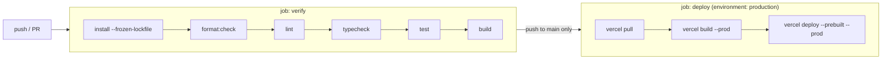

# `aladawy-pack`

<Badge tone="client">Client</Badge>

**Client project.** The website for **Aladawy Pack for Printing & Packaging**,
a flexible-packaging manufacturer in Egypt founded in 1971. A rebuild of
`aladawypack.com`.

Private · standalone Next.js 16 app · not part of the monorepo · staging at
`aladawy-pack.vercel.app`

Its link-in-bio page is a separate repo:
[`aladawy-links`](/repositories/aladawy-links).

<Callout type="warning">
  Not to be confused with **Adawy** Pack, the Group brand at `apps/pack` inside
  [`adawy-platform`](/repositories/adawy-platform). Different company,
  different codebase. See [the repository map](/repositories).
</Callout>

<Stats>
  <Stat label="Pages" value="6" />
  <Stat label="Locales" value="en · ar" />
  <Stat label="Package manager" value="pnpm 11.26.0" />
  <Stat label="CI" value="verify → deploy" />
</Stats>

## Stack

| | |
| --- | --- |
| Framework | Next.js 16.3.5 (App Router, Turbopack), React 19.3 |
| Language | TypeScript, strict — `tsc` is TypeScript 7 (see below) |
| Styling | Tailwind CSS v4 + shadcn/ui on Radix |
| Motion | GSAP 3.15 (ScrollTrigger, SplitText) + Lenis |
| Forms | react-hook-form + zod 4 |
| i18n | next-intl 4 — `/en` (default), `/ar`, full RTL |
| Tests | Vitest 5 |
| Images | sharp 0.35, baked to AVIF/WebP ahead of build |
| Package manager | `pnpm@11.26.0` (pinned in `packageManager`), Node 24 in CI |

Statically prerendered, deployed on Vercel from GitHub Actions.

**TypeScript 7 runs side by side with 6.** `@typescript/native` (TS 7)
provides the `tsc` binary that `pnpm typecheck` runs, while the `typescript`
package is aliased to `@typescript/typescript6` because typescript-eslint and
Next still load the TS 6 API. *Why:* the fast native checker is usable today,
but the tooling around it is not ready for the 7 API yet.

**ESLint 10 goes through `@eslint/compat`.** `eslint-config-next`'s react,
jsx-a11y and import plugins still call context APIs ESLint 10 removed, so their
configs are wrapped in `fixupConfigRules`. *Why:* it keeps ESLint current
without waiting on the plugins; drop the wrapper once they support ESLint 10.

## Commands

```bash
pnpm install
pnpm dev                 # http://localhost:3000 → redirects to /en
pnpm build && pnpm start

pnpm format:check        # prettier --check (CI runs this first)
pnpm lint                # eslint
pnpm typecheck           # tsc --noEmit (TypeScript 7)
pnpm test                # vitest run
pnpm format              # prettier --write

pnpm assets:bake         # re-encode photography (manual, commits its output)
```

Run the same sequence CI runs — `format:check → lint → typecheck → test →
build` — before pushing. *Why:* a push to `main` deploys, so a red CI run is
the only thing between a mistake and the staging site.

## Layout

```
app/[locale]/            one route per page; [locale] is the topmost layout
  page.tsx               home
  products/ services/ build/ about/ contact/
  opengraph-image.tsx    share card
app/api/contact/         contact intake (POST only)
app/api/quote/           "build your own bag" intake (POST only)
app/robots.ts, sitemap.ts, manifest.ts
components/home/         the home page's scroll set-pieces, one file per section
components/about/        differentiators, leadership messages, management directory
components/services/     client journey, plant lines, sectors, substrates
components/products/     product catalogue
components/forms/        build-form, contact-form, field
components/layout/       header, footer, page hero, locale switch, brand mark
components/motion/       Reveal, KineticText, Counter, smooth-scroll (Lenis)
components/ui/           shadcn primitives — unmodified
lib/content/             catalogue and capability data (structure only)
lib/schemas/             zod schemas (build, contact), shared by form and route
lib/seo/                 metadata + JSON-LD builders
lib/motion/gsap.ts       the only place gsap is imported from the package
lib/enquiry.ts           the single delivery seam for both forms
lib/site.ts              PRODUCTION_HOST, siteUrl, contact details, hreflang
i18n/                    routing (locales, getDirection), navigation, request
messages/                en.json / ar.json + parity.test.ts
proxy.ts                 next-intl locale routing (Next 16's middleware)
scripts/bake-assets.ts   photography → AVIF/WebP into public/
```

The six routes are `/`, `/products`, `/services`, `/build`, `/about` and
`/contact`, each under `/en` and `/ar`. The sitemap emits every one with its
full `alternates.languages` map. *Why:* it tells search engines the two copies
are one page in two languages, not two competing documents.

## The rules to know before editing

**1. Content is split in two.** `lib/content/*` holds only what does *not*
translate — slugs, image names, `1270 mm`, process steps, plant lines,
substrates, sectors, leadership. Every name, description and label lives in
`messages/<locale>.json` under the same slug. A new product is one entry in
`products.ts` plus one block in each message file. *Why:* one structure,
two languages, and no chance of the Arabic page having a different catalogue
from the English one. The same pattern runs in
[`aladawy-shop`](/repositories/aladawy-shop) — learn it once, use it twice.

**2. The parity test is the locale gate.** `messages/parity.test.ts` fails if
`en.json` and `ar.json` have different key paths (either direction), if any
string is empty, or if a message uses different ICU placeholders in the two
locales. *Why:* `next-intl` throws at *render* time, so without it a forgotten
Arabic key surfaces as a 500 on a prerendered page for an Arabic-speaking
visitor.

**3. The chrome is monochrome; colour is a second, separate system.** Neutrals
are an OKLCH ramp carrying a trace of cool chroma (hue 265), and the extremes
stop short of pure black and white (`#0B0C10`, `#F2F3F5`). *Why:* pure black on
pure white reads as an unset default, and halates on a large dark field.
Colour arrives two ways: the product photography runs in full colour, and four
muted press inks (`--ink-cyan`, `--ink-rose`, `--ink-ochre`, `--ink-indigo`) mark
product category, process step, sector family and a registration bar. *Why:*
the company prints ten-plus colour rotogravure, and a site that renders its own
printed film in grey argues against the product. The partner wall rests in
colour rather than revealing it on hover, because touch devices never hover.

When a component is handed its colour by data (a card given a category, a step
given an index), set the `.ink-*` class on the wrapper and read `--ink-accent`
inside, instead of writing the colour into the markup.

**4. Surfaces invert through `@theme inline`.** Sections alternate between
`.surface-field` (dark) and `.surface-paper` (light), and both re-declare the
same semantic slots — `--ink`, `--line`, `--surface`, and the inks — so a
component reads those and works on either surface without knowing which it
landed on. Nesting works: a paper card on a field section is a nested
`.surface-paper`.

Those aliases live in **`@theme inline`**, and that is load-bearing: a plain
`@theme` resolves a `var()` once into `:root`, which would freeze
`text-ink-faint` at its dark-surface value and leave it white on a paper
section. Anything that must invert per surface belongs in the `inline` block.
`--ink-faint` is the ink at 0.6 alpha because the old 0.42 measured 2.71:1 on paper and
failed even the 3:1 large-text floor — check contrast with a calculator before
lightening it.

**5. Reduced motion means no ScrollTrigger at all.** Every scroll driver
early-exits on `prefers-reduced-motion`, so the authored CSS state must
*already* be the finished layout — never a start-of-animation state waiting to
play. *Why:* otherwise a reduced-motion visitor sees the start frame forever.
Import `gsap` from `@/lib/motion/gsap`, never from the package: that module is
where plugins are registered, and registration order matters for `useGSAP`.
Lenis is wired to GSAP's ticker in `components/motion/smooth-scroll.tsx`; use
its `scrollTo()` for programmatic scrolls, because `window.scrollTo` is
overwritten every tick.

**6. Arabic gets its own type settings.** Latin faces are Archivo (display,
width axis), Inter (body) and JetBrains Mono (labels); Arabic is IBM Plex Sans
Arabic, and it **leads** the mono stack under `:lang(ar)`, not trails it.
*Why:* JetBrains Mono has no Arabic glyphs, and even with a fallback the
*spaces* kept coming from the monospace face, doubling word gaps. Under
`:lang(ar)` display leading is 1.4 (Latin runs 0.86, which clips shaddas),
tracking is zero (letter-spacing severs cursive joins), and the line masks
(SplitText and `.clip-line`) are switched off. Keep all of it scoped to
`:lang(ar)` so Latin metrics are untouched.

## Forms and enquiries

Two forms, two POST routes: `/api/contact` and `/api/quote` (the "build your
own bag" specification). Each form shares its zod schema in `lib/schemas/`
with its route, which re-validates. *Why:* client validation is a convenience,
not a control. A filled honeypot parses and gets `200 { ok: true }` without
delivery, so a bot learns nothing about which field caught it.

Both routes await `deliverEnquiry()` in `lib/enquiry.ts`, which today writes
one structured `console.info` line (`event: "enquiry"`, greppable in
`vercel logs`). Wiring a provider (Resend or the Vercel Marketplace email
integration is suggested in the source) is one function body. It is
deliberately not half-wired: a misconfigured mail transport fails silently in
production ([forms & enquiries](/guides/forms-and-enquiries)).

## CI and deploy

One workflow, `.github/workflows/verify.yml`, on push to `main` and on every
pull request (in-progress runs for the same ref are cancelled).



- **`verify`** — Node 24, pnpm from `packageManager` via `pnpm/action-setup`,
  then `format:check`, `lint`, `typecheck`, `test`, `build`. Formatting runs
  first because it is the cheapest check and the one most often forgotten
  locally.
- **`deploy`** — needs `verify`, runs only on a push to `main`, and ships to
  `https://aladawy-pack.vercel.app`. *Why Actions and not Vercel's Git
  integration:* the Vercel project is on the Hobby plan, which refuses to link
  a private organisation-owned repository (`repo_owned_by_org`). The CLI is
  pinned (`vercel@58`) so a new release cannot change the deploy between runs,
  and `--prebuilt` uploads exactly what the job built. It needs one repository
  secret, `VERCEL_TOKEN`; the org and project IDs are inlined because they are
  identifiers, not credentials.

`.gitattributes` pins every text file to LF. *Why:* CI checks formatting on
Linux, and a Windows checkout with `core.autocrlf=true` would otherwise fail
`format:check` on every file.

## Assets

`pnpm assets:bake` reads originals from outside the repo and writes optimized
AVIF/WebP files into `public/` plus `lib/content/image-dimensions.ts`. Point it
at your own copies:

```bash
ALADAWY_SOURCE_DIR=...   # factory + product photography
ALADAWY_PARTNER_DIR=...  # partner logo set (colour + -mask pairs)
```

Its output is committed, so a fresh clone builds without the sources. `sharp`
is on the `allowBuilds` list in `pnpm-workspace.yaml` because the bake needs
its native codecs to emit AVIF. One product shot is flagged `approximate` in
the script — `slider-zipper-lock-bag` has no true photograph and wants
re-shooting.

## Going live

The site is **not indexable** while it lives on `*.vercel.app`, which is
deliberate: staging must never outrank the client's real site.
`PRODUCTION_HOST` is `null` today in both files that state it.

To publish, set `PRODUCTION_HOST` in **both** `lib/site.ts` and
`next.config.ts` (restated there because Next loads the config outside the app
bundle, where `@/` does not resolve). That one switch flips `robots.txt`, the
`noindex` meta, the `X-Robots-Tag: noindex, nofollow` header and the sitemap
host together — and only on the production deployment of that host, so
previews stay out of search. Full procedure:
[Client Projects](/how-we-work/client-projects).

Two facts on the site derive rather than hardcode: "years of experience" is
computed from `FOUNDED_YEAR = 1971`, so it never goes stale; `siteUrl` falls
back to the Vercel host, so a preview's share card points at its own images.

## Agent guidance

There is **no `AGENTS.md`** in this repo. The constraints live in the README
and in the source comments, which explain the *why* at the point of use. Read
those before changing colour, motion or Arabic typography.
