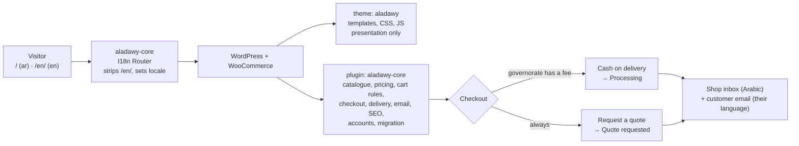

# `aladawy-shop-wp`

<Badge tone="client">Client</Badge> <Badge tone="live">Live</Badge>

**Client project.** The production storefront of **Aladawy Shop**, the
packaging, disposables and kitchen-supply house also served by
[`aladawy-shop`](/repositories/aladawy-shop). Aladawy Shop is a client, not a
Group brand.

Private · WordPress theme `aladawy` + plugin `aladawy-core` on WooCommerce ·
not part of the monorepo · **live at `aladawyshop.com` since 24 September
2026** · the work sits on branch `build/wordpress-rebuild` (a draft pull request
into `main`, which holds only the design documents)

<Stats>
  <Stat value="53" label="catalogue lines" hint="imported from the Next.js catalogue" />
  <Stat value="6" label="categories" />
  <Stat value="ar · en" label="locales" hint="Arabic at the root, English under /en/" />
  <Stat value="2" label="ways to order" hint="request a quote · cash on delivery" />
</Stats>

## What it is

The same storefront as the Next.js build — the same catalogue, the same
retail/wholesale pricing rule, the same quote builder, the same black, white
and red design — rebuilt as a classic WordPress theme and a plugin so that it
runs on the shop's existing WordPress + WooCommerce site. The Next.js repo was
the **reference implementation**: its catalogue and both message files were
exported into the plugin, and its design system was ported into the theme.

The customer can browse in Arabic or English, build a quote with tiers and
options, and then either **request a quote** (no payment; staff confirm by
phone or WhatsApp) or **pay cash on delivery** when their governorate has a
delivery fee. Staff run everything from wp-admin: products, orders, customers
and the shop's own settings. Order mail goes to the shop's inbox.

Staff training is [twelve short videos](/guides/training-videos), six in Arabic
and six in English, recorded on staging.

## Why WordPress, when a Next.js build already existed

From the rebuild design (`docs/specs/2026-09-21-wordpress-rebuild-design.md`):

- **The business already runs the shop in wp-admin.** Keeping WordPress +
  WooCommerce keeps the owner managing products and orders in the tool they
  know, instead of a committed TypeScript file only a developer can edit.
- **The site already has state the Next.js build does not.** Customer
  accounts, existing orders and customers, and the Mailchimp signup were all on
  the WordPress site and had to be kept.
- **The real problem was the front end, not the platform.** The live site ran
  a WoodMart demo theme with demo copy still showing, 58 products priced at 0
  in USD with no codes, English only, and an admin username exposed through
  the REST API. The rebuild replaces the front end, moves the real catalogue
  into WooCommerce and closes the security and SEO gaps — on the same install.
- **Payment arrives as a setting, not a rewrite.** Building on WooCommerce's
  cart and checkout means cash on delivery (built) and online payment (later)
  are gateways switched on in WooCommerce, not new code paths.

The domain, its DNS and its email stay on the Verpex host. This site is **not**
on Vercel ([Domains, DNS & Email](/architecture/domains-and-email)).

## How it fits together



**The theme is presentation only; the plugin is everything else.** *Why:* the
plugin is the only component that knows both languages and all the rules, so a
theme swap can never take the pricing rule, the checkout guards or the SEO
with it. The theme's own header says it requires the plugin.

## Layout

```
wp-content/plugins/aladawy-core/
  aladawy-core.php          boots at include time (the language must be known
                            before any plugin loads a translation)
  src/Account/              registration, profile, sign-in throttle
  src/Admin/                product and category fields, Settings → Aladawy,
                            Tools → Aladawy migration
  src/Cart/ src/Catalog/    tier + option line data, pricing shape, quantities, filters
  src/Checkout/             fields, the quote gateway, cash on delivery
  src/Delivery/             per-governorate fees and the shipping method
  src/Email/                quote emails, per-order language, envelope sender
  src/I18n/                 /en/ routing, output language, labels
  src/Migration/            the one-time migration and its steps
  src/Seo/                  head tags, JSON-LD, sitemap, robots
  src/Http/ src/Lookup/     legacy-URL redirects; /p/<code> → the product
  src/Order/ src/Quote/     the "Quote requested" status, line meta, WhatsApp text
  src/Contact/              the contact form route
  migration/                catalog.json + the 53 product photos
  templates/emails/         the "we received your quote request" email
wp-content/themes/aladawy/
  *.php, woocommerce/       page templates and WooCommerce overrides
  inc/                      setup, assets, WooCommerce hooks, settings, REST
  assets/css/src/ → app.css Tailwind v4 source → committed build
  assets/js/                six small vanilla modules, no jQuery
tests/php/                  PHPUnit (pure classes, no WordPress)
tests/e2e/                  Playwright specs + a test-only mu-plugin + Playground blueprint
tools/                      catalogue export, i18n, image/font/brand copy
bin/                        dev.sh, check.sh, php
docs/specs/                 the rebuild design and the COD & accounts design
```

## The rules to know before editing

The two design documents in `docs/specs/` are binding, and each ends with the
refinements made while building. The rules that matter most:

1. **`aladawy_pricing_shape()` is the only place the pricing rule lives** —
   `choice`, `single` or `retail-only`, exactly as in the Next.js build. The
   product page, card, shop facet, cart validation and JSON-LD all call it.
   *Why:* two identical figures offered as a choice is a choice that does not
   exist ([the domain fact](/repositories/aladawy-shop#the-domain-fact-that-shapes-the-whole-codebase)).
2. **An empty wholesale price is "on request"; an equal one is "one price".**
   They are stored differently and never collapsed. *Why:* one means ask the
   counter, the other means there is nothing to ask.
3. **Tier and option are part of a cart line's identity, and the price is set
   on the server** in `woocommerce_before_calculate_totals`. *Why:* a price
   sent by the browser is a price the customer chose.
4. **The quote gateway takes no payment, sets its own status ("Quote
   requested") and does not reduce stock.** *Why:* nothing is sold until staff
   confirm stock and price; staff can edit a quote's lines and prices while it
   is in that status.
5. **Cash on delivery is offered only where Settings → Aladawy has a delivery
   fee for the billing governorate.** An empty fee means no delivery rate, so
   only the quote is offered, with delivery "confirmed with the quote". *Why:*
   a COD order has to carry a real delivery price.
6. **Gateway titles come from translations at runtime, never from stored
   settings.** *Why:* stored text freezes one language, and every checkout is
   in two.
7. **Arabic lives at the root; English lives under `/en/`.** The plugin strips
   the prefix before WordPress parses the request. AJAX and REST calls carry
   the language in the path too (`/en/?wc-ajax=…`), not in a query argument.
   *Why:* the existing Arabic URLs keep their search equity, and a page cache
   keyed only on the URL stays correct.
8. **Shop emails are always in Arabic** and state the customer's language;
   customer emails follow the order's language. *Why:* the staff read Arabic.
9. **Only the classic checkout exists.** The WooCommerce Store API checkout
   answers 403. *Why:* that route skipped the phone check, honeypot and rate
   limit.
10. **The contact form has no nonce** — it relies on a same-origin check, a
    honeypot and a rate limit. *Why:* a nonce baked into a cached page expires
    and refuses real visitors.
11. **Sign-in is throttled per IP and account, and per IP.** Five failures of
    one account from one IP in 15 minutes lock that pair; twenty from one IP
    lock the IP. *Why:* one guesser behind a shared carrier-grade NAT address
    would otherwise lock out everyone on it.
12. **Committed build output.** `assets/css/app.css` and the `.po/.mo` files are
    committed and checked for staleness. *Why:* the host has no build step and
    no shell; what is in the repo is what gets uploaded.

## Running locally

Local WordPress runs in **WordPress Playground** — WordPress and WooCommerce in
Node, no Docker, no database server. Every boot starts from
`tests/e2e/blueprint.json` and holds its state in memory. *Why:* a throwaway
site can never drift from what the tests assume.

You need Node 24 with `pnpm` (pinned in `packageManager`), PHP 8.2 and
Composer. `bin/php` prefers Homebrew's `php@8.2` because 8.2 is what the live
server runs. Regenerating translations also needs `wp-cli` and `gettext`.

```bash
pnpm install
composer install

pnpm dev                 # WordPress Playground on http://127.0.0.1:9400, signed in
bash bin/dev-images.sh   # import the 53 photos into the running site (slow)
pnpm css                 # rebuild the committed Tailwind output (css:watch while editing)
pnpm i18n                # regenerate POT → Arabic PO → MO for plugin and theme

bash bin/check.sh        # everything CI would run, locally
```

`pnpm dev` mounts the plugin, the theme, the repo's mu-plugins, the test-only
mu-plugins and the migration folder into the Playground site.

## Testing

- **PHPUnit** (`composer test`) covers the pure classes with no WordPress
  loaded: pricing, money formatting, the Egyptian phone rule, Arabic search
  folding, quantities, delivery fees, login allowance, redirects, JSON-LD, the
  migration's catalogue data and more.
- **PHPCS** (`composer lint`) against the WordPress Coding Standards and PHP
  compatibility for 8.2.
- **Playwright** (`pnpm test:e2e`) boots its own Playground and runs every spec
  against it on **one worker, in file order**. *Why:* one in-memory site holds
  all the state, so the migration spec must run before the ones that browse,
  and the `zz-admin-*` specs sort last on purpose. Specs cover both languages,
  the cart, checkout, COD by governorate, accounts, the sign-in throttle, SEO,
  search and `/p/<code>`, plus axe accessibility checks.
- `tests/e2e/mu-plugins/` is **test-only** — it adds a readiness endpoint and
  a migrate endpoint for the tests. It is never uploaded to a real site.

**CI is manual-only.** `.github/workflows/ci.yml` runs on `workflow_dispatch`
alone (PHP, e2e, i18n jobs), and its own comment says to run it when billing
allows. The gate day to day is **`bin/check.sh`**, which runs the same checks
and fails on stale CSS or stale translations. Run it before building a release.

## Hosting

`aladawyshop.com` is WordPress + WooCommerce on the group's **Verpex reseller
WHM/cPanel** host, behind LiteSpeed. DNS and email are on the same host. The
account has **no SSH**, so nothing runs a shell command on the server: every
change goes through the WHM/cPanel API, the cPanel file manager, Softaculous or
wp-admin. That is why the migration also runs from wp-admin, and why the
catalogue and photos ship inside the plugin.

**Staging** is `staging.aladawyshop.com`, a Softaculous clone of live. It is
behind basic auth, tells search engines to stay away, and carries a
staging-only mu-plugin, `staging-mail-guard.php`, that drops mail to anyone
outside the shop's own domain. *Why:* a clone of live contains real customers,
and a rehearsal must never email them.

**Backups** are full cPanel account backups taken through the API, plus a
Softaculous backup of the install. The Backuply plugin is installed but was
reported not to work, so do not rely on it.

## Deploying: staging rehearsal, then live

```mermaid
flowchart LR
  B["bin/check.sh<br/>green"] --> Z["git archive<br/>plugin + theme zips"]
  Z --> S["Staging rehearsal<br/>(fresh clone of live)"]
  S --> BK["Live backups<br/>cPanel full + Softaculous"]
  BK --> U["Upload zips<br/>in wp-admin"]
  U --> MG["Migration:<br/>Preview, then Run once"]
  MG --> TH["Activate theme,<br/>deactivate old plugins"]
  TH --> C["Checks on live"]
  C -->|"a check fails and<br/>cannot be fixed"| RB["Rollback"]
```



**Staging is never copied over live.** Code goes to live as uploaded zips, and
content goes through the migration. *Why:* orders and customers created on live
since the clone would be overwritten by a staging copy. If a staging copy is
ever pushed to live (Softaculous push-to-live), **delete
`staging-mail-guard.php` first**, or live will silently stop emailing
customers.

The first go-live followed this sequence, after two full rehearsals on staging:

1. **Back up first** — a full cPanel backup through the API (wait until the
   archive stops growing) and a Softaculous backup of the install. Do not
   continue without both.
2. **Build the zips from one commit** with `git archive`: the plugin including
   `migration/`, the theme without `assets/css/src`. Check that neither
   contains test files.
3. **Update WooCommerce to the version tested on staging**, then confirm its
   database version matches the plugin version.
4. **Set the site language to Arabic** and update translations so
   WooCommerce's Arabic pack installs.
5. **Upload the plugin and theme** in wp-admin; do not activate the theme yet.
6. **Activate `aladawy-core` and deactivate SiteSEO** in the same step. *Why:*
   two SEO plugins would print two sets of head tags.
7. **Tools → Aladawy migration → Preview.** Stop if it lists errors, page-slug
   conflicts or anything the rehearsal did not show. Then **Run**, pressing Run
   again until no photos are pending, and save Settings → Permalinks.
8. **Activate the `aladawy` theme**, then deactivate the replaced plugins
   (WoodMart core, Elementor, Slider Revolution, Contact Form 7, Safe SVG).
   **Delete nothing.** *Why:* deactivated plugins are the fast half of a
   rollback.
9. **Settings → Aladawy**: the shop email. Leave delivery fees empty until the
   owner gives real ones — never copy staging's test fees.
10. **Settings → Reading**: "Discourage search engines" must be off on live.
11. **Check live**: every main page in both languages returns 200 with no PHP
    notices, canonical and hreflang in the head, the right pages `noindex`,
    `/sitemap.xml` and `robots.txt`, old URLs answering 301, and one real test
    quote order reaching the shop inbox, then moved to the trash.

**Rollback** is a Softaculous restore of the step-1 backup **and** moving the
new plugin and theme folders out of `wp-content`. *Why:* a Softaculous restore
overwrites what was backed up but does not delete files added afterwards.

**WordPress maintenance mode does not work here.** A `.maintenance` file also
blocks wp-admin and the Softaculous sign-on on this host, so the first switch
ran with the site up for about fifteen minutes. Use WP Toolkit's maintenance
mode, which lets admins through, or accept the window.

The repo does not yet record a procedure for a **later** code release. The
safe reading of the above is steps 1, 2, 5 and 11: backups, zips, upload,
checks. The migration is **not** run again.

## Current state

Verified 27 September 2026:

- `aladawyshop.com` serves the `aladawy` theme (`<html lang="ar" dir="rtl">`),
  and `/en/` answers 200. Staging answers 401 without credentials.
- The migration ran once on live on 24 September. It updated the 53 products,
  imported their photos, created the 6 categories and retired the old pages
  and demo posts as drafts with redirects. Nothing was deleted.
- The code on live is the head of `build/wordpress-rebuild`. The pull request
  into `main` is still a draft. **Merge it**, so `main` matches what is live.

Left for the owner or the next person:

- **Delivery fees are empty**, so checkout offers only the quote. Cash on
  delivery switches on per governorate as fees are entered in Settings →
  Aladawy.
- **The WhatsApp number, phone, address and hours are empty.** The quote
  thank-you page has no WhatsApp button until the number is set.
- Four products are drafts waiting for a decision: two that share a code with
  another product, and two that are not in the catalogue.
- The old plugins and themes are deactivated, not deleted, and have pending
  updates. Remove them once the owner is sure there is no rollback.
- The live `wp-config.php` defines `WP_DEBUG` twice. That was there before the
  rebuild, and it logs a warning on every request.
- **The old Next.js deployment is still indexable** and does not redirect. The
  design says noindex, then redirect to `aladawyshop.com`
  ([details](/repositories/aladawy-shop)).
- Not installed yet, though the design lists them: LiteSpeed Cache and Two
  Factor. Search Console and Merchant Center need the owner's Google account.

## Traps

- **The migration runs once.** After a successful real run, a second run is
  refused unless forced. *Why:* it would put the committed catalogue back over
  every edit the owner has made since. Preview is always safe.
- **The migration never changes a product's type and never takes a page slug
  another page owns.** It reports both as errors for a person to resolve.
- **Signed-in pages must never be served from a page cache.** The header shows
  "Sign in" or "My account" on the server. There is no page cache on live
  today. If LiteSpeed Cache is ever installed, keep "Cache Logged-in Users"
  off.
- **The sign-in throttle trusts `REMOTE_ADDR`.** If a proxy or CDN is ever put
  in front of the site, every visitor shares one address and the throttle
  locks out everyone. Check what the server sees before adding one.
- **A locked-out admin has to wait.** There is no shell to clear the counters;
  they are transients that expire after 15 minutes.
- **Stale CSS or translations fail the gate.** Run `pnpm css` and `pnpm i18n`
  and commit the output; the server never builds anything.
- **Numerals stay Latin in both languages.** *Why:* codes and prices are read
  against the printed counter list.
- **Aladawy Shop is a client.** No `@adawy/*` packages and no Group branding
  in this repo ([Client Projects](/how-we-work/client-projects)).
