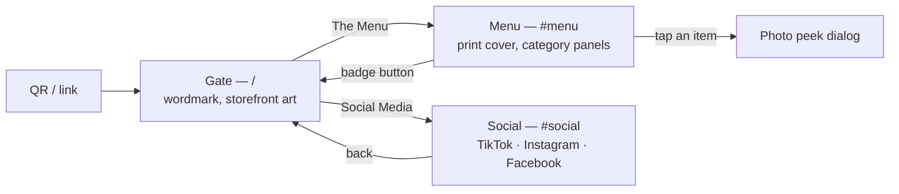

# `baron-menu`

**Client project.** A phone-first digital menu for **Baron — The Lord of Fried
Chicken**, opened by scanning a QR code at the table.

Private · plain HTML/CSS/JS · **no build step, no framework** ·
<Badge tone="client">Client</Badge> · live at `baron-menu.vercel.app`

This repo is the odd one out on purpose, and it is worth understanding why
before you "modernize" it.

## Why there is no framework here

The whole product is: a customer at a table, hungry, on a cheap phone and
restaurant Wi-Fi, deciding in under a minute. Success is finding an item and
its price in a couple of thumb-scrolls.

A static page of hand-written HTML, CSS and JS is the fastest possible answer
to that, and it has **no runtime dependency that can rot**. A menu that changes
four times a year should not carry a build pipeline that breaks twice a year.
"Zero build step" is a stated design principle in the repo's `PRODUCT.md`, not
an accident of history.

Do not port this to Next.js. If it ever needs a framework, that is a decision
with an ADR behind it, not a refactor.

<Callout type="info">
  **There is a `package.json` now, and it is not a build.** It exists for one
  dev-only tool: `sharp` (`^0.35.2`, locked at **0.35.4**, the release carrying
  the libheif fix for the high-severity AVIF advisory), used by
  `convert-images.mjs` to optimize photos. It uses **npm** (`package-lock.json`)
  and has **no `packageManager` pin and no scripts** — unlike the pnpm repos.
  `.vercelignore` keeps `package.json`, the lockfile, `node_modules` and the
  script out of the deploy, so Vercel serves the folder as plain static files
  and never installs anything. `jsqr` was dropped (19 Sep 2026): neither the
  site nor the script used it.
</Callout>

## What the visitor sees



- **A gate first.** Since August 2026 the QR lands on a Baron-branded choice
  screen, not straight in the menu: a solid-red *The Menu* panel and an
  outlined *Social Media* one, which flips in place to the social cards.
- **The three states live in the URL hash** (`/`, `#social`, `#menu`) and are
  pushed to history. *Why:* the phone's back gesture then walks back out of the
  menu instead of leaving the site. `#menu` and old `#<category>` links still
  deep-link past the gate.
- While the gate is up everything behind it is `inert` + `aria-hidden`, focus
  moves to the right control, and Esc backs out of the social face.
- **The menu** — sticky category chips with scroll-spy, a back-to-top button,
  and tap-any-item to open a photo "peek" `<dialog>`. Seven categories: family
  meals, appetizers, wings, beef burgers, chicken sandwiches, beverages,
  extras.

## The one file that matters

Everything is driven by **`data/menu.js`**, a plain `const MENU = {…}` loaded
by a `<script>` tag before `script.js`. Editing it needs no coding.

```js
{ name: "Classic Burger", nameAr: "كلاسيك برجر",
  desc: "Beef patty, ...", descAr: "لحم بقري، ...",
  single: 220, double: 265, img: "classic-burger" },
```

- One price → `price: 220`
- Two sizes → `single: 220, double: 265`
- `img` is the filename inside `images/`, without the extension
- `hero` / `heroTag` headline each category panel
- `contact` (phone, address, hours) shows in the footer — currently all empty
- `social` — the accounts on the gate and as footer pills; each `id` must be
  `tiktok`, `instagram` or `facebook`, *because those are the only glyphs
  `script.js` draws*

**Bilingual.** The `ع / EN` button switches language and flips the layout to
RTL. Arabic copy lives in the same file in the `*Ar` fields (`nameAr`,
`descAr`, `heroTagAr`, `labelAr`); UI strings are the `I18N` table in
`script.js`. If an Arabic field is missing the English text shows instead, so
a partial translation never breaks the page. The choice is stored in
`localStorage` (`baron-lang`), and Arabic-language phones start in Arabic.
Prices stay in Western digits, with `LE` / `ج.م`.

<Callout type="warning">
  The Arabic copy is marked **a draft to review** in the header comment of
  `data/menu.js`. The prices were last synced to the print PDF export of **3
  Aug 2026**.
</Callout>

## Adding an item with a photo

1. One-time: `npm install` (installs `sharp`).
2. Run `node convert-images.mjs <folder-with-png-images>`. The source folder is
   now **an argument** — it used to be a hard-coded macOS path, so the script
   only ran on one machine. It resizes each PNG to fit 480×480 (never
   enlarging), writes WebP (quality 80, alpha 90) into this repo's `images/`,
   and slugs the filename (`Cheese Fries.png` → `cheese-fries.webp`), printing
   the name map.
3. Add the item in `data/menu.js` with `img: "cheese-fries"`.

## Publishing

There is **no CI and no Git-connected deploy.** Publish from the folder:

```bash
vercel deploy --prod --yes
```

<Callout type="warning">
  **The deploy URL must never change.** The QR code is printed on physical
  table cards. `baron-menu.vercel.app` is baked into every one of them — a new
  URL means reprinting the whole restaurant. Add a custom domain in the Vercel
  dashboard if the client wants one; the `.vercel.app` link keeps working
  alongside it.
</Callout>

What ships is decided by `.vercelignore`: the npm files, the image script,
`qr/` and stray root screenshots are excluded. It anchors `/baron-*.png` to the
root on purpose — *an unanchored pattern once also excluded
`images/baron-wordmark.png`, the mask the script wordmark is painted from.*

Preview locally with any static server:

```bash
python3 -m http.server 8848   # → http://localhost:8848  (python on Windows)
```

## Files

| File / folder | What it is |
| ------------- | ---------- |
| `index.html`, `styles.css`, `script.js` | The site (~155 / ~900 / ~460 lines) |
| `data/menu.js` | **The menu — edit this** |
| `images/` | Optimized food photos (WebP), badge, wordmark, illustrations |
| `qr/` | The QR code (PNG for screens, SVG for large prints) — not deployed |
| `marketing/table-card.png` | Print-ready A6 table card |
| `marketing/_templates/render.html` | Generator page for the table card |
| `favicon.svg` | Browser tab icon |
| `convert-images.mjs` | Photo optimizer (dev only, needs `sharp`) |
| `package.json`, `package-lock.json` | npm, for `sharp` only — not deployed |
| `PRODUCT.md` | Users, brand personality, anti-references, design principles |
| `.gitattributes` | Pins checkouts to LF on every platform |

There is **no `AGENTS.md`**, no tests and no lint/format tooling. `PRODUCT.md`
is the closest thing to a contract: its five principles (print menu is the
source of truth, food does the selling, one thumb with no dead ends, content
parity, zero build step) are what a change is judged against.

## Standards that still apply

Being framework-free does not exempt it from the department's bars:

- **WCAG AA contrast**, verified: cream `#F7F1EB` against red `#CE2733` is
  4.7:1 and used for text both ways.
- **Full `prefers-reduced-motion` alternatives**, visible focus rings,
  semantic headings per category, alt text on every food photo.
- **Real RTL** using logical properties — not a mirrored stylesheet — with
  Lalezar + Rubik as the Arabic pairing (Google Fonts).
- **Prices match the printed menu exactly.** The print PDF is the source of
  truth; the site follows it, never the reverse.
