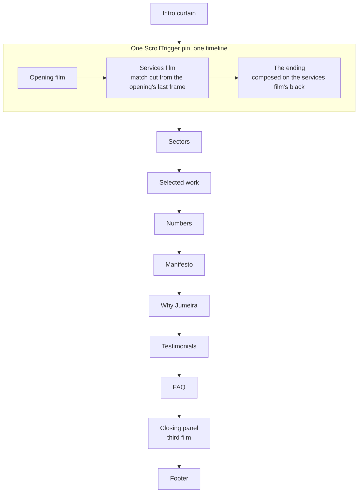
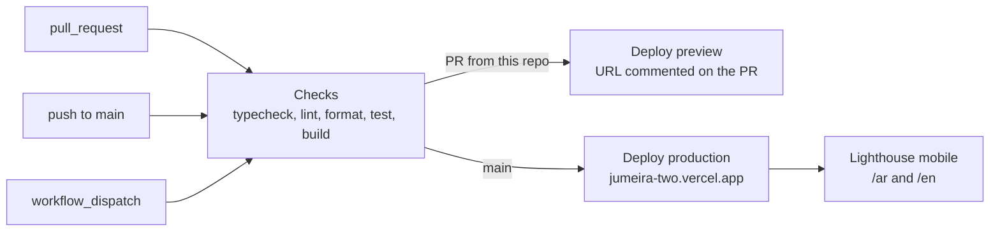

# `jumeira`

**Client project.** The pre-launch site for **Jumeira Catering** — a contract
catering and premium buffet company in **Benghazi, Libya**, feeding corporates,
hospitals, oil fields, aviation, conferences and weddings.

<Badge tone="client">Client</Badge> Private · standalone Next.js 16.3 app ·
`pnpm@11.26.0` · not part of the monorepo, and **no `@adawy/*` dependencies** —
the client must be able to take the repo and keep building. Patterns from the
handbook carry over; packages do not.

<Stats>
  <Stat value="AR" label="default locale" hint="`/ar` first, `/en` second" />
  <Stat value="2" label="page routes" hint="the scroll, plus a noindex privacy holding page" />
  <Stat value="3" label="films" hint="all three are folders of frames" />
  <Stat value="0" label="video elements" hint="every film draws to a canvas" />
</Stats>

It is the second-largest codebase in the org after
[`adawy-platform`](/repositories/adawy-platform), and by some distance the most
demanding one per page: a single route whose entire content is a scroll-driven
film. If you are looking for the department's hardest client engineering, it is
here.

<Callout type="warning">
  **This page describes the shape, not the measurements.** Frame counts, byte
  budgets, pin lengths and scroll shares all live in the repo's own contract
  files and are held there by tests — see [where the contract
  lives](#where-the-contract-lives). Numbers copied into a handbook rot
  silently, and this page had rotted that way once already.
</Callout>

## What it is for

`PRODUCT.md` states the job precisely: *"a pre-launch holding page while the
full site is built… this page is not competing for search traffic, it is
answering the question 'are these people serious?' for someone who already has
the link."* Success is defined as **a contract buyer forwarding the link instead
of asking for a company profile PDF**.

Two audiences with almost nothing in common: a procurement lead deciding whether
Jumeira can feed several hundred people a day on schedule, and a family planning
a wedding, arriving from Instagram on an Arabic phone. That is why the argument
is a film rather than a page of claims.

## Stack

| | |
| --- | --- |
| Framework | Next.js **16.3.5** (App Router, Turbopack), React **19.3** — `middleware.ts` is `proxy.ts` here, as Next 16 renamed it |
| Language | **TypeScript 7 and 6 side by side**: `tsc` (so `pnpm typecheck`) is TS 7 through `@typescript/native`, while `typescript` is aliased to `@typescript/typescript6` because typescript-eslint and Next still load the TS 6 API. Strict, plus `noUncheckedIndexedAccess`, `exactOptionalPropertyTypes`, `verbatimModuleSyntax`, target ES2022 |
| Styling | Tailwind CSS v4 + shadcn/ui (`new-york`, `rtl: true`) on the unified `radix-ui` package; one stylesheet entry, `app/globals.css`, importing `app/styles/*.css` in order |
| Motion | GSAP 3.15 + ScrollTrigger (`@gsap/react`), **plus Locomotive Scroll v5 as the single scroll authority** — see [below](#the-scroll-authority-is-a-reversed-decision) |
| i18n | next-intl 4 — `ar` (default) + `en`, `localePrefix: 'always'`, `hreflang` `ar-LY` |
| Lint / format | **ESLint 10** — `eslint-config-next`'s react, jsx-a11y and import plugins still call context APIs ESLint 10 removed, so their configs go through `@eslint/compat`'s `fixupConfigRules`; `eslint-plugin-unicorn` 75, `simple-import-sort`. Prettier 3 with the Tailwind plugin |
| Tests | **Vitest 5**, in two projects: `node` and a jsdom `dom` project for `*.browser.test.ts` — [below](#tests) |
| Fonts | IBM Plex Sans, IBM Plex Sans Arabic, Alexandria — all OFL, through `next/font/google` at build time, none preloaded |
| Package manager | **pnpm 11.26.0** (`packageManager`; CI's `pnpm/action-setup` reads the same field, so local and CI installs match). `minimumReleaseAge: 4320` in `pnpm-workspace.yaml` |
| Runtime | Node **24** in CI and on Vercel |
| Hosting | Vercel (Hobby), deployed by the Vercel CLI from GitHub Actions — [CI and deploys](#ci-and-deploys) |

No forms, no server actions, no API routes, no state library. The only stateful
things on the page are a scrub position, a theme and an audio element — and the
music is opt-in: the page is silent and downloads no audio until the reader
presses the disc in the corner.

The other routes are all generated rather than static: `/og` (a Satori card per
page, in both scripts), `robots.ts`, `sitemap.ts`, `manifest.ts` and
`/llms.txt`. Every URL in them is built from the same locale helpers as the
page canonicals, so none can describe a page differently from the page itself.
`/llms.txt` is deliberately **not** gated on the publishing switch — it invites
nothing to crawl — while `robots.txt` and the sitemap are.

## Layout

```text
app/[locale]/          page.tsx (the scroll), privacy/, error.tsx, not-found.tsx;
                       the locale layout owns <html>, dir and JSON-LD
app/styles/            the stylesheet, split at its own section banners
app/og/, llms.txt/     generated card and text route; robots.ts, sitemap.ts, manifest.ts
components/home/       the pinned opening scene: markup, timeline, film per half,
                       plus the ending's band, sketch field and geometry
components/media/      film-canvas.ts (every film's fetch and draw), frame-window.ts
                       (the bitmap window, decoded in a worker), HeldImage
components/<section>/  sectors, selected-work, numbers, manifesto, why,
                       testimonials, faq, cta, footer - one directory per section
components/layout/     page chrome: header, site menu, intro curtain, sound control,
                       smooth scroll, drift field
components/ui/         vendored shadcn primitives - no barrel, on purpose
lib/content/           structural data only (keys, icon names, years) - no copy
lib/motion/            markers, build queue, gsap + smooth-scroll gateways, drift
lib/seo/, lib/site.ts  metadata, JSON-LD, URL builders; the publishing switch
lib/audio/             the track and the player that outlives the tree
i18n/                  routing (the one place locales are declared), request, navigation
messages/              ar.json / en.json + parity and client-namespace tests
scripts/               hand-run asset bakes (Python, shell); output is committed
masters/               the camera masters - gitignored, only README.md is tracked
```

Every `components/*`, `lib/content`, `lib/motion`, `lib/seo` and `hooks`
directory has an `index.ts` barrel: import through it from outside, relatively
from inside, *because a module the barrel re-exports cannot import the barrel
without a cycle*. `lib/motion/gsap.ts`, `smooth-scroll.ts` and `build-queue.ts`
sit **outside** their barrel, because each pulls GSAP in and the barrel has to
stay importable from a server component.

The page, top to bottom:



## Where the contract lives

The repo's architectural contract outgrew one file and **split by scope, not by
size**. Read the one that covers what you are touching; do not read all five.

| File | Covers | Read it before touching |
| ---- | ------ | ----------------------- |
| `AGENTS.md` | The rules that cross a section boundary — module gateways, the design-token layers, the pin, the drift system, the enforcement table | Anything |
| `SECTIONS.md` | Every section of the page, one heading each, in reading order | That section's directory under `components/` |
| `CHROME.md` | The site menu, the sound control, the intro curtain — the fixed layers over the document | `components/layout/`, `lib/audio/` |
| `FILMS.md` | The three films as media: masters, crops, delivery order, the draw path | `public/hero/`, `public/cta/`, `masters/`, `components/media/` |
| `PRODUCT.md` | Who the page is for and what it must feel like | Any judgement call about tone |

`masters/README.md` is a sixth, narrower document: the spec of every camera
master, which bake still reads which one, and why they must be backed up
outside the repo (they are gitignored, so `git clean -xdf` deletes them).

**The division is the rule:** a constraint governing two sections stays in
`AGENTS.md`; a measurement taken on one section moves to its companion. *Why it
matters beyond one repo:* an agent reads roughly the first 150k characters of a
document, so a contract past that length silently stops being a contract
([working with AI](/how-we-work/working-with-ai#every-repo-carries-an-agentsmd)).

## Commands

```bash
pnpm install
pnpm dev                 # http://localhost:3000 → redirects to /ar

# the five gates, in the order CI runs them
pnpm typecheck && pnpm lint && pnpm format:check && pnpm test && pnpm build
```

<Callout type="important">
  **All five, not three.** `format:check` and `build` are gates here exactly as
  they are everywhere else, and `build` is the only one that catches a prerender
  failure a dev server hides
  ([testing](/standards/testing#the-gates-that-block-a-merge)).
</Callout>

Asset bakes are **hand-run and need tools the standard machine setup does not
install**. All of their output is committed, so a fresh clone builds without any
of it ([dev environment](/onboarding/environment),
[pattern 7](/architecture/patterns)):

| Bake | Needs |
| ---- | ----- |
| `pnpm bake:brand` — logo, wordmark, symbol, favicons | Python 3 + ImageMagick (`magick`) |
| `pnpm bake:clients` — the sixteen client marks | Python 3 + Pillow |
| `pnpm bake:track` — the background music, to AAC | bash + `afconvert`, i.e. **macOS** — the script chose it because there is no ffmpeg on the project's machines |
| `scripts/bake-film-frames.py`, `bake-services-frames.py` | Python 3, Pillow and ffmpeg; the opening film reads `masters/Final.mp4` |
| the other `scripts/bake-*.py` (cta frames, faq, footer, menu, numbers, why, selected work, outro sketch) | Python 3 + Pillow, run directly — there is no `pnpm` alias |

`scripts/measure-films.mjs` and `measure-cta.mjs` are the harnesses the film
measurements in `FILMS.md` came from — re-run them rather than trusting a
figure copied anywhere else.

## The one idea to understand first

**The page opens on a single GSAP ScrollTrigger pin carrying two films and an
ending in one continuous timeline**, and then nine ordinary sections scroll past
underneath it.

It was built as two pinned sections once, and read as two: the first pin
released, the scene scrolled away and the next scrolled in, so a cut appeared
where the footage had none. The services film opens on the exact frame the
opening film closes on, which is the one place a pin boundary would show. So the
second scene **takes the parent timeline as an argument** rather than building
its own, and the ending writes into that same timeline for the same reason.

The scene is split **by what the code is, not by how big it got**: markup /
choreography / film-as-media / arithmetic, per movement. The arithmetic modules
import nothing at all, which is exactly what lets them be tested in Node with no
DOM — the same rule the platform applies to its `lib/` layer
([testing](/standards/testing)).

<Callout type="info">
  Markup and timeline share elements through a `MARKER` constant map, never
  through refs or raw selector strings: *"a GSAP target is a selector and a
  React prop is an attribute, so an animated element is otherwise spelled twice
  with nothing to catch a rename."* A test holds every `data-*` selector in the
  stylesheet to a `MARKER` value. This is the same idea as the platform's typed
  anchors ([platform architecture](/architecture/platform-architecture),
  [pattern 3](/architecture/patterns)).
</Callout>

## The films are frame sequences, not video

Nothing on this page ever *plays*. Every film is scrubbed against the
scrollbar, and almost every unusual decision in the repo follows from that.

**All three are folders of WebP drawn onto a canvas** — the opening film, the
services film and the closing panel's film. There is no `video` element left on
the site, and with the element went the codec ladder, the two bandwidth tiers,
the two responsive cuts per film, the playback-rate measurement and the buffer
clamp that used to hold the scrub back to what had downloaded.

<Callout type="warning">
  **This was a knowing trade, not a measurement that changed.** `FILMS.md` keeps
  the decode table that argued against it: a `currentTime` seek runs on the
  phone's hardware decoder, while a WebP decode is software on the same
  throttled CPU. What the swap bought is **one pipeline for three films instead
  of two**, and the deletion of every mechanism that existed to choose between
  formats. Roughly half of `FILMS.md` is now the record of the pipeline that was
  removed, kept deliberately — it is why the sequences are shaped the way they
  are.
</Callout>

All three films fetch and draw through **one module,
`components/media/film-canvas.ts`**; each film's own module keeps only its
policy (arming, probe, held frame, gate). The rules it holds each fail silently
if broken:

- **A sequence's last frame is load-bearing, so it is fetched second** — right
  behind the first in-flight batch, out of order. The opening film's last frame
  is the branded plate the About copy is read on *and* the frame the services
  film match-cuts from; the services film's is the black the ending is composed
  against. In strict order the last frame was also the last byte, and an
  ordinary first visit reached the About beat with the plate still in the
  kitchen.
- **The queue follows the playhead, not frame 0.** It asks for the first frame
  not in hand at or ahead of the reader at high priority, and backfills behind
  (nearest first, low priority) only once nothing ahead is missing — and not at
  all while the playhead is parked on the last frame. The old in-order queue
  plus a single-flight "jump lane" spent every byte on frames the reader had
  already passed once they outran the link, and the picture moved in leaps; the
  jump lane is gone because *the queue is the jump lane now*.
- **Every frame is fetched once, decoded once, in a Worker, and blitted as an
  `ImageBitmap` — there is no image path.** The films used to fetch through an
  `HTMLImageElement` and `decode()` it, then the bitmap window decoded the same
  bytes again; the first decode starved the second and the draw fell back to
  painting images, which is a raster-path decode on the main thread. A
  main-thread `createImageBitmap` with a crop and resize still blocks on both
  Chromium and WebKit; the same call in a worker does not. The window
  (`frame-window.ts`) is **byte-budgeted**, not frame-counted, because
  predecoding a whole film runs to gigabytes of RAM. Where `createImageBitmap`
  is missing, nothing is fetched and each film's designed fallback stands.
- **The second film is queued behind the first, not merely time-gated.** At low
  bandwidth both films split the line: *"Neither film could move and both were
  being paid for."* The services sequence becomes *eligible* at a timeline mark
  and only starts transferring once the opening film has finished its own.
- **A recut renames its frame folder.** The folders are served `immutable` for
  a year (`next.config.ts`), so re-baking in place hands a returning visitor a
  film spliced from two bakes, and nothing errors.

**Nothing downloads until the reader could plausibly want it.** The canvases
carry no source in the markup; delivery arms a beat after the intro curtain
releases the page, or on the first gesture that could scrub, whichever comes
first — standing down entirely for a data-saver visitor, and waiting for a real
gesture on a portrait phone.

<Callout type="warning">
  **Do not measure media with Resource Timing.**
  `performance.getEntriesByType` does not surface media range requests, so it
  reported 0 bytes for the old video element and looked fine while CI failed.
  That mistake is how a 6.8 MB preload shipped in the first place
  ([performance checklist](/guides/performance-checklist#verify)).
</Callout>

## The scroll authority is a reversed decision

This page used to say there was no Lenis here, and gave a good reason. **That
decision has since been reversed, and the reason it gave is the reason it could
be.**

The original finding stands as written: Lenis's lerp stacked on top of
ScrollTrigger's numeric `scrub: 0.5` catch-up, and two smoothings in series read
as seek lag. What changed is which of the two was removed. The repo now runs
**Locomotive Scroll v5 — which is Lenis, rebuilt on it — as the one smoothing
authority**, confined to a single gateway module (`lib/motion/smooth-scroll.ts`),
and **every scrub on the page is `scrub: true`**. No number goes back into a
scrub.

It animates the window's own scroll rather than proxying it, so `position:
sticky`, `position: fixed` and ScrollTrigger all read true positions. Touch is
left native, because momentum scrolling is already the smoothest input a phone
has. Under `prefers-reduced-motion` the instance is never constructed at all.
And it is built only after the intro curtain releases the page, because a Lenis
that exists but has not started intercepts wheel events and answers them with
nothing.

**`scroll-behavior: smooth` stays banned**, and that ban is the durable half of
the original note: it is a second smoothing authority in one CSS line, whichever
library sits underneath it.

*Why this matters beyond one repo:* the rule was never "no smooth scroll" — it
is **one authority for one question**. Stacking a library's lerp on a scrub's
catch-up is the bug; either one alone is fine
([pattern 5](/architecture/patterns), [tech stack](/architecture/tech-stack)).

## Nothing is built until the reader scrolls

The heaviest thing this page does at load is now **nothing**, and that is
deliberate. Every scene build — the opening pin included — is registered with a
build queue and run on the reader's **first scroll gesture**, not in React's
commit.

The reasoning is worth carrying: a pinned scene at rest and an unpinned one at
rest are the same pixels, because the pin only does anything once the page
moves. So the invariant is not *built before first paint* but **correct before
the first scroll lands** — and a gesture's listeners run before its scroll is
applied, so a build that runs synchronously inside the gesture satisfies it.
Inserting the pin spacer relays out a document thirteen thousand pixels tall;
doing that in React's commit was worth hundreds of milliseconds of blocking time
and failed the CI budget on `main`.

Two more consequences shape the codebase:

- **Six sections do not hydrate at all.** They are server components whose only
  client code is a marker island that renders nothing, names its scene, and
  dynamically imports that scene's motion module inside the queue's drain. A
  section with real state — the carousel, the sector rail, the FAQ accordion —
  stays a client component.
- **Images are held rather than lazy.** `loading="lazy"` is read against the
  layout the *parser* has, which has no pin spacers in it yet, so a section
  twelve viewports down is about one viewport down at the moment the browser
  decides
  ([the measured version](/guides/performance-checklist#lazy-loading-is-read-against-the-parse-time-layout)).
  A helper runs `getImageProps` so the optimiser still computes the candidate
  set, parks the URLs on attributes the browser does not fetch, and sets them
  two viewports out.

<Callout type="info">
  **Arm the pictures before the reduced-motion guard, not after.** A section's
  photographs are the section, not an effect on it — a reader who asked for less
  motion still gets the images. Both call sites return the observer's teardown
  from the reduced-motion path for exactly this reason.
</Callout>

## Arabic is the default, and the design language

`i18n/routing.ts` says it plainly: *"Arabic is the default, because the
business, its clients and its staff are in Benghazi."* `PRODUCT.md` goes
further — *"every type decision is judged in Arabic first. A treatment that is
beautiful in Latin caps and merely acceptable in Arabic has failed the majority
of the audience."*

Consequences worth carrying to your own work:

- **Physical direction utilities are lint errors here even inside
  `components/ui/`** — the vendored primitives are held to the same rule as
  everything else, because a shadcn default that ships `ml-2` mirrors wrongly
  in Arabic exactly like your own code would ([i18n & RTL](/standards/i18n-rtl)).
  The same `no-restricted-syntax` rule bans template literals in `className`
  (they lose utility conflicts; use `cn()`) there too, and everywhere outside
  `components/ui/` it also bans `overflow-x-hidden`, which creates a scroll
  container that traps RTL layouts (use `overflow-x-clip`).
- **Locale facts live in one module.** `HREFLANG` is a `Record<Locale, string>`
  rather than a `locale === 'ar' ? 'ar-LY' : locale` written out in three files.
  Adding a third locale is now a **type error until it is mapped**, instead of
  three silent `else` branches.
- **Message keys are typed.** `global.d.ts` augments next-intl's `AppConfig`, so
  a key renamed in one message file and not the other fails `pnpm typecheck`
  rather than rendering its own path — and `messages/parity.test.ts` keeps the
  Arabic tree identical to the English one it is typed against.
- **Ordinals are Arabic-Indic, figures are not.** `getNumberLocale` asks for
  `-u-nu-arab` by name, because ICU's default for `ar` and `ar-LY` is Western
  digits; the headline statistics stay Western in both locales.

<Callout type="warning">
  **A number inside Arabic prose needs its own bidi isolate — isolating a
  parent is not enough.** Space-separated digit groups reorder, so a phone
  number renders back-to-front
  ([i18n & RTL](/standards/i18n-rtl#the-traps-that-only-appear-in-arabic)).
</Callout>

**No font is preloaded, on purpose.** `next/font` decides its preloads at build
time from the module graph, of which there is one for both locales — so `/ar`
and `/en` both preloaded the same five files at high priority, half of them the
script the reader could not read, ahead of the stylesheet and the LCP image.
With `preload: false` the browser discovers faces from the stylesheet, resolves
`unicode-range` first and fetches only what the page has glyphs for; `display:
swap` means the fallback paints immediately either way
([i18n & RTL](/standards/i18n-rtl#the-traps-that-only-appear-in-arabic)).

## Traps that have already cost someone a day

<details>
<summary>The intro curtain</summary>

- **The overlay must never be removed from the DOM.** The controller called
  `overlay.remove()` once; React still held the fiber, and the next client-side
  navigation died in the unmount commit with no error boundary above the layout.
  The symptom was *switching locale showed an error page, every time, in both
  directions.* Retire it by dropping its attribute and letting CSS hide it.
- **The release chain must never be able to reject.** `Animation.finished`
  rejects with `AbortError` when its animation is cancelled, and `Promise.race`
  settles on the first settlement — including a rejection — so the timeout
  ceiling cannot rescue it and the reader gets a page that will not scroll.
- **The playout deliberately returns no teardown.** The release has to happen on
  every path, including one where the component unmounts mid-build; a cleanup
  that cancelled it would leave the page locked until a CSS failsafe fires
  seconds later. A root attribute is what makes a second call a no-op.
- **Anything the curtain hides needs its own CSS failsafe keyframe.** The header
  had none, and a fixed transparent strip went on swallowing clicks whenever a
  release never came.
- **Check curtain timing on a throttled network, not a local load.** The
  truncation only appears once first paint passes 300 ms, which is every real
  connection and no local one. CPU throttling barely moves it.

</details>

<details>
<summary>The pin and the scrub</summary>

- **A pinned scene is sized `h-screen`, never `dvh`.** A pin freezes the
  element's computed height as pixels, so a dynamic unit measured once stops
  being dynamic: `dvh` froze at the *small* viewport, the first scroll retracted
  the phone's address bar, and a permanent strip of background opened under the
  film. `100vh` is the one height the address bar cannot move — and `h-screen`
  rather than `h-lvh`, because a browser that does not know `lvh` drops the
  declaration entirely and leaves a pinned scene with no height at all.
- **A trigger created after ScrollTrigger's batch refresh is never measured.**
  The symptom is a pin with no travel: an enabled trigger, a spacer with no
  padding, a scrubbed timeline that never advances, and nothing errors or logs.
  Anything built outside the initial commit has to refresh itself.
- **Never drive a scrub from a value that several tweens take turns writing.**
  GSAP renders a timeline's children in reverse when the playhead moves back, so
  one render landing short of the run walked seven tweens to their own `from` in
  turn — painting six frames from the middle of the film over settled copy. The
  reader's report was *an aeroplane cabin flashing over the About text*. Derive
  the frame from the playhead instead.
- **A beat composed against a particular frame has to bring that frame's ground
  with it.** The closing composition is read against the film's last frame,
  which is near-black — on a connection that never delivers it, the same copy
  lands over a lit photograph of a kitchen. A plain black card fading in under
  the beat is what makes the beat independent of delivery.

</details>

<details>
<summary>The bakes</summary>

- **Bake from `masters/`, never from the files in `public/`.** The frames
  supplied for the opening film once were the shipped H.264 exported back out —
  verified by aligning them frame by frame — and they were 35 frames short,
  which is exactly the stretch carrying the branded plate three other things are
  composed against. The bake script now reads the master itself and takes no
  source argument.
- **The services sequence is not its master re-exported.** It is a re-render
  that re-times the morphs, with more frames than the master, so exporting
  frames from the master would give back a coarser edit. Its boundaries are
  indices into the sequence; re-read them off the frames if it is recut.
- **Do not assume the next master is cropped like the last.** The current one
  carries 12px of pure black down both edges on every frame, which `cover` would
  show as a seam down the hero. The master before it had none. Measure.
- **The masters are not in git and must be backed up elsewhere.** `Final.mp4`
  is 239 MiB, over GitHub's hard limit, so `masters/` is gitignored — and it is
  now the *only* way to rebuild the opening film's frames at all.
- **A recut renames its frame folder**, because the folders are served
  `immutable` for a year
  ([above](#the-films-are-frame-sequences-not-video)).

</details>

## Tests

**Vitest 5, 46 test files in two projects split by filename**, so neither
project has to know about the other:

- **`node`** (32 files, `*.test.ts`) — the default place to write, and it runs
  in about 200 ms because nothing in it needs a DOM. It holds the cross-file
  agreements nothing else would catch: `PRODUCTION_HOST` across `lib/site.ts`
  and `next.config.ts`, the two message trees (`messages/parity.test.ts`), the
  client namespaces the layout forwards against every `useTranslations` in a
  `"use client"` module, the `MARKER` names the stylesheet spells by hand, the
  curtain's exit timing against `app/styles/intro.css`, the manifest's colours
  against the theme, the design-token layers, the frame counts against the
  files on disk, and the pure arithmetic behind each scene (beats, geometry,
  marquee wrap, menu travel, lightbox paging).
- **`dom`** (14 files, `*.browser.test.ts`, jsdom) — the browser state
  machines that are pure logic: the music player's toggle sequence, every path
  through the intro curtain that must end with the page released, the build
  queue, gestures, held images, `film-canvas` and the bitmap window (including
  its worker), each film's delivery, and the reach of the selected-work
  section. The films are driven through shared fakes in
  `components/media/film-canvas.fakes.ts`. It still does not render the scene.

*Why the split exists:* the suite used to be node-only with a `**/*.test.ts`
include, so no component or browser state machine could be tested — and both
runtime defects found in one review were sitting in that hole. The film suites
are the **only** gates that can see a short bake or a broken delivery order,
because Lighthouse leaves media unbudgeted and never scrolls to the frames.

## CI and deploys

`.github/workflows/ci.yml` runs **automatically again** — on every pull request
and every push to `main` — after a stretch in 2026-08 when the account's
Actions minutes were spent and it was dispatch-only. `workflow_dispatch` stays
as the by-hand route, with a `deploy` input of `checks only`, `preview` or
`production`.



| Job | What it does |
| --- | --- |
| **Checks** | Node 24, `pnpm install --frozen-lockfile`, then the five gates in the order above |
| **Deploy preview** | `vercel pull` → `vercel build` → `vercel deploy --prebuilt`; skipped for forks, which never see the token |
| **Deploy production** | The same with `--prod`, to the pre-launch alias `https://jumeira-two.vercel.app` |
| **Lighthouse (mobile)** | Warms the edge cache and the poster variants, then audits the production alias, three runs per URL |

- **Deploys only ever follow a green `Checks`** (`needs: checks`), through the
  Vercel CLI with a prebuilt output. *Why not the Vercel Git integration:* the
  Hobby plan cannot connect a private organisation repo, and the CLI path only
  deploys a build that passed CI anyway.
- **Until the `VERCEL_TOKEN` secret exists, deploy jobs skip with a warning**
  instead of failing, and the gates still run. `VERCEL_ORG_ID` and
  `VERCEL_PROJECT_ID` are repo *variables*.
- **Lighthouse budgets are hard errors on what is deterministic** —
  accessibility ≥ 0.9, per-type transfer sizes (document, stylesheet, script,
  font, image), TBT ≤ 400 ms, CLS ≤ 0.1, LCP ≤ 4.5 s — and **only a warning on
  the composite performance score**, because lab runs of this page swing about
  ±10 points around an LCP heuristic. Media is deliberately unbudgeted: a
  total-weight budget used to force the hero film to wait for a gesture and pop
  in mid-scrub. SEO is off while the site ships `noindex`.
- **`.vercelignore` must not exclude `node_modules/` or `.next/`.** A
  `--prebuilt` deploy's function configs point at files there, and ignoring
  either creates a deployment that fails on the first missing file while
  production stays on the previous build.
- **Branch protection is not available on the current GitHub plan**, so a red
  PR can still be merged — it just will not deploy. Run the gates before
  pushing.

Dependabot opens weekly grouped npm and Actions PRs with a three-day cooldown,
held level with `minimumReleaseAge: 4320` in `pnpm-workspace.yaml`. *Why the two
must match:* Dependabot resolves each update a second time with that release-age
cutoff, and with no floor locally the first pass floated a day-old transitive
dependency into the lockfile that the second pass then rejected — failing the
whole npm run on 2026-08-19.

## Going live

Same publishing switch as the other client projects: `PRODUCTION_HOST` set in
**both** `lib/site.ts` and `next.config.ts`, hostname only. Setting one and not
the other ships a half-indexed site — the meta tags and the `X-Robots-Tag`
header disagree — and a colocated test is the only thing that catches it. Full
procedure: [Client Projects](/how-we-work/client-projects#the-go-live-switch).

Four things this repo does that the generic checklist does not cover:

- **A merge to `main` is a production deploy.** CI deploys the pre-launch
  alias on every push to `main`, so there is no separate release step to hold
  a change back — keep unfinished work on a branch
  ([deployment](/how-we-work/deployment#client-projects-deploy-the-same-way)).
- **The site URL falls back to a hard-coded pre-launch host, not an env var.**
  CI runs `vercel build` on a GitHub runner where no `VERCEL_*` host variables
  exist, so the env-var version read back `undefined`, every page prerendered
  with `metadataBase` on `localhost`, and link cards rendered with no image.
- **A redirect map from the client's legacy domain is a launch blocker.** Only
  a handful of entry points are mapped today; the rest has to come off the old
  sitemap before `jumeira-catering.com` moves
  ([why](/how-we-work/client-projects#launch-checklist)).
- **The privacy page needs three changes made together**: the real text under
  `Privacy` in both message files, `noindex: false` in
  `app/[locale]/privacy/page.tsx`, and a `/privacy` entry in
  `INDEXABLE_ROUTES`. Any one alone leaves a placeholder in the index or a
  finished policy no search engine is told about, and nothing catches either.

Still open before launch, per `AGENTS.md` and the README: the street address and
`SITE.geo` coordinates (omitted rather than published as an approximate pin),
the placeholder `SITE.founded`, and the eight testimonials, which are
placeholders today.
