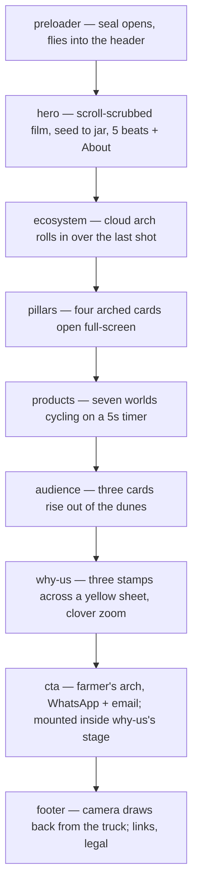
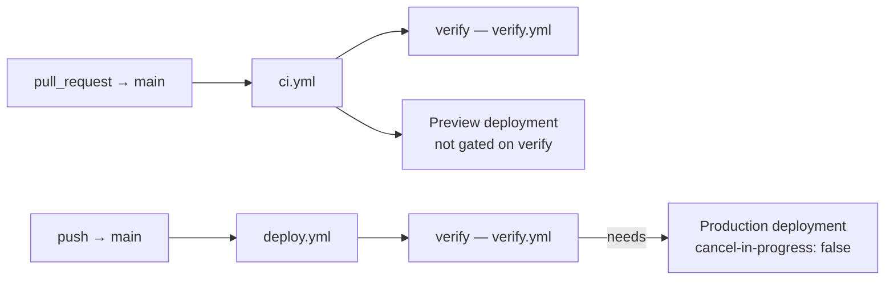

# `zad-alhkoul`

**Client project.** The marketing site for **Zad Al-Hkoul for Agricultural
Crops** (شركة زاد الحقول للمحاصيل الزراعية) — a Saudi company operating from
Egypt across trade, agriculture, industry and food packaging, with a separate
humanitarian relief supply line.

Private · standalone Next.js 16 app · not part of the monorepo ·
<Badge tone="client">Client</Badge>

<Stats>
  <Stat value="EN" label="default locale" hint="unprefixed — `/` and `/ar`" />
  <Stat value="10" label="feature folders" hint="one per part of the page" />
  <Stat value="126" label="test files" hint="Vitest, node + jsdom projects" />
  <Stat value="1,039" label="baked hero frames" hint="524 landscape, 515 portrait" />
</Stats>

It is no longer a holding page. The home route is one long, scroll-driven
story — a preloader, a scrubbed hero film, then six designed sections and a
footer — plus two legal stubs. Nearly all of it is choreographed with GSAP
against baked art from the designer's Figma exports. The README is unusually
long (≈1,000 lines) because it records *why* each number is what it is;
**read the section for the feature you are about to touch before changing
it.**

<Callout type="warning">
  **Pre-launch.** The site is deliberately `noindex`, the Bogart display font is
  a **trial** licence, and every contact value (WhatsApp, email, phone,
  address, social profiles in `src/lib/contact.ts`) is a **placeholder** until
  the client confirms its channels. See [Going live](#going-live).
</Callout>

## The things that are different here

Every client repo in the org shares a shape ([project
structure](/standards/project-structure#a-standalone-project-client-work)).
This one deviates in three ways, and each will catch you out.

**English is the default and it is not prefixed.** `localePrefix: 'as-needed'`,
so the site is `/` for English and `/ar` for Arabic — where
[`aladawy-shop`](/repositories/aladawy-shop) and
[`jumeira`](/repositories/jumeira) are Arabic-default with an always-on prefix.
The reason is stated in `src/i18n/routing.ts`: *"the marketing site lives at
`/` for the export audience and `/ar` for the Saudi/Egyptian audience."* The
default locale is a per-project fact, never a house default ([i18n &
RTL](/standards/i18n-rtl)). `/en` redirects to `/`.

**Everything lives under `src/`.** `src/app`, `src/features`, `src/lib`,
`src/messages`, `src/i18n`, `src/fonts`, `src/styles`, `src/assets`. The other
Next.js repos put those at the root. Nothing depends on the difference; you
just have to know before you go looking.

**Code is organised by feature, and ESLint enforces the shape.** See
[Layout](#layout) — the dependency direction and the 200-line module cap are
lint errors, not conventions.

## Stack

| | |
| --- | --- |
| Framework | Next.js **16.3.5** (App Router, Turbopack), React **19.3.0** |
| Language | TypeScript, strict; `typescript.ignoreBuildErrors: false`. **TypeScript 7** (`@typescript/native`) runs `tsc`; the TS 6 API package stays installed as `typescript` for typescript-eslint and Next |
| Styling | Tailwind CSS v4.3 (CSS-first `@theme`, no JS config) + shadcn/ui (`base-nova`) on `@base-ui/react` 1.8 |
| Motion | GSAP 3.15 + `@gsap/react`, Lenis 1.3 driven off the GSAP ticker |
| i18n | next-intl 4.14 — `en` (default, unprefixed) + `ar`, timezone pinned `Asia/Riyadh` |
| Icons | lucide-react |
| Lint / format | ESLint **10** (`eslint-config-next` wrapped in `@eslint/compat`'s `fixupConfigRules`), Prettier 3 + `prettier-plugin-tailwindcss` |
| Tests | **Vitest 5** + Testing Library + jsdom 30; plus a dependency-free smoke script |
| Commits | Conventional Commits via commitlint + husky; lint-staged on `pre-commit` |
| Package manager | **pnpm 11.26.0** (`packageManager`), Node `>=20.9.0` (CI uses 22) |
| Hosting | Vercel, deployed from GitHub Actions |

*Why `fixupConfigRules`:* `eslint-config-next`'s react, jsx-a11y and import
plugins still call context APIs ESLint 10 removed. The wrapper comes out once
they support ESLint 10 — the comment in `eslint.config.mjs` says so.

`pnpm-workspace.yaml` is not a workspace — it only carries pnpm 11's
`allowBuilds` list (`@parcel/watcher` and `@swc/core` may run install scripts;
`sharp` and `unrs-resolver` may not).

## Commands

```bash
pnpm install
cp .env.example .env.local   # optional locally; the defaults are sane
pnpm dev                     # http://localhost:3000 — English at /, Arabic at /ar

pnpm verify                  # the whole gate, exactly as CI runs it
```

`pnpm verify` is one composed script, in this order:

```
typecheck → lint → format:check → check:i18n → check:fonts → test → build → test:smoke
```

*Why a single script rather than a remembered list:* the gate cannot drift from
the documentation of the gate if there is only one of them. The CI steps in
`verify.yml` are the same list in the same order.

| Script | Does |
| --- | --- |
| `pnpm typecheck` | `next typegen && tsc --noEmit` — typegen first, so the image-module and route types exist before `tsc` looks |
| `pnpm lint` / `lint:fix` | ESLint, `--max-warnings=0`, content-keyed cache |
| `pnpm format` / `format:check` | Prettier (also sorts Tailwind classes) |
| `pnpm check:i18n` | Fails if `en.json` and `ar.json` diverge in keys **or** inline `<mark>` tags |
| `pnpm check:fonts` | Fails once indexing is on and any `-trial` font is still in `src/fonts/` |
| `pnpm test` / `test:watch` | The Vitest unit suite |
| `pnpm test:smoke` | Boots the build with `next start` and checks what types can't |
| `pnpm gen:*` | Regenerate a generated file — see [Generated files](#generated-files) |

<Callout type="info">
  **`--cache-strategy content` on `pnpm lint` is load-bearing.** ESLint's
  default cache keys on mtime, and checkout stamps every file with the checkout
  time, so on CI a metadata-keyed cache re-lints the whole tree and saves
  nothing while looking like it works.
</Callout>

## Layout

```
src/
├── app/                     # routing only
│   ├── [locale]/            # this layout IS the root layout
│   │   ├── page.tsx         # composition only: header, sections, footer
│   │   ├── [...rest]/       # unmatched paths → the localised 404
│   │   ├── privacy/, terms/ # legal stubs the footer links to
│   │   ├── error.tsx, not-found.tsx
│   ├── __tests__/           # route tests (robots, sitemap, error, global-error)
│   ├── og/route.tsx         # OG image, 1200×630, text-free
│   ├── apple-icon.tsx, robots.ts, sitemap.ts, global-error.tsx
│   └── globals.css          # imports every layer + every feature's CSS, in order
├── features/                # one folder per part of the page
│   ├── site-header/  preloader/  hero/  ecosystem/  pillars/
│   ├── products/  audience/  why-us/  cta/  footer/  legal/
├── components/              # ui/ (Button, Spinner), brand/, providers/,
│                            # and what >1 feature renders (StatusScreen, RevealLine)
├── hooks/                   # useMediaQuery, useProgressiveSection
├── lib/                     # gsap, fonts, seo, site, env, routes, contact, utils…
├── i18n/                    # routing, navigation, request config
├── messages/                # en.json, ar.json
├── styles/                  # tokens/ → semantic.css → typography/, base, utilities
├── assets/                  # baked scene art, one folder per section
├── test/                    # the test harness
└── proxy.ts                 # next-intl locale routing (Next 16's middleware)
public/hero/{land,port}/     # the baked film frames
scripts/                     # checks, smoke test, and the gen:* bakes
```

Every feature folder has the same shape, with only the parts it needs:
`components/` (one component per file; `<feature>-section.tsx` is the server
component that translates the copy and renders the client component that
animates it), `hooks/`, `lib/` (logic with no React in it), `data/` (static
tables and tuning constants, each with the measurement behind it), `types.ts`
and `<feature>.css`.

Three rules keep it that way:

- **Dependency direction is app → features → shared.** `lib/`, `hooks/`,
  `components/` and `i18n/` may not import `@/features/*` or `@/app/*`, and a
  feature may not import `@/app/*` — both are `no-restricted-imports` errors.
  *Why:* shared code that reaches into a feature stops being shared, and a
  feature that reaches into a route couples the page to one URL. A feature that
  needs another's knowledge imports that feature's `lib` or `data` directly
  (the header reads the hero's `about-position`, why-us appends the CTA's
  outro).
- **No module over 200 lines** — ESLint `max-lines`, generated files and tests
  exempt. *Why:* a module that outgrows it is doing more than one job; split it
  by responsibility, not at the line.
- **No barrel files.** *Why:* a barrel pulls every re-export into whatever
  imports it, client bundles included.

### The page, top to bottom



Things worth knowing before you touch any of it:

- **The hero film is not a `<video>`.** It is baked WebP frames drawn on a
  canvas, decoded to `ImageBitmap` in a Worker, fetched by a queue that follows
  the playhead, and cached in a byte-budgeted window. *Why:* a video seeks to
  keyframes, and a scrub asks for every frame between two of them — that is the
  stutter on scroll-video sites. Portrait screens get a **separate edit**
  (`public/hero/port`), not a crop.
- **Big zooms are painted on a canvas, never scaled as a layer** (why-us's
  clover, the footer's camera). *Why:* Chrome re-rasterises a scaled layer a
  tile at a time and tears when the zoom runs backwards — measured, and written
  up in the README.
- **Scrubbed layouts are opt-in.** The server's markup, no-JS readers and
  `prefers-reduced-motion` all get the plain stacked sections;
  `useProgressiveSection` upgrades them only once the timeline exists. *Why:*
  the whole catalogue must be in the served HTML — `test:smoke` asserts it.
- **Copy is authored one line per element and never split at runtime.** *Why:*
  GSAP SplitText's line detection is LTR-only, and splitting into characters
  breaks Arabic cursive shaping.
- **Import GSAP from `@/lib/gsap`**, never the package, so plugin registration
  has run; use `useGSAP` with a `scope` ref.

## The three-layer design system

`src/app/globals.css` imports the design system **in a strict order**, and the
order is the rule:

```
styles/tokens/        colors.css, scales.css, utilities.css — raw brand primitives
styles/semantic.css   maps primitives onto the shadcn token contract, + font stacks
styles/typography/    scale.css, then roles.css (.display-1, .h1…h7, .body-*, …)
```

Then `base.css`, the shared `utilities.css`, and each feature's own CSS — a
colourway only one section uses (`--pillar-*`, `--world-*`, `--audience-*`)
lives beside that feature, not in the semantic layer.

Components build against the **semantic** layer (`bg-background`,
`text-muted-foreground`, `border-border`) and never against the primitives.
`tokens/colors.css` states it in the file: *"these are primitives: never
reference them directly in components."* *Why:* the semantic layer is what a
context swaps — it is what lets the header repaint itself over the film
(`on-film`) without a second set of classes. The site is **one theme**; there
is no dark mode.

Prefer the **type roles** (`.h1`, `.body-sm`, …), which carry size, weight and
line-height together; `text-h1`… give the bare size when you need to override
one part. Display and H1–H3 are fluid `clamp()`s capped at the brand sheet's
size — *the fluidity is an addition; the sheet gives fixed sizes.*

<Callout type="error">
  **`cn()` here is not the stock `cn()`.** `src/lib/utils.ts` wraps
  `extendTailwindMerge` and teaches tailwind-merge the brand's text roles,
  radii, shadows, durations and z-layers. Without that,
  `cn("text-body-sm", "text-brand-ink")` returns `"text-brand-ink"` — merge
  cannot tell a size class from a colour class, keeps the last one, and **the
  size is silently lost with no error**. Same hazard between the brand's
  `rounded-r1…r5` and Tailwind's right-side `rounded-r-*`. Always import `cn`
  from `@/lib/utils`.
</Callout>

`src/components/ui/` holds only what the site renders — `Button` and
`Spinner`. *Why the unused shadcn primitives were deleted:* Tailwind v4 scans
source files, not the import graph, so a dead component's classes still ship
in the one stylesheet every visitor downloads.

## Testing

**Vitest**, co-located (`foo.test.ts` beside `foo.ts`), in two projects set up
in `vitest.config.mts`:

| Project | Environment | Picks up | Count |
| --- | --- | --- | --- |
| `unit` | node | `src/**/*.test.ts`, `scripts/**/*.test.mjs` | 46 + 4 |
| `dom` | jsdom | `src/**/*.test.tsx` | 76 |

It covers every module that runs without a browser: the data tables and their
invariants, timeline builders, geometry (film window, clip paths, camera,
road), hooks, every `<feature>-section` component, the routing, proxy, SEO,
sitemap and robots, and the `scripts/` checks themselves. `src/test/` is the
harness — `renderSection` awaits a server component and renders it under the
**real** catalogue for a locale, and `next-intl/server` is mocked over the same
catalogues, *so a missing key fails a test rather than rendering a key path.*
A small Vite plugin in the config loads `.webp`/`.png` imports as
`{ src, width, height }` read from the file header, *so geometry that reads
`src.width` is tested against the pictures that actually ship.*

What unit tests can't see, **`scripts/smoke.mjs`** checks against a real
`next start` of the build: `/` and `/ar` answer 200 with the right
`lang`/`dir`; `/en` redirects to `/` (the one check that notices the proxy
stopped running); the hero frame counts match the bake; the section markup is
in the served HTML; the legal pages; `/nope`, `/ar/nope` and `/deep/er/path`
return **404** with the branded Arabic 404 reachable; `/og` and `/apple-icon`
are PNGs; the sitemap's routes, hreflang and `x-default`; and the noindex
layers agree. It asserts against the markup **with `<script>` tags stripped**,
*because Next serialises the React tree into the RSC payload, so a string can
be in the body while the rendered HTML is empty* — which is exactly how a
broken 404 once looked like it worked.

Locale parity is guarded twice: by `pnpm check:i18n` (a dependency-free script
that compares every catalogue against the **union** of all keys, and the inline
`<mark>` tags in each message) and by the tests rendering under the real
catalogues. There is no `messages/parity.test.ts`; the intent of the
[parity gate](/standards/i18n-rtl#the-parity-test-is-a-merge-gate) is met by
the script, which runs as its own CI step.

## CI and deploy

Three workflows, **one event each**:



- **`verify.yml`** (reusable, `workflow_call`) is the single definition of "is
  this code good": one job, *Typecheck, lint, format, i18n, fonts, test, build,
  smoke*. Both callers use the job id `verify`, so the check row reads the same
  on PRs and on `main` — *the string a required status check would be
  configured with; a required check that is never reported blocks every merge
  forever.* It restores ESLint/tsc incremental state and the Turbopack cache
  (`.next/cache/turbopack` only — not the time-keyed `fetch-cache`).
- **`ci.yml`** runs `verify` and a **preview deploy** on every PR. Previews are
  deliberately not gated: a preview URL is how you review a change, and it is
  most useful while the checks are still red.
- **`deploy.yml`** runs `verify` then **production**, which `needs: verify`.
  *Why production waits:* `vercel build` catches a broken build but not a lint,
  type, i18n or smoke regression — those used to ship when deploy ran beside CI.
  Production runs with `cancel-in-progress: false` so two quick merges cannot
  kill a deploy midway and leave the older commit live.

*Why one event per workflow:* an `if:`-gated job still creates its check run,
so the old two-trigger files ran the gate twice per merge and left two
permanently "skipping" rows on every PR. **Do not add a second trigger to
either file.**

*Why deploy from Actions at all:* Vercel's Git integration does not support
private org repos on the Hobby plan. Jobs need `VERCEL_TOKEN`, `VERCEL_ORG_ID`
and `VERCEL_PROJECT_ID`, and skip themselves (not fail) if the token is
missing. The Vercel CLI is **pinned to 59.10.0** (59.11.0 shipped depending on
an unpublished package and broke every deploy), and all actions are pinned to
commit SHAs; Dependabot bumps the `github-actions` ecosystem monthly, grouped
into one PR. Production runs `vercel pull --environment=production` then
`vercel build --prod` then `vercel deploy --prebuilt --prod` — *the verify
build is a staging artifact by construction, because `NEXT_PUBLIC_*` values are
baked at build time.*

## Generated files

Regenerated, never hand-edited:

| Output | Command | Needs |
| --- | --- | --- |
| `src/components/brand/logo-lockup.tsx` | `pnpm gen:logo` | Node |
| `src/lib/og-assets.ts` | `pnpm gen:og` | Node |
| `public/hero/{land,port}/` | `pnpm gen:hero <wide.mp4> <portrait.mp4>` | ffmpeg |
| `src/fonts/mona-sans/` | `pnpm gen:mona` | Python, `fonttools[woff]` |
| licensed Bogart → WOFF2 | `pnpm gen:fonts` | Python, `fonttools[woff]` |
| `src/assets/<section>/*.webp` | `pnpm gen:eco`, `gen:pillars`, `gen:products`, `gen:audience`, `gen:why-us`, `gen:cta`, `gen:footer`, `gen:header` | Python + Pillow (NumPy for pillars/products; ImageMagick with librsvg for products) |

The source exports for the section bakes are **kept out of the repo**; several
bakes also *print* placements (rects, fitted offsets) that are pasted into the
feature's `data/` files — re-run and paste after any art change. None of this
is needed to build or run the site: every output is committed.

## Traps

<details>
<summary>Fonts: the digits-only subset must sit ahead of Bogart — and must not be metric-adjusted</summary>

The trial Bogart maps every digit to the same struck-through placeholder
glyph, so ordinary CSS fallback never fires. `mona-sans-numerals.woff2` is a
9.6 KB digits-only subset declared with `unicode-range: U+0030-0039` and placed
**ahead** of Bogart in the *display* stack only.

- **`adjustFontFallback: false` on the subset is critical.** `next/font`
  otherwise emits a metrics-adjusted *"&lt;name&gt; Fallback"* family with **no
  `unicode-range`** — sitting ahead of Bogart, it would claim every character
  and render the entire site in a system sans.
- **Bogart is declared `preload: false`** because `preload: true` emits a
  `<link rel="preload">` for *every* declared face — eighteen of them, roughly
  1.8 MB before first paint — for the two or three weights a page renders.
  Mona Sans *is* preloaded: one 44 KB variable file that sets all body copy.

</details>

<details>
<summary>The proxy matcher must exclude extension-less metadata routes — and double its backslash</summary>

`/og` and `/apple-icon` have no file extension, so the usual `.*\..*`
exclusion does not catch them; without naming them the proxy rewrites them to
`/en/og` and `/en/apple-icon`, which do not exist, and both 404 — for crawlers
and social cards only, where nobody looks. And the matcher is a **string**, so
the dot is written `\\.`: a single backslash cooks to `.`, which excludes every
path but `/` and silently stops the proxy running anywhere.

</details>

<details>
<summary>404s come from `notFound()`, never from the proxy</summary>

An earlier version set `status: 404` in the middleware response. It passed
under `next start` and broke on Vercel, which treats a non-200 out of
middleware as final and serves its own `/404`. `notFound()` is the one
mechanism that behaves the same on both. The 404 body is client-rendered in
this layout shape; the status — what search engines act on — is correct.
Every unknown path reaches the branded page: `/ar/nope` in Arabic, and
`/nope` or `/a/b/c` in English, because `localePrefix: "as-needed"` rewrites an
unprefixed path onto `en` (`/en/nope` redirects to `/nope` first).
`ROUTES` in `src/lib/routes.ts` is what the sitemap lists: **adding a page
means adding it there.**

</details>

<details>
<summary>Client components only get the namespaces they translate themselves</summary>

Copy is translated on the server — each `<feature>-section.tsx` reads its own
namespace and passes strings down. The locale layout hands client components
only `error` and `notFound`; a client component that starts calling
`useTranslations` needs its namespace added there. Import `Link` from
`@/i18n/navigation`, never `next/link`, or hrefs lose their locale.

</details>

## Going live

<Callout type="important">
  **This repo does not use `PRODUCTION_HOST`.** Its publishing switch is the
  environment variable **`NEXT_PUBLIC_ALLOW_INDEXING`**, read once as
  `ALLOW_INDEXING` in `src/lib/env.ts` (strictly `=== "true"`). While it is not
  `"true"` the site is `noindex` through three independent layers:
  `robots.ts` returns `Disallow: /`, every page emits a `noindex, nofollow`
  meta tag, and `next.config.ts` adds an `X-Robots-Tag` header. All three drop
  together when it flips.

  Following the generic [launch
  checklist](/how-we-work/client-projects#launch-checklist) literally here
  would leave a launched site invisible to search. The header layer exists
  because the meta tag only protects HTML documents — the header also covers
  the OG image, the icons and the sitemap.
</Callout>

The same switch **arms the font-licence gate.** `next.config.ts` calls
`assertFontsLicensedForLaunch()`, which throws when indexing is on and any
`-trial` file remains in `src/fonts/`. *Why in the config and not only in
`pnpm check:fonts`:* the flag is set in the Vercel project, so CI never sees it
as true, and the production build is `vercel build`, which runs no CI checks —
the config is the one thing evaluated on every build. The two launch
obligations (index the site, license the font) are tied to one switch on
purpose.

At launch, in the Vercel **production** environment and on the real domain:

1. License Bogart; convert with `pnpm gen:fonts` (`scripts/fonts-to-woff2.py`),
   update filenames in `src/lib/fonts.ts`, and remove the numerals subset if
   the licensed files have real digits.
2. Replace every placeholder in `src/lib/contact.ts`, and the stand-in product
   titles in `src/messages/{en,ar}.json`. Social profiles go into
   `siteConfig.social` only once they are really the company's — *that list is
   the JSON-LD `sameAs`.*
3. Set `NEXT_PUBLIC_SITE_URL` to the real domain (it otherwise falls back to
   the Vercel production URL, then `https://zad-alhkoul.vercel.app`).
4. Set `NEXT_PUBLIC_ALLOW_INDEXING=true`.

An SEO audit **will** report this site as "Not Indexable" before then. The
README says it plainly: *that is the intended state.* Do not "fix" it early.

## Contract files

`AGENTS.md` holds **only the block `next dev` generates** (read the Next 16
docs in `node_modules/next/dist/docs/` before writing code). The real contract
— layout rules, the design system, every section's measurements and traps —
lives in the **README**, which is tracked and current. There is no `CLAUDE.md`
or `PRODUCT.md`. Line endings are pinned to LF by `.gitattributes`, *because a
Windows checkout with CRLF fails `format:check` on every file.*
