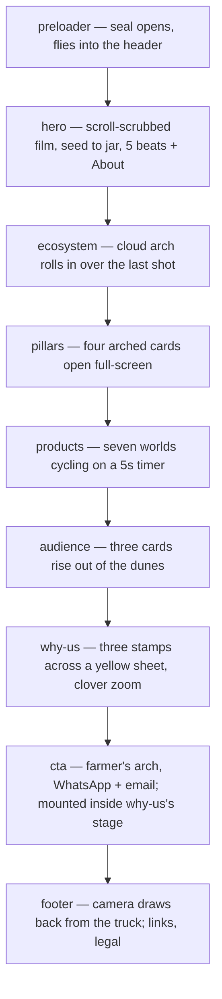
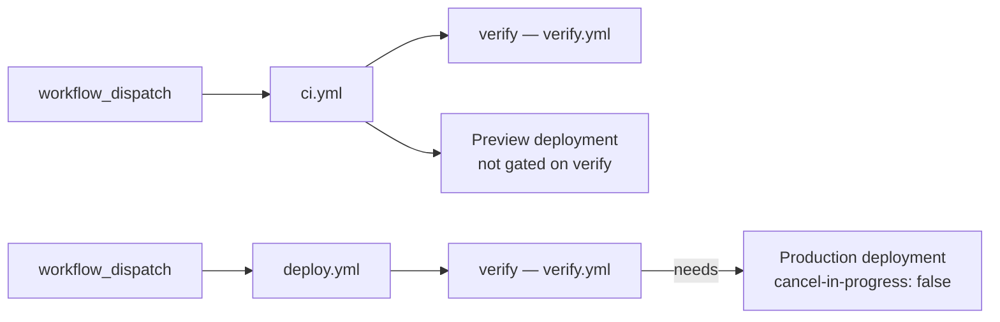

# `zad-alhkoul`

**Client project.** The marketing site for **Zad Al-Hkoul for Agricultural
Crops** (شركة زاد الحقول للمحاصيل الزراعية) — a Saudi company operating from
Egypt across trade, agriculture, industry and food packaging, with a separate
humanitarian relief supply line.

Private · standalone Next.js 16 app · not part of the monorepo ·
<Badge tone="client">Client</Badge>

<Stats>
  <Stat value="EN" label="default locale" hint="unprefixed — `/` and `/ar`" />
  <Stat value="11" label="feature folders" hint="one per part of the page, plus legal" />
  <Stat value="132" label="test files" hint="Vitest, node + jsdom projects" />
  <Stat value="1,039" label="baked hero frames" hint="524 landscape, 515 portrait" />
</Stats>

It is no longer a holding page. The home route is one long, scroll-driven
story — a preloader, a scrubbed hero film, then six designed sections and a
footer — plus two legal stubs. Nearly all of it is choreographed with GSAP
against baked art from the designer's Figma exports. The README is unusually
long (≈1,000 lines) because it records *why* each number is what it is;
**read the section for the feature you are about to touch before changing
it.**

<Callout type="warning">
  **Live, and indexable, since 2026-09-29** at `zadalhkoul.com`; the old
  `zad-alhkoul.vercel.app` host answers with a permanent redirect to it. The
  trial Bogart display face was replaced with Fraunces to make that possible.
  **Every contact value is still a placeholder** (WhatsApp, email, phone,
  address and social profiles in `src/lib/contact.ts`) until the client
  confirms its channels, so the CTA's WhatsApp button reaches a dummy number.
  See [Live](#live).
</Callout>

## The things that are different here

Every client repo in the org shares a shape ([project
structure](/standards/project-structure#a-standalone-project-client-work)).
This one deviates in three ways, and each will catch you out.

**English is the default and it is not prefixed.** `localePrefix: 'as-needed'`,
so the site is `/` for English and `/ar` for Arabic — where
[`aladawy-shop`](/repositories/aladawy-shop) and
[`jumeira`](/repositories/jumeira) are Arabic-default with an always-on prefix.
The reason is stated in `src/i18n/routing.ts`: *"the marketing site lives at
`/` for the export audience and `/ar` for the Saudi/Egyptian audience."* The
default locale is a per-project fact, never a house default ([i18n &
RTL](/standards/i18n-rtl)). `/en/*` redirects to the unprefixed URL with a
**308**, not next-intl's 307 (`src/proxy.ts`): that URL is never valid, so a
permanent redirect lets search engines pass its signals to the real page
instead of keeping both. Redirects that depend on the visitor's cookie or
`Accept-Language` stay temporary.

**Everything lives under `src/`.** `src/app`, `src/features`, `src/lib`,
`src/messages`, `src/i18n`, `src/fonts`, `src/styles`, `src/assets`. The other
Next.js repos put those at the root. Nothing depends on the difference; you
just have to know before you go looking.

**Code is organised by feature, and ESLint enforces the shape.** See
[Layout](#layout) — the dependency direction and the 200-line module cap are
lint errors, not conventions.

## Stack

| | |
| --- | --- |
| Framework | Next.js **16.3.5** (App Router, Turbopack), React **19.3.0** |
| Language | TypeScript, strict; `typescript.ignoreBuildErrors: false`. **TypeScript 7** (`@typescript/native`) runs `tsc`; the TS 6 API package stays installed as `typescript` for typescript-eslint and Next |
| Styling | Tailwind CSS v4.3 (CSS-first `@theme`, no JS config) + shadcn/ui (`base-nova`) on `@base-ui/react` 1.8 |
| Motion | GSAP 3.15 + `@gsap/react`, Lenis 1.3 driven off the GSAP ticker |
| i18n | next-intl 4.14 — `en` (default, unprefixed) + `ar`, timezone pinned `Asia/Riyadh` |
| Icons | lucide-react |
| Lint / format | ESLint **10** (`eslint-config-next` wrapped in `@eslint/compat`'s `fixupConfigRules`), Prettier 3 + `prettier-plugin-tailwindcss` |
| Tests | **Vitest 5** + Testing Library + jsdom 30; plus a dependency-free smoke script |
| Commits | Conventional Commits via commitlint + husky; lint-staged on `pre-commit` |
| Package manager | **pnpm 11.26.0** (`packageManager`), Node `>=20.9.0` (CI uses 22) |
| Fonts | Fraunces (Latin display), Mona Sans (Latin text), Rubik (Arabic) — all SIL OFL, self-hosted through `next/font`, none preloaded |
| Hosting | Vercel, deployed with the Vercel CLI — from a dispatched workflow or a terminal ([CI and deploy](#ci-and-deploy)) |

*Why `fixupConfigRules`:* `eslint-config-next`'s react, jsx-a11y and import
plugins still call context APIs ESLint 10 removed. The wrapper comes out once
they support ESLint 10 — the comment in `eslint.config.mjs` says so.

`pnpm-workspace.yaml` is not a workspace — it only carries pnpm 11's
`allowBuilds` list (`@parcel/watcher` and `@swc/core` may run install scripts;
`sharp` and `unrs-resolver` may not).

## Commands

```bash
pnpm install
cp .env.example .env.local   # optional locally; the defaults are sane
pnpm dev                     # http://localhost:3000 — English at /, Arabic at /ar

pnpm verify                  # the whole gate, exactly as CI runs it
```

`pnpm verify` is one composed script, in this order:

```
typecheck → lint → format:check → check:i18n → check:fonts → test → build → test:smoke
```

*Why a single script rather than a remembered list:* the gate cannot drift from
the documentation of the gate if there is only one of them. The CI steps in
`verify.yml` are the same list in the same order.

| Script | Does |
| --- | --- |
| `pnpm typecheck` | `next typegen && tsc --noEmit` — typegen first, so the image-module and route types exist before `tsc` looks |
| `pnpm lint` / `lint:fix` | ESLint, `--max-warnings=0`, content-keyed cache |
| `pnpm format` / `format:check` | Prettier (also sorts Tailwind classes) |
| `pnpm check:i18n` | Fails if `en.json` and `ar.json` diverge in keys **or** inline `<mark>` tags |
| `pnpm check:fonts` | Fails once indexing is on and any `-trial` or `-demo` font file is in `src/fonts/` |
| `pnpm test` / `test:watch` | The Vitest unit suite |
| `pnpm test:smoke` | Boots the build with `next start` and checks what types can't |
| `pnpm gen:*` | Regenerate a generated file — see [Generated files](#generated-files) |

<Callout type="info">
  **`--cache-strategy content` on `pnpm lint` is load-bearing.** ESLint's
  default cache keys on mtime, and checkout stamps every file with the checkout
  time, so on CI a metadata-keyed cache re-lints the whole tree and saves
  nothing while looking like it works.
</Callout>

## Layout

```
src/
├── app/                     # routing only
│   ├── [locale]/            # this layout IS the root layout
│   │   ├── page.tsx         # composition only: header, sections, footer
│   │   ├── [...rest]/       # unmatched paths → the localised 404
│   │   ├── privacy/, terms/ # legal stubs the footer links to
│   │   ├── error.tsx, not-found.tsx
│   ├── __tests__/           # route tests (robots, sitemap, llms, error, global-error)
│   ├── og/route.tsx         # OG image, 1200×630, text-free
│   ├── llms.txt/route.ts    # Markdown summary for AI assistants, built at build time
│   ├── apple-icon.tsx, robots.ts, sitemap.ts, global-error.tsx
│   └── globals.css          # imports every layer + every feature's CSS, in order
├── features/                # one folder per part of the page
│   ├── site-header/  preloader/  hero/  ecosystem/  pillars/
│   ├── products/  audience/  why-us/  cta/  footer/  legal/
├── components/              # ui/ (Button, Spinner), brand/, providers/,
│                            # and what >1 feature renders (StatusScreen, RevealLine)
├── hooks/                   # useMediaQuery, useProgressiveSection
├── lib/                     # gsap, fonts, seo, json-ld, site, env, routes, contact, utils…
├── i18n/                    # routing, navigation, request config
├── messages/                # en.json, ar.json
├── styles/                  # tokens/ → semantic.css → typography/, base, utilities
├── assets/                  # baked scene art, one folder per section
├── test/                    # the test harness
└── proxy.ts                 # next-intl locale routing (Next 16's middleware)
public/hero/{land,port}/     # the baked film frames
scripts/                     # checks, smoke test, and the gen:* bakes
```

Every feature folder has the same shape, with only the parts it needs:
`components/` (one component per file; `<feature>-section.tsx` is the server
component that translates the copy and renders the client component that
animates it), `hooks/`, `lib/` (logic with no React in it), `data/` (static
tables and tuning constants, each with the measurement behind it), `types.ts`
and `<feature>.css`.

Three rules keep it that way:

- **Dependency direction is app → features → shared.** `lib/`, `hooks/`,
  `components/` and `i18n/` may not import `@/features/*` or `@/app/*`, and a
  feature may not import `@/app/*` — both are `no-restricted-imports` errors.
  *Why:* shared code that reaches into a feature stops being shared, and a
  feature that reaches into a route couples the page to one URL. A feature that
  needs another's knowledge imports that feature's `lib` or `data` directly
  (the header reads the hero's `about-position`, why-us appends the CTA's
  outro).
- **No module over 200 lines** — ESLint `max-lines`, generated files and tests
  exempt. *Why:* a module that outgrows it is doing more than one job; split it
  by responsibility, not at the line.
- **No barrel files.** *Why:* a barrel pulls every re-export into whatever
  imports it, client bundles included.

### The page, top to bottom


```mermaid
flowchart TD
  P[preloader — seal opens, flies into the header] --> H
  H[hero — scroll-scrubbed film, seed to jar, 5 beats + About] --> E
  E[ecosystem — cloud arch rolls in over the last shot] --> PI
  PI[pillars — four arched cards open full-screen] --> PR
  PR[products — seven worlds cycling on a 5s timer] --> A
  A[audience — three cards rise out of the dunes] --> W
  W[why-us — three stamps across a yellow sheet, clover zoom] --> C
  C[cta — farmer's arch, WhatsApp + email; mounted inside why-us's stage] --> F
  F[footer — camera draws back from the truck; links, legal]
```

Things worth knowing before you touch any of it:

- **The hero film is not a `<video>`.** It is baked WebP frames drawn on a
  canvas, decoded to `ImageBitmap` in a Worker, fetched by a queue that follows
  the playhead, and cached in a byte-budgeted window. *Why:* a video seeks to
  keyframes, and a scrub asks for every frame between two of them — that is the
  stutter on scroll-video sites. Portrait screens get a **separate edit**
  (`public/hero/port`), not a crop.
- **The film does not download until it is wanted** (`film-gates.ts`, since
  2026-09-20). After first paint it fetches a 48-frame lead-in at low
  priority; the rest comes on the first wheel, touch, key or pointer move, or
  when a reload lands part-way down the page. *Why:* fetching every frame at
  hydration cost 11 MB on a phone and 29 MB on a desktop before anyone
  scrolled, charged visitors who never scrolled for the whole film, and held
  mobile Lighthouse at 45–56.
- **Big zooms are painted on a canvas, never scaled as a layer** (why-us's
  clover, the footer's camera). *Why:* Chrome re-rasterises a scaled layer a
  tile at a time and tears when the zoom runs backwards — measured, and written
  up in the README.
- **Scrubbed layouts are opt-in.** The server's markup, no-JS readers and
  `prefers-reduced-motion` all get the plain stacked sections;
  `useProgressiveSection` upgrades them only once the timeline exists. *Why:*
  the whole catalogue must be in the served HTML — `test:smoke` asserts it.
- **Copy is authored one line per element and never split at runtime.** *Why:*
  GSAP SplitText's line detection is LTR-only, and splitting into characters
  breaks Arabic cursive shaping.
- **Import GSAP from `@/lib/gsap`**, never the package, so plugin registration
  has run; use `useGSAP` with a `scope` ref.

## The three-layer design system

`src/app/globals.css` imports the design system **in a strict order**, and the
order is the rule:

```
styles/tokens/        colors.css, scales.css, utilities.css — raw brand primitives
styles/semantic.css   maps primitives onto the shadcn token contract, + font stacks
styles/typography/    scale.css, then roles.css (.display-1, .h1…h7, .body-*, …)
```

Then `base.css`, the shared `utilities.css`, and each feature's own CSS — a
colourway only one section uses (`--pillar-*`, `--world-*`, `--audience-*`)
lives beside that feature, not in the semantic layer.

Components build against the **semantic** layer (`bg-background`,
`text-muted-foreground`, `border-border`) and never against the primitives.
`tokens/colors.css` states it in the file: *"these are primitives: never
reference them directly in components."* *Why:* the semantic layer is what a
context swaps — it is what lets the header repaint itself over the film
(`on-film`) without a second set of classes. The site is **one theme**; there
is no dark mode.

Prefer the **type roles** (`.h1`, `.body-sm`, …), which carry size, weight and
line-height together; `text-h1`… give the bare size when you need to override
one part. Display and H1–H3 are fluid `clamp()`s capped at the brand sheet's
size — *the fluidity is an addition; the sheet gives fixed sizes.*

<Callout type="error">
  **`cn()` here is not the stock `cn()`.** `src/lib/utils.ts` wraps
  `extendTailwindMerge` and teaches tailwind-merge the brand's text roles,
  radii, shadows, durations and z-layers. Without that,
  `cn("text-body-sm", "text-brand-ink")` returns `"text-brand-ink"` — merge
  cannot tell a size class from a colour class, keeps the last one, and **the
  size is silently lost with no error**. Same hazard between the brand's
  `rounded-r1…r5` and Tailwind's right-side `rounded-r-*`. Always import `cn`
  from `@/lib/utils`.
</Callout>

`src/components/ui/` holds only what the site renders — `Button` and
`Spinner`. *Why the unused shadcn primitives were deleted:* Tailwind v4 scans
source files, not the import graph, so a dead component's classes still ship
in the one stylesheet every visitor downloads.

## Testing

**Vitest**, co-located (`foo.test.ts` beside `foo.ts`), in two projects set up
in `vitest.config.mts`:

| Project | Environment | Picks up | Count |
| --- | --- | --- | --- |
| `unit` | node | `src/**/*.test.ts`, `scripts/**/*.test.mjs` | 50 + 4 |
| `dom` | jsdom | `src/**/*.test.tsx` | 78 |

It covers every module that runs without a browser: the data tables and their
invariants, timeline builders, geometry (film window, clip paths, camera,
road), hooks, every `<feature>-section` component, the routing, proxy, SEO,
the JSON-LD graph, sitemap, robots and `llms.txt`, and the `scripts/` checks
themselves (the font gate's tests run against a fixture, not the repo's own
fonts, so they keep testing the gate now that no trial file is left). `src/test/` is the
harness — `renderSection` awaits a server component and renders it under the
**real** catalogue for a locale, and `next-intl/server` is mocked over the same
catalogues, *so a missing key fails a test rather than rendering a key path.*
A small Vite plugin in the config loads `.webp`/`.png` imports as
`{ src, width, height }` read from the file header, *so geometry that reads
`src.width` is tested against the pictures that actually ship.*

What unit tests can't see, **`scripts/smoke.mjs`** checks against a real
`next start` of the build: `/` and `/ar` answer 200 with the right
`lang`/`dir`; `/en` redirects permanently (308) to `/` (the one check that
notices the proxy stopped running); the hero frame counts match the bake; the section markup is
in the served HTML; the legal pages; `/nope`, `/ar/nope` and `/deep/er/path`
return **404** with the branded Arabic 404 reachable; `/og` and `/apple-icon`
are PNGs; the sitemap's routes, hreflang and `x-default`; and the three
indexing layers agree with `NEXT_PUBLIC_ALLOW_INDEXING`, whichever way it is
set. It asserts against the markup **with `<script>` tags stripped**,
*because Next serialises the React tree into the RSC payload, so a string can
be in the body while the rendered HTML is empty* — which is exactly how a
broken 404 once looked like it worked.

Locale parity is guarded twice: by `pnpm check:i18n` (a dependency-free script
that compares every catalogue against the **union** of all keys, and the inline
`<mark>` tags in each message) and by the tests rendering under the real
catalogues. There is no `messages/parity.test.ts`; the intent of the
[parity gate](/standards/i18n-rtl#the-parity-test-is-a-merge-gate) is met by
the script, which runs as its own CI step.

## CI and deploy

Three workflows, **one event each** — and today that event is
`workflow_dispatch` for both callers. The org's free Actions minutes ran out on
2026-09-23, and on 2026-09-27 `ci.yml`'s `pull_request` trigger and
`deploy.yml`'s `push` trigger were replaced with `workflow_dispatch` rather
than left to queue runs that could not start. The quota reset on 1 October;
the triggers have not been restored.


```mermaid
flowchart LR
  DC[workflow_dispatch] --> CI[ci.yml]
  CI --> V1[verify — verify.yml]
  CI --> PV[Preview deployment<br/>not gated on verify]
  DD[workflow_dispatch] --> D[deploy.yml]
  D --> V2[verify — verify.yml]
  V2 -->|needs| PROD[Production deployment<br/>cancel-in-progress: false]
```

- **`verify.yml`** (reusable, `workflow_call`) is the single definition of "is
  this code good": one job, *Typecheck, lint, format, i18n, fonts, test, build,
  smoke*. Both callers use the job id `verify`, so the check row reads the same
  on PRs and on `main` — *the string a required status check would be
  configured with; a required check that is never reported blocks every merge
  forever.* It restores ESLint/tsc incremental state and the Turbopack cache
  (`.next/cache/turbopack` only — not the time-keyed `fetch-cache`).
- **`ci.yml`** runs `verify` and a **preview deploy** (on every PR, while it
  had its trigger). Previews are deliberately not gated: a preview URL is how
  you review a change, and it is most useful while the checks are still red.
- **`deploy.yml`** runs `verify` then **production**, which `needs: verify`
  (on every push to `main`, while it had its trigger).
  *Why production waits:* `vercel build` catches a broken build but not a lint,
  type, i18n or smoke regression — those used to ship when deploy ran beside CI.
  Production runs with `cancel-in-progress: false` so two quick merges cannot
  kill a deploy midway and leave the older commit live.

*Why one event per workflow:* an `if:`-gated job still creates its check run,
so the old two-trigger files ran the gate twice per merge and left two
permanently "skipping" rows on every PR. **Do not add a second trigger to
either file** — restoring automatic runs means swapping `workflow_dispatch`
back to `pull_request` in `ci.yml` and to `push` in `deploy.yml`, not adding
them beside it.

*Why deploy from Actions at all:* Vercel's Git integration does not support
private org repos on the Hobby plan. Jobs need `VERCEL_TOKEN`, `VERCEL_ORG_ID`
and `VERCEL_PROJECT_ID`, and skip themselves (not fail) if the token is
missing. The Vercel CLI is **pinned to 59.10.0** (59.11.0 shipped depending on
an unpublished package and broke every deploy), and all actions are pinned to
commit SHAs; Dependabot bumps the `github-actions` ecosystem monthly, grouped
into one PR. The installed CLI itself is cached, so a cache hit skips the
install. Production runs `vercel pull --environment=production` then
`vercel build --prod` then `vercel deploy --prebuilt --prod` — *the verify
build is a staging artifact by construction, because `NEXT_PUBLIC_*` values are
baked at build time.*

<Callout type="warning">
  **A merge to `main` ships nothing, and a PR shows no checks.** Run
  `pnpm verify` locally, then either dispatch `deploy.yml` from the Actions tab
  or deploy with the Vercel CLI (`vercel build --prod` then
  `vercel deploy --prebuilt --prod`), and confirm the deployment on
  `zadalhkoul.com`. No workflow has run since 2026-09-27; the launch itself
  was deployed from a terminal with the CLI.
</Callout>

## Generated files

Regenerated, never hand-edited:

| Output | Command | Needs |
| --- | --- | --- |
| `src/components/brand/logo-lockup.tsx` | `pnpm gen:logo` | Node |
| `src/lib/og-assets.ts` | `pnpm gen:og` | Node |
| `public/hero/{land,port}/` | `pnpm gen:hero <wide.mp4> <portrait.mp4>` | ffmpeg |
| `src/fonts/mona-sans/` | `pnpm gen:mona` | Python, `fonttools[woff]` |
| `src/assets/<section>/*.webp` | `pnpm gen:eco`, `gen:pillars`, `gen:products`, `gen:audience`, `gen:why-us`, `gen:cta`, `gen:footer`, `gen:header` | Python + Pillow (NumPy for pillars/products; ImageMagick with librsvg for products) |

The source exports for the section bakes are **kept out of the repo**; several
bakes also *print* placements (rects, fitted offsets) that are pasted into the
feature's `data/` files — re-run and paste after any art change. None of this
is needed to build or run the site: every output is committed.

## Traps

<details>
<summary>Fonts: the display face is a stand-in for the brand sheet's, and nothing is preloaded</summary>

The brand sheet names **Bogart**, but only its trial build was ever in the
repo, and that licence (CC BY-NC) does not cover a commercial site. It was
replaced with **Fraunces** (SIL OFL), the closest open-licensed match, on
2026-09-29 so the site could launch. Fraunces has real digits, so the
digits-only Mona Sans subset that used to sit ahead of the trial Bogart is
gone too. To go back to Bogart once it is licensed: add the licensed files
under `src/fonts/`, load them with `localFont` in `src/lib/fonts.ts`, and put
their variable first in the display stacks in `styles/semantic.css` — the
stacks are the only place a face's role is decided.

- **The font-licence gate stays armed.** Any `-trial` or `-demo` file under
  `src/fonts/` now fails the production build, because indexing is on
  ([Live](#live)).
- **No face is preloaded.** Chrome holds rendering for a preloaded font, and
  with four preloads (121 KB) the first frame of a lab run came up to two
  seconds late. Nothing is lost, because the preloader covers the page for its
  first four seconds and waits for `document.fonts.ready`. For the same reason
  the stylesheet is inlined (`experimental.inlineCss` in `next.config.ts`),
  which removes a round trip before first paint; `test:smoke` strips `<style>`
  as well as `<script>` before it searches the markup.

</details>

<details>
<summary>The proxy matcher must exclude extension-less metadata routes — and double its backslash</summary>

`/og` and `/apple-icon` have no file extension, so the usual `.*\..*`
exclusion does not catch them; without naming them the proxy rewrites them to
`/en/og` and `/en/apple-icon`, which do not exist, and both 404 — for crawlers
and social cards only, where nobody looks. And the matcher is a **string**, so
the dot is written `\\.`: a single backslash cooks to `.`, which excludes every
path but `/` and silently stops the proxy running anywhere.

</details>

<details>
<summary>404s come from `notFound()`, never from the proxy</summary>

An earlier version set `status: 404` in the middleware response. It passed
under `next start` and broke on Vercel, which treats a non-200 out of
middleware as final and serves its own `/404`. `notFound()` is the one
mechanism that behaves the same on both. The 404 body is client-rendered in
this layout shape; the status — what search engines act on — is correct.
Every unknown path reaches the branded page: `/ar/nope` in Arabic, and
`/nope` or `/a/b/c` in English, because `localePrefix: "as-needed"` rewrites an
unprefixed path onto `en` (`/en/nope` redirects to `/nope` first).
`ROUTES` in `src/lib/routes.ts` is what the sitemap lists: **adding a page
means adding it there.**

</details>

<details>
<summary>Client components only get the namespaces they translate themselves</summary>

Copy is translated on the server — each `<feature>-section.tsx` reads its own
namespace and passes strings down. The locale layout hands client components
only `error` and `notFound`; a client component that starts calling
`useTranslations` needs its namespace added there. Import `Link` from
`@/i18n/navigation`, never `next/link`, or hrefs lose their locale.

</details>

## Live

<Callout type="important">
  **This repo does not use `PRODUCTION_HOST`.** Its publishing switch is the
  environment variable **`NEXT_PUBLIC_ALLOW_INDEXING`**, read once as
  `ALLOW_INDEXING` in `src/lib/env.ts` (strictly `=== "true"`). It is `"true"`
  in the Vercel **production** environment only, so production is indexable
  and every preview stays `noindex`. While it is not `"true"` the site is
  `noindex` through three independent layers: `robots.ts` returns
  `Disallow: /`, every page emits a `noindex, nofollow` meta tag, and
  `next.config.ts` sends `X-Robots-Tag: noindex, nofollow`. All three flip
  together.

  Following the generic [launch
  checklist](/how-we-work/client-projects#launch-checklist) literally here
  would leave a launched site invisible to search. The header layer exists
  because the meta tag only protects HTML documents — the header also covers
  the OG image, the icons and the sitemap.
</Callout>

**The header is sent either way.** With indexing on it reads `index, follow,
max-image-preview:large, max-snippet:-1, max-video-preview:-1` rather than
being dropped, *because only a header can tell a search engine that the OG
card and the baked art may be shown full size* — a meta tag never reaches an
image response.

The same switch **arms the font-licence gate.** `next.config.ts` calls
`assertFontsLicensedForLaunch()`, which throws when indexing is on and any
`-trial` or `-demo` file is in `src/fonts/`. *Why in the config and not only in
`pnpm check:fonts`:* the flag is set in the Vercel project, so CI never sees it
as true, and the production build is `vercel build`, which runs no CI checks —
the config is the one thing evaluated on every build. The two obligations of a
public site (index it, license its fonts) are tied to one switch on purpose,
and the gate was cleared for launch by
[replacing the trial face](#traps), not by licensing it.

What search and answer engines get, all derived from the single `SITE_URL` in
`src/lib/site.ts` (`NEXT_PUBLIC_SITE_URL`, set to `https://zadalhkoul.com` in
production):

- **One linked JSON-LD graph** per locale (`src/lib/json-ld.ts`): an
  `Organization` with a raster logo (the 180px `apple-icon`, because Google
  wants a raster logo of at least 112px) and the product range as
  `hasOfferCatalog`, and a `WebSite` whose `publisher` points at it by `@id`.
- **`/llms.txt`**, a Markdown summary for AI assistants built from the
  English catalogue and the product catalogue, *so it says only what the page
  says*. It leaves the contact details out while they are placeholders.
- **The `publisher` meta tag reads *Adawy Software***, and the footer's rights
  line carries a *Designed & developed by Adawy Software* credit linking to
  the group site in the reader's locale. The JSON-LD still names the company
  as its own publisher: the graph is about who the site is *for*, the meta tag
  only credits who built it.
- **An IndexNow key file** in `public/`, so Bing and the other IndexNow
  engines can be pinged to recrawl after a content deploy (the README has the
  call).

Still open after launch: every value in `src/lib/contact.ts` (the WhatsApp
number is a dummy), the privacy and terms bodies (both pages still say they
are being prepared), the rows the writer's content pack still marks HOLD in
`src/messages/{en,ar}.json` — the product names, the English legal name and
the founder — and `siteConfig.foundingDate` (2026, from the company brief,
published as the JSON-LD `foundingDate`) against the registration. The
writer's v2 response (#54, 2026-09-27) landed the SEO title, keywords and
trimmed copy before launch. Social profiles go into `siteConfig.social` only
once they are really the company's — *that list is the JSON-LD `sameAs`.*

## Contract files

`AGENTS.md` holds **only the block `next dev` generates** (read the Next 16
docs in `node_modules/next/dist/docs/` before writing code). The real contract
— layout rules, the design system, every section's measurements and traps —
lives in the **README**, which is tracked and current. There is no `PRODUCT.md`.
Line endings are pinned to LF by `.gitattributes`, *because a
Windows checkout with CRLF fails `format:check` on every file.*
